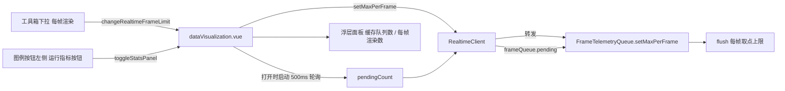

## 产品概述

在走航车可视化页面的实时模式下，新增一组「渲染运行指标」入口与配置项，用于观察和解决"接收快于渲染"导致的画面滞后问题。

## 核心功能

**1. 运行指标按钮与浮层面板**

- 在页面右下角「图例」按钮**左侧、同一行**新增一个按钮（文案如「运行指标」）
- 点击按钮弹出半透明深色浮层小卡片，展示两项实时数据：
- **当前缓存队列数量**：帧队列中尚未交给渲染层的点数（积压量）
- **当前每帧渲染数量**：客户端实际生效的 `maxPerFrame`
- 再点按钮或点击面板外任意位置关闭；面板打开期间数字每 500ms 刷新一次，关闭即停

**2. 每帧渲染数量下拉**

- 在工具箱「每秒接收」右侧的同一行新增一格「每帧渲染:」下拉
- 可选值：**1 / 2 / 5 / 10 / 20 / 50**
- 选中后**立即生效**（纯客户端参数，不走重连），用于在大批量补发时快速消化积压

**3. 移除上一版方案**

- 删除加在「清除数据:」标签右侧的 `缓存 N` 徽标及其 500ms 常驻定时器，改为由新面板按需展示

## 边界与约束

- 仅实时模式（`searchType == 1`）下可见；历史模式不展示按钮与下拉
- 未建立实时连接时，面板显示 0 与当前配置值，不报错
- 按钮与面板需适配现有三处响应式断点，不在窄屏溢出或遮挡图例

## 技术栈

沿用项目现有栈：Vue 2（Options API + SFC）+ TypeScript（自定义 ts-loader 转译）+ SCSS(scoped) + Element UI（`el-select`/`el-option`）+ MapLibre/Cesium。不引入新依赖。

## 实现思路

**核心判断：`maxPerFrame` 是纯客户端参数，必须热更新。**
`maxPointsPerSecond`（每秒接收）在握手时提交给服务端、改它需要 close(4002) 重连；而 `maxPerFrame` 只影响 `FrameTelemetryQueue.flush()` 每帧取几个点，与服务端无关。因此改它不能复用 `setMaxPointsPerSecond` 的"断开重连"套路——那样会白闪一次「网络异常」并触发多余补发。正确做法是让队列的 `maxPerFrame` 从 `readonly` 构造参数改为**运行时可写字段**，由页面下拉直接下发。

**单一数据源：面板显示的每帧渲染数量从 `RealtimeClient` 读回**，不直接复用页面下拉的绑定值，避免"下拉改了但客户端没生效"时显示失真。

**按需轮询：只在面板打开时启动 500ms 采样**，关闭即停。上一版的常驻定时器是这次要纠正的点——没有数据回调时队列也在被消费，只有定时采样才能反映"积压正在下降"，但常驻没必要。

**布局落点：在 `legend.vue` 内增加操作行 + 具名 slot**。
「图例」按钮位于 `legend.vue` 内部（`.legend` 绝对定位 110×240，按钮 `top:208px; right:0`，73×34 圆角胶囊）。若在父组件用绝对定位另放一个按钮，需为三处媒体查询分别手算偏移（图例容器 `right` 在窄屏变成 `2vw`、宽度变 80/60px），容易错位。改为在 `legend.vue` 里把按钮包进 `.legend-actions` 弹性行、并在图例按钮前留一个具名 slot，父组件把新按钮与浮层塞进 slot：同一行对齐由 flex 保证，响应式自动继承。Vue 2 的 scoped CSS 会同时作用于父组件传入的 slot 内容，父组件样式可正常命中。

## 执行要点（避免回归）

- `FrameTelemetryQueue.flush()` 每帧取点受两个条件约束：`batch.length < maxPerFrame` 与 `budgetMs = 5ms`。改大 `maxPerFrame` 后仍受时间预算封顶，属预期行为（防止单帧渲染阻塞主线程）。
- `setMaxPerFrame` 里改完值要调用一次 `schedule()`：若上一帧是因预算耗尽退出、而队列仍有剩余且有新调度未排队，可立即恢复消费。`schedule()` 内部有 `paused / frameHandle !== null / cursor >= length` 三重短路，重复调用安全。
- 点击外部关闭用 `document` 上的 click 监听，打开时注册、关闭与 `beforeDestroy` 时移除，避免监听器泄漏；判断时用 `contains` 排除按钮与面板自身的点击，防止"点按钮立刻被外部监听关掉"的抖动（用 `@click.stop` 或捕获阶段判断）。
- 浮层 `z-index` 需高于图例（`.legend-box` 为 66），取 80。
- 清理路径：`stopRealtime()` 与 `beforeDestroy()` 都要收掉轮询定时器、document 监听并把面板置为关闭态。
- 该文件已存在约 95 条 ts-plugin 类型告警（Vue 2 Options API 在严格推断下的固有产物，例如 `realtimeClient: null` 被推断为 `never`）。新增代码会新增同类告警，**不要顺手去修这些既有告警**，否则改动范围会失控。
- 面板文案与配色沿用现有工具箱：`#122336` 底、`rgba(255,255,255,.5)` 描边、`backdrop-filter: blur()`、`#0095FF` 强调色、`#d8f3ff` 正文。

## 架构与数据流



## 目录结构

```
QHZHC_Web/src/views/DataVisualization/
├── services/
│   └── FrameTelemetryQueue.ts     # [MODIFY] maxPerFrame 由 readonly 构造参数改为可写字段；新增 setMaxPerFrame / maxPerFrameValue；保留已有 pending()
├── services/
│   └── realtimeClient.ts          # [MODIFY] 保存当前 maxPerFrame；新增 setMaxPerFrame（转发到队列）与 maxPerFrameValue；保留已有 pendingCount()
├── components/
│   └── legend.vue                 # [MODIFY] 按钮外包一层 .legend-actions 弹性行；在图例按钮左侧新增具名 slot，供父组件注入按钮与浮层；不改图例自身逻辑
└── dataVisualization.vue          # [MODIFY] 移除上一版徽标/常驻定时器；新增运行指标按钮+浮层面板（含按需轮询、点击外部关闭、销毁清理）；工具箱新增「每帧渲染」下拉并接入热更新；RealtimeClient 构造参数 maxPerFrame 改为读配置值
```

（`QHZHC_Web/tests/unit/` 下若已有覆盖 `FrameTelemetryQueue` / `RealtimeClient` 的 spec，在其中补 `setMaxPerFrame` 与 `pending()` 的用例；否则新增一个轻量 spec。）

## 关键结构（接口级）

```ts
// FrameTelemetryQueue —— 新增/调整
setMaxPerFrame(value: number): void;   // 取 max(1, floor(value))，变化后 schedule() 恢复消费
maxPerFrameValue(): number;            // 当前生效值，供界面回显
pending(): number;                     // 已存在：Math.max(0, queue.length - cursor)

// RealtimeClient —— 新增
setMaxPerFrame(value: number): void;   // 纯客户端热更新，不重连、不产生 4002
maxPerFrameValue(): number;            // 面板显示的唯一数据源
pendingCount(): number;                // 已存在：stopped ? 0 : frameQueue.pending()
```

## 验证方式

- 用 `vue-template-compiler` 对改动后的 SFC 模板做一次编译校验（临时脚本，用完删除），确认无语法错误且新节点进入 render 函数
- 运行 `npx jest --runInBand` 确认既有 122 个用例不受影响
- 页面冒烟：切换到实时模式，把「每秒接收」选「全部」，观察浮层中缓存数量跳动；再把「每帧渲染」从 1 调到 20，观察积压下降速度变化，且**不出现断连提示**（证明热更新生效、未走重连）

## 设计风格

沿用页面既有的"深蓝科技风"：半透明深色玻璃卡片 + 蓝色强调色 `#0095FF` + 浅蓝正文 `#d8f3ff`，与工具箱、图例、图表面板保持同一套视觉语言，新元素必须"像本来就在这个页面上"。

## 页面与区块

**区块 1：运行指标按钮（图例按钮左侧）**

- 与「图例」按钮同一行的左侧，采用相同的胶囊造型：`border-radius: 20px`、`height: 34px`、主色 `#0095FF` 实心底、白色文字居中
- 宽度略宽于图例按钮（容纳 4 字文案），与图例按钮间距 8px，两者右对齐成组
- 激活态（面板展开时）加 `box-shadow: 0 0 10px rgba(0,149,255,.45)` 与轻微描边变化，给出"已展开"反馈
- hover 时 `transform: translateY(-1px)`，0.2s 缓动，与工具箱按钮的交互一致

**区块 2：运行指标浮层面板**

- 位于按钮正上方（`bottom: 100% + 8px`），右边缘与按钮右边缘对齐，向左展开，`width: 170px`
- 视觉：`background: rgba(18,35,54,.7)` + `border: 1px solid rgba(255,255,255,.5)` + `backdrop-filter: blur(7px)` + `border-radius: 4px` + `box-shadow: 0 4px 10px rgba(38,102,127,.3)`，`z-index: 80`（高于图例的 66）
- 结构：标题行「运行指标」+ 两行键值（缓存队列 / 每帧渲染），键值左标签右数值，数值用 `font-variant-numeric: tabular-nums` 防止数字跳动时宽度抖动
- 缓存数量超过 30 时数值变为橙色 `#FF7B10`，提示当前渲染跟不上接收
- 入场用 0.15s 的淡入 + 轻微上移，避免生硬闪现
- 点击按钮切换；点击面板与按钮之外的任意区域关闭

**区块 3：每帧渲染下拉（工具箱，位于「每秒接收」右侧）**

- 复用 `.btn-content` 一格：同样 `height: 80px`、深色底 `#122336`、`margin-right: 8px`、圆角 5px
- 内部与「每秒接收」完全对齐：`.c-title` 文案「每帧渲染:」（14px，行高 24px）+ 下方 `el-select`（width 88px，margin-top 10px，size="mini"）
- 选项：1 点 / 2 点 / 5 点 / 10 点 / 20 点 / 50 点
- 与「每秒接收」并排同高，视觉上形成"接收侧 / 渲染侧"的对照关系

## 响应式

- 面板与按钮随图例容器一起移动，继承现有三处断点的 `right`（`10px` → `2vw`）与宽度变化
- 窄屏下按钮文案保持 4 字不折行，浮层宽度可收缩至 `150px`，保证不溢出视口

## Agent Extensions

### Skill

- **lsp-code-analysis**
- Purpose：在改动前定位 `maxPerFrame`、`pending()`、`legendShow`、`.legend-box` 等符号的全部引用点与媒体查询覆盖位置，确认改动不会遗漏调用点或破坏既有布局
- Expected outcome：得到精确的引用清单与三处响应式断点的影响面，避免漏改导致窄屏错位