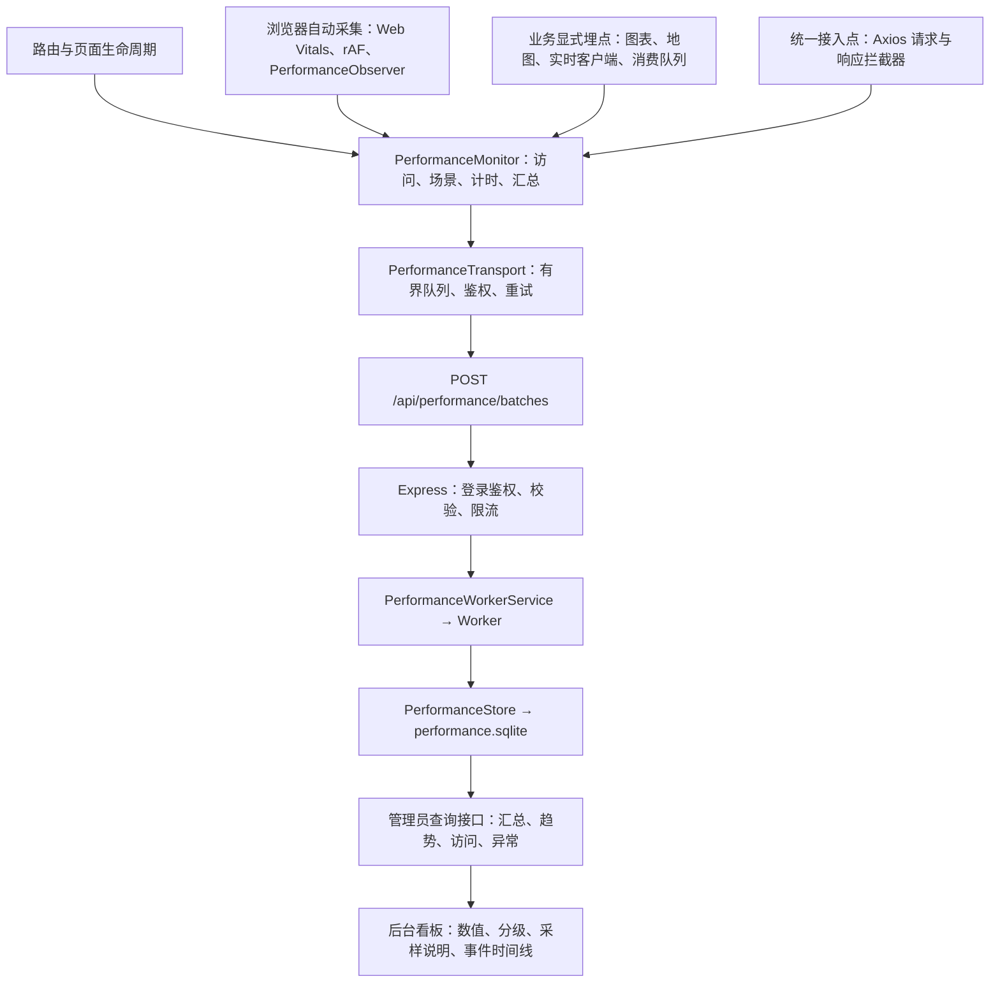
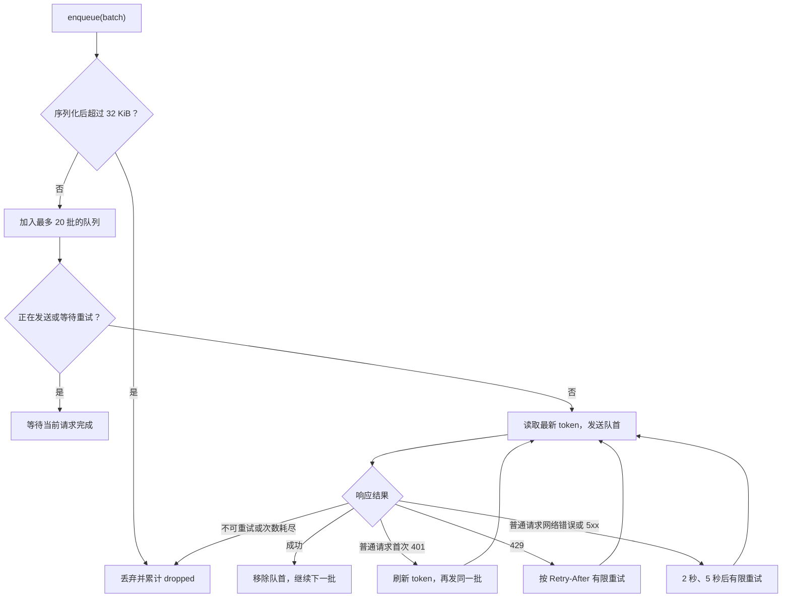
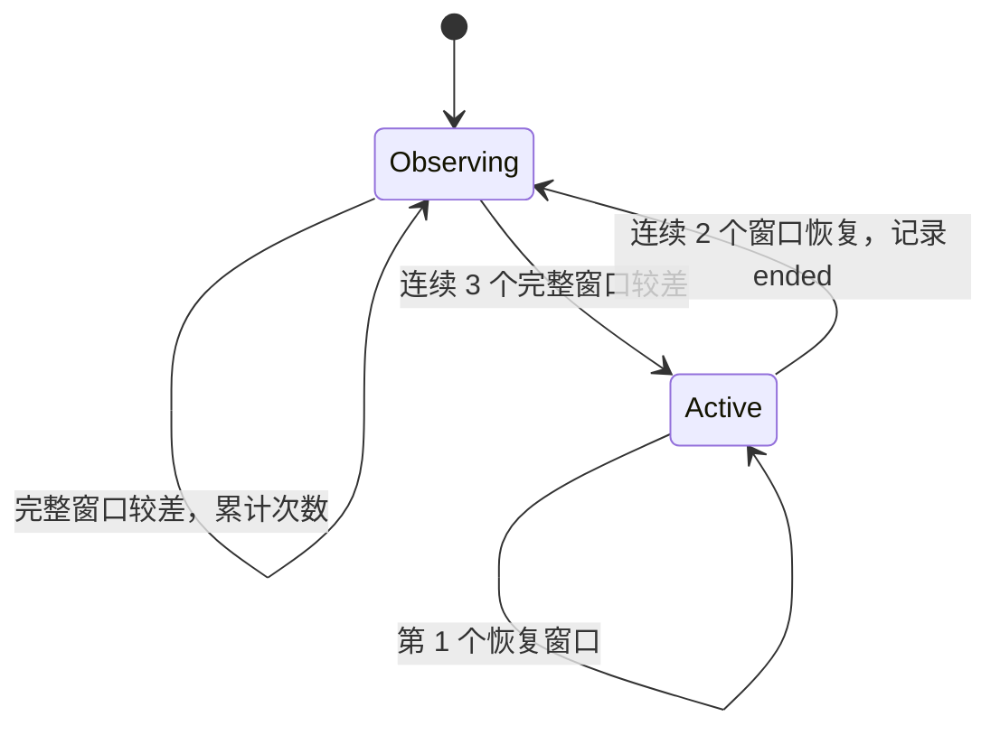
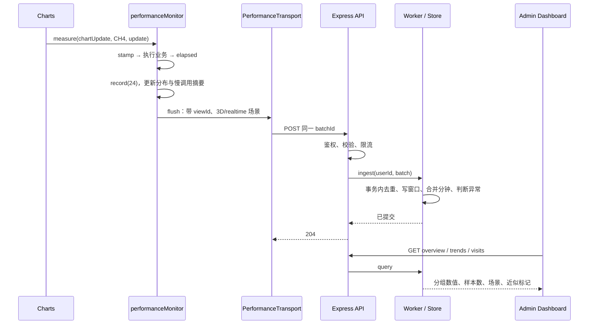

# 前端性能监控平台设计：埋点、公共模块、上报、存储与统计

- [1. 系统分层与完整数据链路](#1-系统分层与完整数据链路)
- [2. 从问题到指标字典](#2-从问题到指标字典)
- [3. 公共模块的边界与依赖方向](#3-公共模块的边界与依赖方向)
- [4. 访问标识、时钟与路由生命周期](#4-访问标识时钟与路由生命周期)
- [5. 文档指标、页面指标与隐藏恢复](#5-文档指标页面指标与隐藏恢复)
- [6. 三种数据采集方式](#6-三种数据采集方式)
- [7. 同步计时、异步计时与失败隔离](#7-同步计时异步计时与失败隔离)
- [8. 页面、图表、地图与实时链路的埋点分工](#8-页面图表地图与实时链路的埋点分工)
- [9. 业务首屏就绪与绘制信号](#9-业务首屏就绪与绘制信号)
- [10. 指标汇总、批次结构与数据最小化](#10-指标汇总批次结构与数据最小化)
- [11. 上报传输与重试状态机](#11-上报传输与重试状态机)
- [12. 服务端接收、鉴权与有界 Worker](#12-服务端接收鉴权与有界-worker)
- [13. SQLite 存储模型与幂等更新](#13-sqlite-存储模型与幂等更新)
- [14. 统计口径：分布、分位数、加权与覆盖](#14-统计口径分布分位数加权与覆盖)
- [15. 异常状态机与后台解释](#15-异常状态机与后台解释)
- [16. 新增组件与指标的接入方法](#16-新增组件与指标的接入方法)
- [17. 扩展到多个页面与可插拔采集器](#17-扩展到多个页面与可插拔采集器)
- [18. 一次慢图表更新如何出现在后台](#18-一次慢图表更新如何出现在后台)
- [19. 验证设计与工程边界](#19-验证设计与工程边界)
- [20. 参考文献](#20-参考文献)

## 1. 系统分层与完整数据链路

前端性能监控把页面运行过程转换成可比较的测量结果。一次测量需要同时回答：测量什么、发生在哪次访问、属于哪个场景、从哪里开始计时、到哪里结束，以及这个结果能否参与统计。

当前项目使用 Vue 2、Vue Router 3、ECharts、OpenLayers、Cesium、Express 和 SQLite。采集范围是登录后的数据可视化页面，包含实时、历史、初始加载和补发阶段；管理员通过 /#/admin/performance 查看结果。



业务页面、采集模块和后台展示承担不同责任。业务代码提供测量边界；采集模块管理统一规则；服务端持久化并合并统计；后台解释结果。图表组件无需知道上报 URL、重试次数或数据库表名，服务端也无需知道某个 Vue 组件如何生成 ECharts 配置。

### 【埋点、指标、事件与场景】

| 概念 | 含义 | 项目中的例子 |
|---|---|---|
| 埋点 | 在可观察位置加入计时、计数或事件记录 | 包裹图表 updateOptions、接收 WebSocket 消息时打时间戳 |
| 指标 | 可以聚合的数值测量 | 一次更新 12 ms；接收 20 个点；一次 FPS 采样为 48 |
| 事件 | 具有时间顺序的离散事实 | 进入页面、连接成功、切换地图、断开连接 |
| 场景维度 | 解释和分组指标的背景 | 2D/3D、实时/历史、数据量档位、浏览器、设备 |
| 访问 | 用户一次进入受监控页面的过程 | 本次进入产生一个 viewId |
| 测量跨度 | 从某个起点到终点的时间范围 | 发起请求到刷新重试后的最终响应 |
| 采样窗口 | 汇总一段运行过程的时间边界 | 常规 10 秒窗口、独立的约 5 秒 FPS 窗口 |

同一个“12 ms”，如果缺少指标名，就无法判断它是图表更新、地图更新还是请求耗时；缺少场景，就无法比较 2D 与 3D；缺少访问标识，就无法把慢调用与断线恢复放进同一条时间线。

> 性能埋点的基本单元是“有定义、有边界、有上下文的测量”，而不只是一个 console.log 或 performance.now()。

## 2. 从问题到指标字典

### 【先确定测量终点，再确定指标名称】

| 业务问题 | 起点与终点 | 采集方式 | 解释边界 |
|---|---|---|---|
| 用户何时看到主要内容 | 浏览器定义的文档加载过程 | web-vitals | Canvas/WebGL 业务数据可能不在 LCP 中体现 |
| 页面持续运行是否卡顿 | 一段有效前台观察窗口 | rAF、事件循环延迟、LoAF | FPS 是调度估算，不能单独定位到地图 |
| 图表更新为什么慢 | updateOptions 开始至同步返回 | measure | 包含数据整理、配置生成和同步更新 |
| 数据是否积压 | 入队至实际消费 | 时间戳与队列观察回调 | 排队时间与处理时间分开 |
| 接口让页面等了多久 | 首次请求至最终成功或失败 | Axios 拦截器 | 包括鉴权刷新和重试等待 |
| 业务首屏何时就绪 | 路由导航开始至必要组件发出绘制信号 | 数据状态与引擎事件协作 | 不等同于 mounted 或接口返回 |

LCP（Largest Contentful Paint）、INP（Interaction to Next Paint）、CLS（Cumulative Layout Shift）采用公开 Web Vitals 的定义和分级；以第 75 百分位判断整体体验时，桌面与移动设备分开。常用良好边界分别是 2.5 秒、200 ms、0.1。项目的图表耗时、队列等待和业务首屏目标属于工程预算。[[1]](https://web.dev/articles/vitals)

### 【当前核心指标与阈值】

下表整理共享字典中的现行范围。标准指标使用“良好”，项目预算表示初始工程目标；中间区间统一为待优化，缺失值不评级。

| 指标名称 | 聚合口径 | 良好 / 工程目标 | 待优化 | 较差 |
|---|---|---|---|---|
| LCP（Largest Contentful Paint） | P75 | ≤ 2500 ms | >2500～4000 ms | >4000 ms |
| INP（Interaction to Next Paint） | P75 | ≤ 200 ms | >200～500 ms | >500 ms |
| CLS（Cumulative Layout Shift） | P75 | ≤ 0.1 | >0.1～0.25 | >0.25 |
| FCP（First Contentful Paint） | P75 | ≤ 1800 ms | >1800～3000 ms | >3000 ms |
| TTFB（Time to First Byte） | P75，指导性范围 | ≤ 800 ms | >800～1800 ms | >1800 ms |
| FPS（Frames Per Second） | rAF 窗口估算，按时长加权 | ≥ 55，60 Hz 档位 | 30～<55 | <30 |
| ELD（Event Loop Delay） | P95 | ≤ 20 ms | >20～100 ms | >100 ms |
| LoAF-BR（Long Animation Frame Blocking Ratio） | 有效时长内阻塞比例 | ≤ 1% | >1%～5% | >5% |
| CUT（Chart Update Time） | 分组件 P95 | ≤ 8 ms | >8～16.7 ms | >16.7 ms |
| MUT（Map Update Time） | 分地图 P95 | ≤ 8 ms | >8～16.7 ms | >16.7 ms |
| RAT（Receive-to-Apply Time） | P95 | ≤ 100 ms | >100～500 ms | >500 ms |
| QWT（Queue Waiting Time） | P95 | ≤ 50 ms | >50～200 ms | >200 ms |
| WS-RTT（WebSocket Round-Trip Time） | P95 | ≤ 100 ms | >100～300 ms | >300 ms |
| API-RT（Application Programming Interface Response Time） | 分接口 P95 | ≤ 300 ms | >300～1000 ms | >1000 ms |
| BRT（Business Ready Time） | P75，按地图使用阈值 | 2D ≤2000 ms；3D ≤3000 ms | 2D >2000～5000 ms；3D >3000～8000 ms | 2D >5000 ms；3D >8000 ms |

FPS 的其他参考档位使用约 92% 作为良好线、50% 作为较差线；参考 Hz 由显式配置提供，不根据繁忙页面的低 FPS 反推设备刷新率。BRT 虽定义 3D 阈值，当前默认 2D 入口切换到 3D 会取消原首屏任务，不自动生成 3D 首屏样本。

吞吐量、队列长度、对象数量、重连、堆内存与慢资源作为诊断数据。它们需要结合场景、基线和趋势解释，不能仅因数值大就判定异常。

### 【稳定的采集键与可修改的展示名称】

共享字典位于 [performance.ts](F:/CX_notes/cx-learn-notes/qhzhc-realtime-platform/QHZHC_Server/src/shared/performance.ts:18)，同时供前端与服务端使用。以图表更新为例：

```ts
// 当前字段结构：采集键用于协议，title 用于显示。
{
  name: "chartUpdate",
  title: "CUT（Chart Update Time）",
  unit: "ms",
  reason: "定位配置生成和更新调用",
  method: "updateOptions 全调用 P95；非完整绘制时间",
  good: 8,
  poor: 16.7,
  source: "项目初始工程目标；桌面前台可见，按场景和版本校准"
}
```

name 保持稳定，改为英文全称或中文解释时只修改 title。否则旧数据可能无法与新数据关联，服务端白名单也可能拒绝上报。

阈值版本与数据结构版本分别使用 thresholdVersion 和 schemaVersion。调整展示名称不改变测量口径；改变单位、边界或统计方式，则需要版本化迁移。当前接收端要求阈值版本严格等于当前版本，尚未实现多个阈值版本同时接收。

**<u>同样使用 ms，并不意味着不同指标可以直接比较。</u>** 8 ms 的图表调用预算与 300 ms 的接口等待预算衡量不同工作。新增指标必须一并定义单位、适用场景、统计函数、缺失语义和是否参与异常判定。

## 3. 公共模块的边界与依赖方向

### 【performanceMonitor 是共享实例】

[monitor.ts](F:/CX_notes/cx-learn-notes/qhzhc-realtime-platform/QHZHC_Web/src/services/performance/monitor.ts:541) 导出类与实例：

```ts
export class PerformanceMonitor {
  // 生命周期、采集、计时、汇总与场景管理
}

export const performanceMonitor = new PerformanceMonitor();
```

业务模块统一导入：

```ts
import { performanceMonitor } from "@/services/performance/monitor";
```

同一页面应用中的这些导入共享同一个实例。每个浏览器标签页仍有自己的 JavaScript 运行环境，不会与其他标签页共用同一块内存。

当前公共能力采用服务模块封装，不需要挂在 Vue.prototype 上，也不要求所有图表继承某个基类。Vue 组件、WebSocket 类、普通 TypeScript 工具和请求拦截器都通过显式导入使用同一套接口。

### 【各层负责的内容】

| 模块 | 输入 | 输出与责任 |
|---|---|---|
| [monitor.ts](F:/CX_notes/cx-learn-notes/qhzhc-realtime-platform/QHZHC_Web/src/services/performance/monitor.ts:40) | 浏览器性能数据、业务调用 | 访问状态、场景、指标分布、上报批次 |
| [transport.ts](F:/CX_notes/cx-learn-notes/qhzhc-realtime-platform/QHZHC_Web/src/services/performance/transport.ts:8) | PerformanceBatch | HTTP 上报、鉴权、重试和丢弃计数 |
| [shared/performance.ts](F:/CX_notes/cx-learn-notes/qhzhc-realtime-platform/QHZHC_Server/src/shared/performance.ts:18) | 指标定义与数值样本 | 数据契约、阈值、直方图及分位数函数 |
| [request.ts](F:/CX_notes/cx-learn-notes/qhzhc-realtime-platform/QHZHC_Web/src/utils/request.ts:15) | 业务 Axios 请求及响应 | 逻辑请求耗时、尝试、失败和取消 |
| [routes.ts](F:/CX_notes/cx-learn-notes/qhzhc-realtime-platform/QHZHC_Server/src/server/performance/routes.ts:203) | 上报与查询请求 | 权限、格式、限流与 HTTP 状态 |
| [service.ts](F:/CX_notes/cx-learn-notes/qhzhc-realtime-platform/QHZHC_Server/src/server/performance/service.ts:48) | 写入或查询命令 | 主线程与 Worker 之间的有界 RPC |
| [worker.ts](F:/CX_notes/cx-learn-notes/qhzhc-realtime-platform/QHZHC_Server/src/server/performance/worker.ts:7) | 带请求编号的消息 | 调用存储并返回结果 |
| [store.ts](F:/CX_notes/cx-learn-notes/qhzhc-realtime-platform/QHZHC_Server/src/server/performance/store.ts:17) | 已验证批次、查询条件 | SQLite 持久化、聚合、异常与清理 |
| [performanceAdmin.vue](F:/CX_notes/cx-learn-notes/qhzhc-realtime-platform/QHZHC_Web/src/views/Admin/performanceAdmin.vue:533) | 管理员接口响应 | 指标卡、趋势、说明、访问和异常展示 |

依赖方向为：业务调用采集接口；采集层依赖协议与传输；传输层依赖注入的鉴权能力；服务端依赖同一协议。采集模块没有反向导入图表组件、路由实例或请求实例。

### 【通过依赖注入解除循环依赖】

[main.ts](F:/CX_notes/cx-learn-notes/qhzhc-realtime-platform/QHZHC_Web/src/main.ts:26) 在创建 Vue 根实例前配置：

```ts
performanceMonitor.configure(
  {
    url: () => resolveApiBaseUrl() + "/api/performance/batches",
    token: () => accessTokenManager.getAccessToken(),
    refresh: () => accessTokenManager.refreshAccessToken()
  },
  process.env.VUE_APP_PERFORMANCE_ENABLED !== "false"
);
```

url、token 和 refresh 采用函数注入。每次发送都读取当前 token，避免长期持有过期凭证；测试也能注入假的 fetch。监控模块不必直接依赖 Axios，因此不会形成“请求拦截器引用监控，监控又引用请求拦截器”的循环。

### 【公共接口的语义】

| 接口 | 适用场景 | 关键约束 |
|---|---|---|
| configure | 应用启动时配置依赖与开关 | 文档级观察器只初始化一次 |
| startView / endView | 页面访问进入与结束 | 由页面生命周期拥有者统一调用 |
| measure | 同步函数调用 | 不自动等待 Promise |
| stamp / elapsed | 跨回调、跨请求计时 | 校验 viewId 与 epoch，过期样本返回 null |
| record | 提交数值样本 | 指标名已注册，值有限且非负 |
| event | 记录阶段事件 | 时间线事件有数量限制 |
| setContext | 地图或业务阶段变化 | 先提交旧窗口，再替换上下文 |
| dataAvailable / dataFailed | 首批业务数据状态 | 空数据、失败与成功分开 |
| rendered / skipHidden | 业务首屏的组件完成条件 | 依赖版本号和组件标识 |
| flush | 封装当前窗口 | 入队不等于服务器已持久化 |

组件销毁时应清理自己注册的事件，而不应随意调用全局 endView()。如果一个图表销毁就结束整个页面访问，其余图表和地图的指标也会一起停止。

## 4. 访问标识、时钟与路由生命周期

### 【不同标识对应不同边界】

| 字段 | 生命周期与用途 |
|---|---|
| sessionId | 当前标签页 sessionStorage 中的会话标识，刷新后可以延续 |
| documentId | 当前文档监控标识；BFCache 恢复时按项目策略重新生成 |
| viewId | 一次受监控页面访问；普通 2D/3D 切换沿用该访问 |
| batchId | 一次待发送批次；重试使用同一编号 |
| metricId | web-vitals 某项指标的标识；同一指标更新保持关联 |
| version | 同一 metricId 的递增版本，服务端只接受更新值 |
| epoch | 客户端有效计时阶段的代号，不作为上报字段 |

耗时使用 performance.now()，事件时间和查询区间使用 Date.now()。performance.now() 使用单调时钟，避免系统时间调整直接影响耗时相减。[[2]](https://developer.mozilla.org/en-US/docs/Web/API/Performance/now)

不能用服务端 Date.now() 减客户端 Date.now() 直接推导单向网络耗时；两端时钟可能不同步。RTT 在同一客户端时钟上配对起终点。

### 【beforeEach 记录导航起点，afterEach 确认访问归属】

导航起点需要包含鉴权等待和页面准备过程，因此在 beforeEach 记录。访问归属必须等到导航真正确认之后，再在 afterEach 开始。Vue Router 3 的 afterEach 位于导航确认之后、DOM 更新之前，不负责取消或重定向导航。[[3]](https://v3.router.vuejs.org/guide/advanced/navigation-guards.html)

关键代码在 [router/index.ts](F:/CX_notes/cx-learn-notes/qhzhc-realtime-platform/QHZHC_Web/src/router/index.ts:92)。下面省略鉴权细节，保留实际的监控调用顺序：

```ts
// 当前路由流程的等价伪代码。
// checkExistingRoutePermissions 代指项目现有鉴权，并非新增的实际函数。
let performanceNavigationStart = 0;

router.beforeEach(async (to, from, next) => {
  performanceNavigationStart = performance.now();
  try {
    await checkExistingRoutePermissions(to);
    next();
  } catch {
    next({ path: "/login", query: { redirect: to.fullPath } });
  }
});

router.afterEach((to, from) => {
  performanceMonitor.noteRoute(to.path);

  if (from.path === "/dataVisualization" && to.path !== from.path) {
    performanceMonitor.endView();
  }
  if (to.path === "/dataVisualization" && from.path !== to.path) {
    performanceMonitor.startView(performanceNavigationStart);
  }
});
```

如果在 beforeEach 直接 startView()，导航可能随后失败、取消或跳转登录页，产生不存在的业务访问。如果在每个图表 mounted 中 startView()，一次访问可能被多个组件反复触发，组件挂载顺序也会污染访问开始时间。

当前实现比较 path。查询参数变化、同路径内切换地图或业务模式不会自动新建访问。对于“同路径不同参数代表不同业务页面”的系统，需要另外定义访问键。

### 【startView 建立访问状态】

[startView](F:/CX_notes/cx-learn-notes/qhzhc-realtime-platform/QHZHC_Web/src/services/performance/monitor.ts:168) 的核心状态变化如下：

```ts
// 当前实现的职责伪代码；缺失原因等初始化分支合并表示。
startView(navigationStartedAt = performance.now()) {
  if (!enabled || active) return;     // 防止重复启动
  active = true;
  viewId = createId();
  epoch += 1;

  viewStart = navigationStartedAt;
  eligible = initialRoute === "#/dataVisualization" && !mixed;
  context = { ...context, mapType: "2d", mode: "initial", dataSize: "small" };

  initializeMissingReasons(eligible, capabilities);
  resetWindowClock();
  event("view-enter");
  beginReady(navigationStartedAt);   // 创建首屏依赖任务

  if (document.visibilityState !== "hidden") startSampling();
}
```

startView 创建采集状态；后续 flush 才生成批次。标准 Web Vitals 观察器在应用启动时已注册，可保存早期指标，但是否上报由访问资格控制。

### 【endView 先封口，再清理】

[endView](F:/CX_notes/cx-learn-notes/qhzhc-realtime-platform/QHZHC_Web/src/services/performance/monitor.ts:194) 的顺序具有业务含义：

```ts
// 当前实现的关键顺序；辅助动作使用职责名称表示。
endView(mixed = true) {
  if (!active) return;
  if (mixed) {
    markDocumentAsMixed();
    event("view-leave");
  }

  cancelReady("cancelled");
  flush(true);                       // active 仍为 true，提交最后一批
  stopSampling();
  active = false;
  epoch += 1;                        // 让旧计时跨度失效
  clearPendingMetricsAndEvents();
  viewId = "";
}
```

如果先 active=false，再调用依赖 active 的 flush，最后一批数据可能被跳过。logout 也要在清除 token 之前结束访问，使退出批次仍有机会携带有效凭证。

endView 不销毁整个文档的 Web Vitals 观察器。文档级观察器与页面级主动采样使用不同生命周期，再次进入页面不会重复注册标准指标观察器。

## 5. 文档指标、页面指标与隐藏恢复

### 【标准 Web Vitals 的文档归属】

web-vitals 管理标准指标的生命周期、回调更新和 BFCache 恢复。同一指标可能多次报告，无交互访问也可能没有 INP；不应把每次回调当成一个新访问，也不应在每次路由进入时反复注册观察器。[[4]](https://github.com/GoogleChrome/web-vitals)

[onVital](F:/CX_notes/cx-learn-notes/qhzhc-realtime-platform/QHZHC_Web/src/services/performance/monitor.ts:145) 把最新值缓存为 metricId + version，flush 时发送尚未发送的版本。

| 导航情况 | 当前标准指标处理 | 业务运行指标 |
|---|---|---|
| 直接打开或刷新可视化页，鉴权通过 | 可形成纯可视化文档样本 | 正常采集 |
| 登录页经 SPA 导航进入可视化页 | 标准指标不适用 | 正常采集，使用业务首屏任务 |
| 首次请求可视化页，被重定向至登录页 | 文档标记为混合路由，不借用登录页指标 | 登录后开始业务访问 |
| 可视化页离开到其他路由 | 同文档访问标记 mixed | 结束当前业务访问 |
| BFCache 恢复 | 新建监控 documentId/viewId，库提供新的标准指标 | 恢复采样，记录缓存恢复事件 |

当前没有开启软导航 Web Vitals，也没有对 SPA 进入的 INP/CLS 独立分段。以后引入软导航指标时，需要单独定义口径和分组。

### 【epoch 防止旧任务污染新访问】

[stamp/elapsed](F:/CX_notes/cx-learn-notes/qhzhc-realtime-platform/QHZHC_Web/src/services/performance/monitor.ts:215) 在异步操作中校验有效性：

```ts
// 与当前实现等价：展开 metricNow()，省略类型标注。
stamp() {
  return { at: performance.now(), epoch: this.epoch, view: this.view };
}

elapsed(stamp) {
  return this.isActive
    && stamp.view === this.view
    && stamp.epoch === this.epoch
      ? performance.now() - stamp.at
      : null;
}
```

请求 A 在可视化页面发出，用户切到管理员页面后请求才返回，view 或 active 已变；标签页隐藏再恢复，epoch 也已变。旧请求耗时不会计入新的有效阶段。

null 表示测量失效，不能改为 0。0 ms 会被当成极快的合法样本，反而抬高达标率。

### 【暂停采样与恢复采样】

页面隐藏：flush 当前窗口 → 停止 rAF、计时器和业务观察器 → epoch 增加 → 取消未完成首屏任务。恢复可见：epoch 增加 → 重新建立窗口并启动采样。

当前 record 依赖 isActive，因此隐藏时不收集数值；event 主要受 active 和数量上限约束，可以保留部分生命周期事实。二者不是完全相同的隐藏策略。

[stopSampling](F:/CX_notes/cx-learn-notes/qhzhc-realtime-platform/QHZHC_Web/src/services/performance/monitor.ts:499) 集中取消定时器、rAF 和 PerformanceObserver。全局 visibilitychange/pagehide/pageshow 监听由 configure 的 booted 标记限制为一次注册；组件自己的绘制事件由组件负责解绑。

## 6. 三种数据采集方式

### 【浏览器自动采集】

[startSampling](F:/CX_notes/cx-learn-notes/qhzhc-realtime-platform/QHZHC_Web/src/services/performance/monitor.ts:413) 与 [configure](F:/CX_notes/cx-learn-notes/qhzhc-realtime-platform/QHZHC_Web/src/services/performance/monitor.ts:83) 管理浏览器可以统一提供的数据：

| 数据 | 采集来源 | 主要处理 |
|---|---|---|
| LCP、INP、CLS、FCP、TTFB | web-vitals | 文档资格、最新版本与缺失原因 |
| FPS（Frames Per Second） | requestAnimationFrame | 约 5 秒采样，记录实际时长 |
| ELD（Event Loop Delay） | 100 ms 自重置定时器 | 实际延迟减去预期 100 ms |
| LoAF-BR（Long Animation Frame Blocking Ratio） | long-animation-frame | 阻塞时长与有效观察时长之比 |
| LTD（Long Task Duration） | longtask | 单独诊断，不与 LoAF 相加 |
| JSHU（JavaScript Heap Usage） | 浏览器支持时的堆内存接口 | 30 秒采样；不单凭上涨判定泄漏 |
| RLT（Resource Load Time） | resource entries | 慢资源路径和耗时，移除 URL 参数 |

[sampleFps](F:/CX_notes/cx-learn-notes/qhzhc-realtime-platform/QHZHC_Web/src/services/performance/monitor.ts:469) 的简化逻辑为：

```ts
// 采样伪代码：首个回调建立起点，后续回调形成帧间隔。
function sampleFps() {
  cancelPreviousFpsSample();
  let first: number | null = null;
  let frames = 0;
  const sampleEpoch = epoch;

  function frame(now: number) {
    if (!isActive || sampleEpoch !== epoch) return;
    if (first === null) first = now;
    else frames++;

    const elapsedMs = now - first;
    if (elapsedMs >= 5000) {
      record("fps", frames / elapsedMs * 1000);
      attachObservationDuration(elapsedMs);
      return;
    }
    fpsHandle = requestAnimationFrame(frame);
  }
  fpsHandle = requestAnimationFrame(frame);
}
```

rAF 是一次性调度，需要在回调中继续申请；频率受设备刷新节奏和页面状态影响，后台标签页通常会暂停回调。测量使用实际时长，不假设必然执行满 60 帧。[[5]](https://developer.mozilla.org/en-US/docs/Web/API/Window/requestAnimationFrame)

ELD 每次以新的时刻作为起点。假设一次回调在 180 ms 后到达，这次延迟为 80 ms；下一次不继续累计上一次的 80 ms。

LoAF 使用 blockingDuration，而不把整帧 duration 全部当成阻塞。窗口阻塞比例为 ΣblockingDuration / activeMs × 100%。[[6]](https://w3c.github.io/long-animation-frames/) 当前按与窗口的重叠时间近似分摊跨边界帧，并把比例限制在 100 以内；这种截断无法恢复浏览器尚未交付的历史片段，结果保留近似解释。

### 【业务显式埋点】

浏览器无法自动识别“CH₄ 配置生成”“历史结果消费”“地图要素更新”的含义，业务代码需要提供命名和边界。优先在已有方法入口计时，一次记录批量处理数量，避免给每个数据点都建立独立上报请求。

```ts
// 组件侧接入示意；指标名取自现有字典。
performanceMonitor.record("chartCount", 1, this.chartName);
performanceMonitor.record("points", points.length, this.chartName);

return performanceMonitor.measure("chartUpdate", this.chartName, () => {
  const options = performanceMonitor.measure(
    "chartConfig", this.chartName, () => getChart(chartInput)
  );
  performanceMonitor.measure(
    "chartSetOption", this.chartName,
    () => this.chart.setOption(options, { notMerge: true, lazyUpdate: false })
  );
  this.chart.resize();
});
```

外层 chartUpdate 已包含内层阶段，统计总成本时不能把外层与内层再次相加。配置生成、setOption 和 resize 的同步结束也不代表浏览器已经将所有像素呈现到屏幕。

### 【在统一接入点采集】

HTTP 请求经过同一个 Axios 实例，在请求与响应拦截器统一采集。业务页面只调用 request.get/post，无需每个接口重复计时和分类。

统一拦截的边界是“经过这个实例的请求”。原生 fetch、其他 Axios 实例或第三方库内部请求需要额外适配。监控上报使用独立 fetch，主动避开业务请求统计，防止监控请求不断生成新的监控请求。

## 7. 同步计时、异步计时与失败隔离

### 【measure 保持业务返回路径】

[measure](F:/CX_notes/cx-learn-notes/qhzhc-realtime-platform/QHZHC_Web/src/services/performance/monitor.ts:223) 使用泛型保留返回类型，用 finally 记录同步耗时：

```ts
// 当前实现；只整理排版。
measure<T>(name: string, component: string, fn: () => T): T {
  if (!this.isActive) return fn();

  const stamp = this.stamp();
  try {
    return fn();
  } finally {
    const value = this.elapsed(stamp);
    if (value !== null) this.record(name, value, component);
  }
}
```

关闭监控时仍然执行 fn，因此监控开关不会阻止业务函数运行。业务抛错时仍经过 finally，再由原有调用链处理异常。

**<u>当前代码的这一保证依赖采集操作本身没有抛出异常。</u>** measure 内的 record 尚未由独立的故障隔离层保护。把它提取为通用 SDK 时，必须捕获监控内部异常，避免覆盖业务原本的返回值或异常；不能用一个包住整个业务函数的 catch 把业务错误也吞掉。

```ts
// 通用 SDK 的增强伪代码，当前源码尚未整体实现此隔离层。
function safelyCollect(action: () => void) {
  try {
    action();
  } catch {
    // 只处理采集失败，不弹业务错误提示，不影响原业务调用。
  }
}

function measure<T>(name: string, component: string, fn: () => T): T {
  if (!enabled) return fn();
  const start = performance.now();

  try {
    return fn();
  } finally {
    safelyCollect(() => record(name, performance.now() - start, component));
  }
}
```

### 【异步操作必须等到真正的终点】

```ts
// 这种写法只测到 Promise 被创建并返回的同步时间。
performanceMonitor.measure("apiDuration", "history", () => fetchHistory());
```

对于请求、等待队列或 worker 响应，使用时间戳跨越异步边界。下面展示手动计时模式，实际 Axios 请求已由拦截器统一处理，不要在同一次请求外再重复添加：

```ts
// 异步边界示意。
const stamp = performanceMonitor.stamp();

try {
  return await loadData();
} finally {
  const duration = performanceMonitor.elapsed(stamp);
  if (duration !== null) {
    performanceMonitor.record("apiDuration", duration, "/api/example");
  }
}
```

stamp 捕获访问与 epoch，确保离开页面、隐藏恢复后到达的旧响应不会误归属。若同一访问中组件已经销毁，还应由组件任务自身的取消标记阻止旧回调；全局 viewId 无法替代组件级任务管理。

### 【鉴权重试只产生一个逻辑请求结果】

[request.ts](F:/CX_notes/cx-learn-notes/qhzhc-realtime-platform/QHZHC_Web/src/utils/request.ts:15) 在首次请求时创建测量对象，每次实际尝试增加 attempts。请求完成后统一记录 apiDuration、apiAttempts、apiFailure 和 apiCancel。

[LogicalRequestMeasurement](F:/CX_notes/cx-learn-notes/qhzhc-realtime-platform/QHZHC_Web/src/services/httpAuth.ts:5) 使用类实例：

```ts
// 当前实现。
export class LogicalRequestMeasurement {
  attempts = 0;
  done = false;

  constructor(
    public stamp: { at: number; epoch: number; view: string },
    public component: string
  ) {}
}
```

当前 Axios 配置合并会复制普通对象；使用类实例使重试前后的配置保留同一个测量对象身份。否则原请求和重试请求可能各持有一份 done=false，导致一次用户操作被记录两遍。

```ts
// 请求与响应拦截器的关键流程伪代码。
function beforeRequest(config) {
  if (performanceMonitor.isActive && isBusinessRequest(config)) {
    config._performance ??= new LogicalRequestMeasurement(
      performanceMonitor.stamp(),
      stripQuery(config.url)
    );
    config._performance.attempts += 1;
  }
  return attachCurrentToken(config);
}

function finishRequest(config, failed = false, cancelled = false) {
  const p = config?._performance;
  if (!p || p.done) return;
  p.done = true;                     // 重试调用链中的其他出口不再重复结算

  const ms = performanceMonitor.elapsed(p.stamp);
  if (ms === null) return;
  performanceMonitor.record("apiDuration", ms, p.component);
  performanceMonitor.record("apiAttempts", p.attempts, p.component);
  performanceMonitor.record("apiFailure", failed && !cancelled ? 1 : 0, p.component);
  performanceMonitor.record("apiCancel", cancelled ? 1 : 0, p.component);
}
```

一次典型请求：首次发起 → 401 → 刷新 token → 重试 → 成功。只记录一次总耗时，attempts=2；刷新 token 的等待包含在总耗时中。若最终鉴权失败，先结算请求，再清除身份并跳转登录，否则跳转后 elapsed 可能已经失效。

## 8. 页面、图表、地图与实时链路的埋点分工

### 【页面提供场景，组件提供局部测量】

页面知道当前展示 2D 还是 3D、实时还是历史；图表知道自身的 chartName、数据量和更新方法；队列知道入队和出队位置。把这些事实放在最接近它的模块中，公共采集层只接收标准化结果。

| 接入位置 | 当前职责 | 不应承担的职责 |
|---|---|---|
| 路由 | 开始和结束访问 | 给每个图表重复启动采样器 |
| 可视化页面 | 地图/模式切换、数据量、首批数据状态 | 直接拼 HTTP 上报请求 |
| Charts.vue | 整体更新与子阶段耗时、绘制信号 | 自行维护另一个全局 viewId |
| 2D/3D 地图 | 地图更新、对象数、引擎绘制信号 | 将同步更新返回当作 GPU 完成 |
| RealtimeClient | 消息到达、排序、消费、断线、RTT | 根据两端 Date.now 相减得出单向时延 |
| FrameTelemetryQueue | 取数、回调与积压的观察回调 | 依赖业务后台的 HTTP 接口 |

### 【2D 与 3D 共用 FPS，地图更新各自计时】

[dataVisualization.vue](F:/CX_notes/cx-learn-notes/qhzhc-realtime-platform/QHZHC_Web/src/views/DataVisualization/dataVisualization.vue:642) 在切换地图时更新上下文：

```ts
performanceMonitor.setContext({ mapType: val === 2 ? "3d" : "2d" });
this.mapType = val;
```

[setContext](F:/CX_notes/cx-learn-notes/qhzhc-realtime-platform/QHZHC_Web/src/services/performance/monitor.ts:267) 先 flush 旧场景，然后替换上下文；地图变化时重新启动 FPS 采样。尚未完成的 FPS 窗口被取消，避免一个样本横跨 2D 与 3D。

当前 stamp 只保存访问和 epoch，不保存场景快照；setContext 也不会增加 epoch。同一访问中的异步请求跨越地图或模式切换后返回，会按结算时的场景记录。若需要保持起始场景，应为跨度保存上下文，或在场景切换时使旧跨度失效。

地图切换会重启 FPS 采样；仅切换 mode 或 dataSize 时，当前不会重新启动该采样，所以跨维度变化的 FPS 窗口也需要保留归属限制。

2D、3D 的 FPS 都是同一个页面级 rAF 采样器。3D 模式 FPS 降低，只能说明该模式下页面调度变慢，需要结合图表、地图、事件循环和长帧数据定位原因。

地图同步耗时则分别包裹真实更新入口：

```ts
// 两个不同组件中的接入示意，复用同一个公共计时方法。
performanceMonitor.measure("mapUpdate", "map:2d", () => {
  updateOpenLayersFeatures();
});

performanceMonitor.measure("mapUpdate", "map:3d", () => {
  updateCesiumEntities();
});
```

[PlanimetricMap.vue](F:/CX_notes/cx-learn-notes/qhzhc-realtime-platform/QHZHC_Web/src/views/DataVisualization/components/PlanimetricMap.vue:447) 与 [StereoscopicMap.vue](F:/CX_notes/cx-learn-notes/qhzhc-realtime-platform/QHZHC_Web/src/views/DataVisualization/components/StereoscopicMap.vue:384) 还分别记录地图对象数量。统计阶段通过 mapType 与 component 分组。

### 【实时数据链路的时间边界】

WebSocket 消息到达 → JSON 解析 → 顺序缓冲 → 帧队列入队 → rAF 取数 → 转换与状态应用 → Vue 更新 → 图表与地图更新。

这条链上应区分多个终点，不能用一个大耗时解释全部问题：

| 指标键 | 当前起终点或数值来源 |
|---|---|
| received | 消息中的 points.length |
| parse | 消息处理入口至解析、排序后的时刻 |
| queueWait | 已消费数据的队列等待 |
| queueTake | FrameTelemetryQueue 取出一个消费批次的同步成本 |
| queueCallback | onFrame 回调本身的同步成本 |
| consumed | 本次传给页面的点数 |
| receiveApply | 接收到 onPacket 同步处理返回 |
| queueLength / queueOldest | 消费之后仍排队的数据量与最老等待年龄 |
| wsRtt | 同一客户端发出 ping 至收到匹配 nonce 的 pong |

[RealtimeClient](F:/CX_notes/cx-learn-notes/qhzhc-realtime-platform/QHZHC_Web/src/views/DataVisualization/services/realtimeClient.ts:137) 以 WeakMap 把数据对象与接收时间关联，不往业务数据中添加需要上报的气体值或坐标。心跳通过一个有界 Map 保存 nonce 对应的本地时间戳。

[FrameTelemetryQueue](F:/CX_notes/cx-learn-notes/qhzhc-realtime-platform/QHZHC_Web/src/views/DataVisualization/services/FrameTelemetryQueue.ts:21) 用可选 onDrain 回调输出统计：

```ts
// 当前结构的使用示意；队列本身不导入监控服务。
new FrameTelemetryQueue(
  points => applyPoints(points),
  300,
  5,
  scheduler,
  stats => {
    performanceMonitor.record("queueTake", stats.takeMs);
    performanceMonitor.record("queueCallback", stats.callbackMs);
    performanceMonitor.record("queueLength", stats.pending);
    performanceMonitor.record("queueOldest", stats.oldestWaitMs);
  }
);
```

取数预算 5 ms 约束的是队列取出数据的循环，不包含后续页面、图表和地图更新。即使每次取数达标，onFrame 或随后的渲染仍可能耗时数百毫秒。

当前 receiveApply 的终点是同步状态应用回调返回，Vue DOM 更新和引擎绘制可能还没有发生。此外，当前 publishFrame 用消费批次最后一个点的 timing 代表该批次；如果一次消费混合了多个到达批次或补发与实时数据，这不是逐点等待时间分布。需要更精确时，应按原始批次或时间戳组分别计量，不能把现有结果描述成每个点的完整延迟。

## 9. 业务首屏就绪与绘制信号

### 【把就绪设计成依赖任务】

接口返回时数据可能还没有渲染；mounted 时图表也可能尚无业务数据。业务首屏就绪需要等待一组明确的依赖。

当前 [beginReady](F:/CX_notes/cx-learn-notes/qhzhc-realtime-platform/QHZHC_Web/src/services/performance/monitor.ts:299) 创建任务，包含五个图表及 map:2d，并以数据非空为前置条件。15 秒仍未完成时记录超时以及未完成组件。

```ts
// 当前首屏任务的结构伪代码。
ready = {
  version: nextReadyVersion(),
  start: navigationStartedAt,
  data: false,
  pending: new Set(["CH4", "CO2", "windspeed", "realTime", "iCH4", "map:2d"]),
  timeout: scheduleTimeout(15000)
};

function rendered(component, version, visible) {
  if (!active || !ready || !ready.data) return;
  if (version !== ready.version || !visible) return;

  ready.pending.delete(component);
  if (ready.pending.size === 0) {
    record("ready", performance.now() - ready.start);
    event("ready", "", "complete");
    cancelTimeout(ready.timeout);
    ready = null;
  }
}
```

空数据记录 no-data；加载失败记录 failed；有数据但未完成绘制记录 timeout；离开、隐藏或切换场景记录 cancelled。上述结果都不产生一个伪造的快速 ready 耗时。

### 【先监听，再触发更新】

2D 使用 OpenLayers 的 postrender，表示地图帧完成渲染阶段；3D 使用 Cesium scene.postRender，表示场景渲染后的事件。[[7]](https://openlayers.org/en/latest/apidoc/module-ol_Map-Map.html) [[8]](https://cesium.com/learn/cesiumjs/ref-doc/Scene.html)

```ts
// 地图接入的顺序示意：先注册，防止漏掉同步或紧接着发生的事件。
const version = performanceMonitor.renderVersion;

removePreviousRenderListener();
const remove = listenForNextEngineRender(() => {
  performanceMonitor.rendered(componentName, version);
  remove();
});

triggerBusinessUpdate();
```

[Charts.vue](F:/CX_notes/cx-learn-notes/qhzhc-realtime-platform/QHZHC_Web/src/views/DataVisualization/components/Charts.vue:102) 在触发 setOption 前注册 rendered 监听，并在同步调用的 finally 中解除。当前配合 lazyUpdate=false 工作；如果以后启用异步更新，这个清理时机可能早于绘制事件，需要改成“一次有效事件、超时或组件销毁时清理”。

当前 renderVersion 标识的是首屏任务版本，并非每次图表更新的独立版本。它可以隔离旧首屏任务，却不能区分同一首屏任务内每个业务更新。data 标记只证明已有非空数据，不是业务数据批次编号。如果新增任务要求严格配对某一次更新，应额外引入 updateId 或 dataVersion，并由更新适配器关联绘制信号，不能认为现有版本号已经覆盖全部更新。

### 【固定依赖集合的扩展边界】

现有 beginReady 固定等待五个图表和 2D 地图。隐藏图表通过 skipHidden 移出集合；当前该方法只删除依赖，不主动再判定任务是否完成，通用封装应让删除依赖与 rendered 共用完成检查。切换地图取消原首屏任务，不会自动创建一个新的 3D 路由首屏样本。

扩展到其他页面时，应由页面配置“首屏需要等待哪些组件”，由公共任务管理器处理版本、超时、取消和完成。否则增加一个页面就要修改公共模块内部的图表名称列表，公共层会逐渐被业务细节填满。

## 10. 指标汇总、批次结构与数据最小化

### 【record 只修改内存分布】

[record](F:/CX_notes/cx-learn-notes/qhzhc-realtime-platform/QHZHC_Web/src/services/performance/monitor.ts:233) 先检查采集是否有效、指标是否注册和值是否有限，再按指标名和组件建立分布：

```ts
// 当前实现的关键算法。
function record(name, value, component = "") {
  if (!isActive || !Number.isFinite(value) || value < 0) return;
  if (!DEFINITION_MAP.has(name)) return;

  const safeComponent = sanitizePerformancePath(component);
  const key = name + "|" + safeComponent;
  let metric = metrics.get(key);

  if (!metric) {
    if (metrics.size >= 80) return;
    metric = { name, component: safeComponent, distribution: emptyDistribution() };
    metrics.set(key, metric);
  }

  observe(metric.distribution, value);
}
```

每个分布包含 count、sum、max、bins。连续更新 100 次时，公共层只增加这些计数，而不保留 100 份完整的业务对象。

当前每个窗口最多 80 个普通指标与组件组合，最多 30 条事件，慢调用摘要最多 10 条。超过组合数上限的样本会被忽略；这一丢弃当前没有单独累计到 dropped，不能把 dropped 当作所有采样损失的完整统计。

### 【flush 固化上下文快照】

[flush](F:/CX_notes/cx-learn-notes/qhzhc-realtime-platform/QHZHC_Web/src/services/performance/monitor.ts:348) 把本窗口数据转为批次，并清空窗口状态：

```ts
// 批次结构示意；数值与标识为说明用样本，并非可直接提交的完整有效报文。
{
  schemaVersion: 1,
  thresholdVersion: "2026-09-07.1",
  batchId: "batch-example",
  sessionId: "session-example",
  documentId: "document-example",
  viewId: "view-example",
  release: "release-example",
  environment: "production",
  context: {
    mapType: "3d",
    mode: "realtime",
    dataSize: "full",
    browser: "Chrome/152",
    device: "desktop",
    viewport: "large",
    referenceHz: 60
  },
  startedAt: windowStartEpochMs,
  endedAt: windowEndEpochMs,
  activeMs: actualVisibleObservationMs,
  complete: actualVisibleObservationMs >= 9500,
  metrics: [
    { name: "chartUpdate", component: "CH4", distribution },
    { name: "fps", component: "", distribution: fpsDistribution,
      durationMs: fpsObservationMs, complete: true }
  ],
  capabilities,
  missing,
  events,
  dropped
}
```

context 在 flush 时复制。场景变化先 flush 旧窗口，再写入新场景，使已完成样本按旧场景提交。常规窗口与 FPS 窗口有独立时长，不能拿整个 10 秒上报间隔代替 FPS 的实际观察时长。

viewId 不等于 batchId：一次访问可以产生很多批次；一个批次重试多次仍使用原 batchId。事件的绝对时间用于时间线，durationMs 用于测量分母。

### 【只上传诊断所需信息】

上报保存指标、组件标识、时间、数量和粗粒度场景，不上传气体数值、坐标、DOM 文本、请求正文或 token。服务端根据 Bearer 鉴权确定用户身份。

[sanitizePerformancePath](F:/CX_notes/cx-learn-notes/qhzhc-realtime-platform/QHZHC_Web/src/services/performance/monitor.ts:16) 去除 query/hash，屏蔽路径里的数字段和类似查询参数的片段，并截断长度。有些地图服务会把 x/y/z 放进路径而不是 URL.search，所以仅删除问号后的字符串不够。

组件标识采用稳定的低基数名称，例如 CH4、map:2d、order-table。不要把订单号、设备编号、用户输入或每次生成的随机 ID 拼到组件名里；这既可能包含敏感内容，也会使分组数迅速膨胀。

## 11. 上报传输与重试状态机

### 【采集层只交付批次，传输层负责发送】

[PerformanceTransport](F:/CX_notes/cx-learn-notes/qhzhc-realtime-platform/QHZHC_Web/src/services/performance/transport.ts:8) 不负责解释指标，也不决定阈值，只接收已经形成的 PerformanceBatch。它使用独立 fetch，不经过业务 Axios 拦截器，避免把“监控上传请求”再次采集成“业务接口耗时”。



队列把 batch、attempts、refreshed、terminal 放在一起。重试复用原批次与 batchId，服务端才能识别重复发送。token 在每次发送时读取，不长期保存在批次中。

| 约束 | 当前实现 | 设计作用 |
|---|---|---|
| 单批体积 | JSON 的 UTF-8 字节数不超过 32768 | 控制传输和解析成本 |
| 客户端队列 | 最多 20 批 | 断网时限制内存增长 |
| 在途请求 | 1 个 | 控制并发，简化重试顺序 |
| 队列满 | 优先丢弃最旧等待批次，保留正在发送的队首 | 保持请求与队列项对应 |
| 请求超时 | 8 秒后 AbortController.abort | 避免一个请求永久占用队列 |
| 普通网络错误、5xx | 最多额外重试 2 次，等待 2 秒、5 秒 | 短暂故障后尝试恢复 |
| 普通 401 | 调用已有刷新流程一次 | 复用身份体系 |
| 429 | 最多额外重试 2 次，解析 Retry-After | 遵守服务端限流 |
| 退出阶段 | keepalive；不刷新 token，不重试网络错误与 5xx | 尽量提交且不阻塞导航 |

429 与网络错误、5xx 共用 attempts 计数。当前 429 分支也会为 terminal 批次安排重试，但页面离开后定时器不保证继续运行，不能把它视为退出上报保障。

### 【keepalive 的能力与边界】

页面隐藏或离开时，flush 把批次标记为 terminal，发送时设置 fetch 的 keepalive。该选项允许请求在页面卸载后继续处理，且 fetch 可以携带 Authorization；它仍不能保证浏览器退出、进程终止或网络中断时最终送达。[[9]](https://developer.mozilla.org/en-US/docs/Web/API/Request/keepalive)

当前实现会把队列内已有批次标记为 terminal，但无法改变已经发出的请求参数；若前面还有等待重试的请求，末尾批次也不保证在退出前开始发送。因而这里提供的是尽力上报。

### 【可靠性由“有限重试 + 幂等”构成】

客户端不使用无限重试。服务端即使已经提交事务，响应也可能在网络中丢失；客户端随后再次发送相同 batchId，由服务端去重，避免重复累计。

仍需明确当前边界：

- 超过 32 KiB 时整批丢弃，尚未自动拆批。
- 队列仅存在内存中，没有 IndexedDB 持久化。
- dropped 是传输实例的累计值，不是本次访问独有的丢失数量。
- 标准指标的已发送版本在进入上传队列时就更新，尚未等待服务端确认。若该批次永久丢失且指标不再更新，后续不会自动补发相同版本。

若扩展为需要更强可靠性的 SDK，应把“已入队版本”和“已确认版本”分开，并明确重放时间范围、存储上限和鉴权归属。增加离线持久化时，也要与服务端“批次结束时间不得偏离当前时间超过 24 小时”的校验同步设计。

## 12. 服务端接收、鉴权与有界 Worker

### 【TypeScript 类型之外还要有运行时校验】

客户端传来的 JSON 不受 TypeScript 类型约束。[validBatch](F:/CX_notes/cx-learn-notes/qhzhc-realtime-platform/QHZHC_Server/src/server/performance/routes.ts:21) 在运行时检查：

- 协议版本、阈值版本、顶层字段和场景字段白名单。
- 指标名称是否存在于共享字典，数值是否有限且非负。
- 样本数量是否为合法整数，直方图桶计数之和是否等于 count。
- 时间起止是否合理、批次大小是否超限。
- 指标最多 100 项、事件最多 30 条、单个分布最多 1200 个桶。
- 字符串长度与非法分隔符，缺失原因与能力字段的允许值。

不能只校验平均值而相信客户端提交的 count；错误计数会影响分位数、速率、失败率和异常判断。当前校验检查分布的基本一致性，但没有从桶重新证明每个样本的真实值，服务端统计仍以通过校验的客户端测量为输入。

事件名称当前主要做格式和长度校验，并没有与指标字典一样的事件名称注册表。扩展公共 SDK 时可以增加事件字典，统一事件含义与允许字段。

### 【写入成功才返回 204】

[performanceRouter](F:/CX_notes/cx-learn-notes/qhzhc-realtime-platform/QHZHC_Server/src/server/performance/routes.ts:203) 的接收顺序可归纳为：

```ts
// 等价伪代码：auth 和 principal 代表现有鉴权中间件的结果。
router.post("/performance/batches", auth, async (req, res) => {
  if (!validBatch(req.body)) return res.status(400).end();

  const userId = principal(req).userId;
  if (exceedsPerUserLimit(userId, 60, 60_000)) {
    return res.set("Retry-After", "60").status(429).end();
  }

  try {
    await performanceService.ingest(userId, req.body);
    res.status(204).end();
  } catch {
    res.status(503).end();
  }
});
```

userId 来自服务端已验证的身份，不接受客户端在批次里指定用户。每个用户每分钟最多 60 批；合法批次的重试也消耗限流额度，数据库去重发生在限流之后。

| 接口 | 权限 | 返回内容 |
|---|---|---|
| POST /api/performance/batches | 已登录 | 提交成功返回 204 |
| GET /api/admin/performance/overview | 管理员 | 分组数值、分级、样本数、缺失信息 |
| GET /api/admin/performance/trends | 管理员 | 按时间分桶的分组指标 |
| GET /api/admin/performance/visits | 管理员 | 访问列表 |
| GET /api/admin/performance/visits/:viewId | 管理员 | 访问窗口与事件、异常 |
| GET /api/admin/performance/anomalies | 管理员 | 异常列表 |
| GET /api/admin/performance/definitions | 管理员 | 字典和阈值版本 |

未登录请求返回 401；非管理员读取管理员接口返回 403。查询默认最近一小时，最多 30 天，列表每页最多 100 条。

### 【Worker 隔离同步 SQLite 工作】

当前 SQLite 使用 DatabaseSync。若直接在 Express 主线程中执行，查询与聚合会占用处理其他请求的线程。因此 [PerformanceWorkerService](F:/CX_notes/cx-learn-notes/qhzhc-realtime-platform/QHZHC_Server/src/server/performance/service.ts:48) 通过 Worker 消息分派工作，SQLite 连接只由 [worker.ts](F:/CX_notes/cx-learn-notes/qhzhc-realtime-platform/QHZHC_Server/src/server/performance/worker.ts:7) 内的 PerformanceStore 持有。Worker 适合隔离这类同步计算工作；它不等于把所有 I/O 自动变快。[[10]](https://nodejs.org/docs/latest-v24.x/api/worker_threads.html)

```ts
// 等价伪代码：主线程的一次 RPC。
function call(method, args) {
  if (failed || pending.size >= 100) {
    return Promise.reject(new Error("storage unavailable or busy"));
  }

  const id = ++sequence;
  return new Promise((resolve, reject) => {
    pending.set(id, { resolve, reject, timer: createTimeout(id) });
    worker.postMessage({ id, method, args });
  });
}

// Worker 收到命令后串行处理同步存储，再按 id 返回结果。
parentPort.on("message", ({ id, method, args }) => {
  try {
    parentPort.postMessage({ id, result: store[method](...args) });
  } catch (error) {
    parentPort.postMessage({ id, error: error.message });
  }
});
```

pending 最大 100，既包含写入，也包含查询。超限后快速失败，路由返回 503；单次等待超过 10 秒会把服务标为失败并终止 Worker。当前没有自动重建 Worker 的恢复机制。

一个 Worker 隔离了主线程阻塞，但查询和写入仍共享该 Worker。复杂查询可能延后写入；因此时间范围、查询条数、聚合规模和清理批量都需要边界。规模扩大后，可以进一步把读统计与写入分离，但不能仅靠增加客户端重试解决服务端积压。

## 13. SQLite 存储模型与幂等更新

### 【分别保存原始窗口、聚合结果和状态】

[PerformanceStore](F:/CX_notes/cx-learn-notes/qhzhc-realtime-platform/QHZHC_Server/src/server/performance/store.ts:17) 使用独立 performance.sqlite，开启 WAL，建立六张表：

| 表 | 保存内容 | 解决的问题 |
|---|---|---|
| visits | 访问归属、文档标识、起止时间、混合路由标记、最新元数据 | 访问列表与采样背景 |
| batches | 原始批次 JSON、访问、结束时间 | 批次去重、近期访问详情与时间线 |
| minutes | 每访问、分钟、指标、组件、场景的分布和观察时长 | 合并统计与趋势查询 |
| vitals | 标准指标 ID 对应的最新版本和值 | 避免把指标更新当作多次访问 |
| anomalies | 异常开始、结束、值、样本数、场景、阈值版本 | 异常展示 |
| streaks | 连续较差次数、恢复次数、活动异常编号 | 跨批次维护异常状态 |

原始批次保留事件与慢调用摘要，分钟聚合保留可合并的分布。聚合后仍可以重新计算不同时间范围的分位数，而不必保留每次同步调用的明细。

### 【同一事务完成去重、写入和聚合】

[ingest](F:/CX_notes/cx-learn-notes/qhzhc-realtime-platform/QHZHC_Server/src/server/performance/store.ts:53) 的关键顺序如下：

```ts
// 等价伪代码；服务端主键附加已鉴权用户编号。
const batchKey = userId + ":" + batch.batchId;
const visitKey = userId + ":" + batch.viewId;

beginTransaction();
try {
  if (batchAlreadyStored(batchKey)) {
    commit();
    return;
  }

  upsertVisit(visitKey, batch);
  if (batch.mixed) markDocumentVisitsMixed(userId, batch.documentId);
  insertRawBatch(batchKey, visitKey, batch);

  for (const metric of batch.metrics) {
    if (isStandardVital(metric.name)) {
      if (!batch.eligible) continue;
      if (metric.version <= storedVersion(userId, metric.metricId)) continue;
      upsertLatestVital(userId, visitKey, metric);
      evaluateStandardAnomaly(metric, batch);
    } else {
      mergeIntoMinute(visitKey, metric, batch);
      if (metric.complete ?? batch.complete) {
        evaluateRuntimeAnomaly(metric, batch);
      }
    }
  }

  commit();
} catch (error) {
  rollback();
  throw error;
}
```

去重检查与聚合属于同一个事务。否则可能出现“批次已登记，但聚合没完成”，或者“聚合已完成，重复发送后又累计一次”。

批次主键是 userId:batchId，访问主键是 userId:viewId；标准指标按 userId:metricId 覆盖更新，只有递增 version 才接受。

后台访问列表返回的 id 是服务端访问主键。查询访问详情时应使用列表中的 id，而不是自行截取并只提交客户端 viewId。

### 【分钟聚合并不等于逐分钟精确切割】

当前把窗口整体归入 batch.endedAt 所在分钟。一个窗口横跨两分钟时，不按每次调用时间把分布拆成两份。这样可以减少上报体积和服务端成本，但趋势图应按窗口聚合数据理解，不能用于精确定位到某一秒。

数据库索引主要覆盖时间、访问和文档。当前场景保存在 JSON 中，查询先按时间读取有上限的记录，再在 Worker 内按场景过滤；尚未建立各场景字段对应的 SQL 索引。

### 【保留期与分批清理】

[cleanup](F:/CX_notes/cx-learn-notes/qhzhc-realtime-platform/QHZHC_Server/src/server/performance/store.ts:450) 在启动时及每小时执行，每张表每次最多删除 5000 条过期记录：

| 数据 | 当前保留期 |
|---|---|
| batches 原始窗口与事件 | 7 天 |
| streaks 连续异常状态 | 7 天 |
| minutes、vitals、anomalies | 30 天 |
| visits 访问元数据 | 30 天 |

超过 7 天的访问可能仍在列表中，但原始窗口与事件已被清理。数据量大时，过期记录需要多个清理周期才能删完，保留期并非严格到点立即删除。

批次去重依赖仍保留的 batches 主键，不是永久去重。当前接收端只接受结束时间距服务器时间不超过 24 小时的批次，正常短期重试处在去重数据的保留范围内。

## 14. 统计口径：分布、分位数、加权与覆盖

### 【直方图合并后计算 P95】

[共享统计函数](F:/CX_notes/cx-learn-notes/qhzhc-realtime-platform/QHZHC_Server/src/shared/performance.ts:241) 记录 count、sum、max 和 bins。正数样本按底数 1.05 的对数桶保存：

```ts
// 等价伪代码。
function observe(distribution, value) {
  distribution.count += 1;
  distribution.sum += value;
  distribution.max = Math.max(distribution.max, value);

  const bucket = value === 0
    ? "zero"
    : String(Math.ceil(Math.log(Math.max(0.000001, value)) / Math.log(1.05)));

  distribution.bins[bucket] = (distribution.bins[bucket] || 0) + 1;
}

function merge(target, source) {
  target.count += source.count;
  target.sum += source.sum;
  target.max = Math.max(target.max, source.max);
  for (const [bucket, count] of Object.entries(source.bins)) {
    target.bins[bucket] = (target.bins[bucket] || 0) + count;
  }
  return target;
}
```

计算 P95 时，把桶按数值从小到大遍历，找到累计计数达到 ceil(count × 0.95) 的桶，返回桶上界，并用实际 max 限制上界。零值单独保存，避免把真实 0 变成微小正数。

这是近似分位数。相邻正数桶的上界比为 1.05，误差与桶区间有关；极小正数还受下限映射影响，不能把这个桶宽解释为统计置信区间。

禁止平均窗口 P95。例如第一个窗口有 100 次 1 ms 调用，第二个窗口只有 1 次 1000 ms 调用：

- 两个窗口的 P95 分别为 1 ms、1000 ms，直接平均得到 500.5 ms。
- 合并后的 101 次调用，其精确 P95 位于第 96 个样本，仍是 1 ms。
- 当前直方图对这组值也能得到相同结论，因为 1 ms 恰好落在桶边界上。

正确方法始终是合并分布，然后计算分位数。

### 【标准指标按最终访问样本计算】

LCP、INP、CLS 等标准指标在 vitals 中保存最新版本。查询时取符合场景且未被标为混合路由的样本，排序后按 nearest-rank 方式取 P75；不会把同一个 metricId 的早期值和最终值作为两个样本。

标准指标采用精确保存值，普通高频耗时采用直方图近似。后台需要展示两者差异，不能让用户把近似 P95 理解成原始调用记录的精确排序值。

### 【FPS 和阻塞比例要按实际时长加权】

不同 FPS 采样窗口可能持续不同时间。一个窗口观察 5 秒得到 60 FPS，另一个观察 10 秒得到 30 FPS：

```text
正确合并 = (60 × 5 + 30 × 10) / (5 + 10) = 40 FPS
直接平均 = (60 + 30) / 2 = 45 FPS
```

[服务端聚合](F:/CX_notes/cx-learn-notes/qhzhc-realtime-platform/QHZHC_Server/src/server/performance/store.ts:204) 为分钟数据保存 duration 与 weighted，合并时累加，再计算 weighted / duration。LoAF 阻塞占比也按有效观察时长加权。

当前前端通常每个指标批次只包含一个 FPS 采样结果。但如果同一汇总窗口出现多次 FPS 采样，分布会累计多个结果，而 durationMs 被最后一次时长覆盖；服务端无法还原各次采样的时长权重。要支持这种情况，应逐窗口保存 FPS 样本，或直接上传累计帧间隔数与累计采样时长。

低 FPS 窗口占比是低于参考帧率一半的采样窗口数量占比，当前按直方图桶上界近似判断。它不是“页面低帧率持续时间占比”，边界附近的桶还可能带来分类近似。

### 【不同指标使用不同聚合函数】

| 指标类型 | 当前统计方式 | 解释注意事项 |
|---|---|---|
| 标准 Web Vitals | 最终样本精确 P75 | 排除不适用和混合路由样本 |
| 普通调用耗时 | 合并直方图后按定义取 P95 或 P75 | 不平均各窗口分位数 |
| FPS、LoAF 阻塞占比 | 按有效时长加权 | 使用实际采样分母 |
| received、consumed、chartCount | 数量总和 / 观察时长 | 转为每秒速率 |
| apiFailure、apiCancel | 0/1 标记的 sum / count × 100% | 一次逻辑请求记录一次结果 |
| 其他诊断指标 | 按字典及服务端规则处理 | 不能只更改显示单位就改变统计方法 |

速率的分母当前来自“包含该指标的窗口”。没有该指标的窗口不会自动补零，因此当前结果更接近有观测窗口内的吞吐速率，不一定等于整个查询时间范围的平均速率。

若需要按全部有效可见时间计算，必须同时保存该场景的覆盖时长，并区分“已观察但数量为零”和“没有观察数据”。HTTP 取消也单独统计；当前取消结果同时作为失败标记 0 进入逻辑请求总样本，不能忽略这个分母定义。

### 【分组和缺失同样属于统计设计】

当前分组键包含指标名、组件名、完整 context 和趋势时间桶。因此 2D/3D、模式、设备、浏览器、数据量、视口和参考 Hz 不会在同一组中混算。

release 与 environment 位于顶层，当前作为筛选条件使用，并未进入聚合分组键。如果没有选择版本或环境，不同版本、环境的同场景样本可能合并。做版本对比时应分别筛选查询；若要同图多版本比较，应扩展分组键及展示。

每组返回 count、visits、durationMs、approximate、sufficient 等信息。sufficient 要求至少 20 个不同访问；服务端仍返回计算分级，前端据此标注样本不足，不给出总体判断。一次访问产生一万次调用，也不等于一万个访问样本。

缺失不能填 0。不支持、无交互、不适用、未完成、超时、无数据、失败和上报丢失具有不同含义。当前 missing 汇总来自访问的最新元数据，并不是所有窗口的精确覆盖率；visitsWithDroppedBatches 也不能证明丢失发生在哪个窗口。

当前查询还设置访问和明细读取上限，并返回部分截断提示。遇到 truncated 时，应缩小范围后查询；标准指标读取上限等路径尚未全部纳入统一截断提示，不能把大范围结果自动视为完整普查。

## 15. 异常状态机与后台解释

### 【连续异常通过状态机合并】

[anomaly](F:/CX_notes/cx-learn-notes/qhzhc-realtime-platform/QHZHC_Server/src/server/performance/store.ts:154) 以访问、指标、组件和场景维护 streaks：



只有完整采样窗口才进入运行指标判定，FPS 使用自身的 complete。没有 FPS 样本的区间不会被当成正常。

当前用窗口结束时间差判断连续性：FPS 小于 90 秒，其他运行指标小于 35 秒。间隔过长会重置连续计数，但缺失观察不会自动关闭已经打开的异常。

标准指标较差时立即记录异常，不等待三个窗口。诊断指标没有较差阈值时不触发异常，避免把内存变化或吞吐量变化直接当作故障。

### 【异常记录的时间与样本含义】

当前运行异常的 started 是第三个较差窗口的结束时间，并未回溯到第一个窗口；初始 samples 也是触发窗口的样本量，没有包含此前两个窗口的样本量。分析时应结合原始窗口，而不是把 started 当作卡顿发生的精确起点。

endView 当前没有主动关闭活动异常。若后续没有两个恢复窗口，ended 可能保持空值；这表示未观察到恢复，不证明用户离开后异常仍在持续。

业务首屏通常每次访问只有一个完成样本。当前它走运行指标的通用连续规则，一次较差首屏不会自然形成三个连续窗口。若要为慢首屏保存独立异常，应在规则层增加“一次访问一次判定”的类型。

阈值版本写入异常记录，便于追溯当时依据。当前历史汇总分级使用运行代码里的现行阈值，尚未按每条历史数据恢复旧阈值配置；阈值调整时要明确历史展示策略。

### 【后台展示保留解释信息】

[performanceAdmin.vue](F:/CX_notes/cx-learn-notes/qhzhc-realtime-platform/QHZHC_Web/src/views/Admin/performanceAdmin.vue:533) 定期请求 overview、trends、visits、anomalies，页面可见时约每 10 秒刷新。刷新锁防止请求重叠，隐藏后暂停，组件销毁时清除定时器和图表实例。后台页面本身不进入可视化性能采集范围。

指标名称由共享字典给出；数值旁保留单位、样本量、场景和分级说明。标准指标与工程预算分别解释，不合成一个综合分数。访问详情把首屏、模式切换、断连、恢复与慢调用放到同一时间线上。

当前看板虽提供 definitions API，但页面直接导入共享字典；核心卡片和趋势系列也有固定配置。新指标进入字典后可以进入通用数据处理，但不会自动获得专属核心卡片或趋势图，仍需配置对应展示。

把所有指标按数值从大到小排列，不能自动得到跨指标瓶颈排名：300 ms 请求、15 ms 图表调用和 50 FPS 的数值不可直接比较。瓶颈分析应在同一指标与统计口径下比较组件，并结合事件时间线解释。

## 16. 新增组件与指标的接入方法

### 【已有指标，新增组件】

如果新组件的测量语义与已有图表更新一致，只需选择稳定组件名，使用已有 chartUpdate 指标：

```ts
// 接入示例：沿用当前公共接口，updateHistoryChart 是新增组件的方法。
import { performanceMonitor } from "@/services/performance/monitor";

function updateHistoryChart(points) {
  return performanceMonitor.measure("chartUpdate", "history-chart", () => {
    const options = createHistoryOptions(points);
    historyChart.setOption(options);
    performanceMonitor.record("points", points.length, "history-chart");
  });
}
```

这里复用 chartUpdate，是因为测量的仍是同步图表更新。若测量的是表格数据转换或异步虚拟列表完成呈现，应登记对应语义的指标，避免同一个名称包含不同终点。

这段接入自动复用当前访问、场景、可见性检查、采样窗口、直方图、上传队列、服务端统计和通用查询。组件无需单独创建 PerformanceMonitor，也不调用 startView、flush 或 endView。

新增组件并不会自动成为首屏依赖。如果它必须参与业务首屏判定，还要配置依赖名称，并在非空业务数据对应的绘制阶段调用 rendered。组件移除时，只清理它自己注册的事件与异步任务。

### 【用轻量封装固定组件标识】

当一个组件有多个测量位置时，可以在公共模块外增加绑定组件名称的薄封装：

```ts
// 扩展方案：当前项目尚未提供此工厂；内部仍复用同一实例。
function createComponentMonitor(component: string) {
  return {
    measure<T>(name: string, fn: () => T): T {
      return performanceMonitor.measure(name, component, fn);
    },
    record(name: string, value: number): void {
      performanceMonitor.record(name, value, component);
    },
    event(name: string, status = "ok", value?: number): void {
      performanceMonitor.event(name, component, status, value);
    }
  };
}

const telemetry = createComponentMonitor("history-chart");
telemetry.measure("chartUpdate", () => historyChart.setOption(options));
telemetry.record("points", points.length);
```

薄封装减少重复字符串，让组件名保持一致。它不创建新的上传队列，不自行注册全局监听，也不复制当前场景。场景仍由页面层设置，避免局部组件覆盖整页状态。

### 【新增测量语义，先登记字典】

例如需要测量“导出数据整理完成”的同步耗时，可以新增一个诊断指标：

```ts
// 扩展示例：需要加入共享 DEFINITIONS 后，才是合法指标。
{
  name: "exportPrepare",
  title: "EPT（Export Preparation Time）",
  unit: "ms",
  reason: "定位导出前数据转换与序列化开销",
  method: "数据整理开始至同步序列化返回，合并分布后取 P95",
  percentile: 0.95,
  source: "项目诊断指标；尚未建立固定设备预算"
}
```

```ts
// 新定义部署到前后端后接入。
const csv = performanceMonitor.measure(
  "exportPrepare",
  "history-export",
  () => serializeRows(rows)
);
```

该指标暂不配置 good、poor，因此不触发缺少基线的自动异常。后续用固定设备、数据规模和实际用户操作建立预算，再给阈值增加版本。

新增步骤是：

1. 写清起点、终点、单位、适用场景与缺失语义。
2. 在共享字典登记稳定 name、展示 title、统计规则与来源。
3. 在真正掌握业务边界的函数中调用公共接口。
4. 若不是普通耗时分位数，修改服务端对应聚合分支。
5. 按需要配置后台卡片、趋势或组件列表。
6. 增加一个验证测量语义的测试，检查结果归属与清理行为。

当前 name 类型是 string。未知名称在前端 record 中被忽略，直接上传未知名称则被服务端拒绝。后续可从只读字典推导 MetricName 联合类型，让拼写错误在编译期出现，但运行时白名单仍需保留。

### 【单位不能代替聚合策略】

若新增一个 requests/s 指标，只给 unit 写上 requests/s 不会自动让服务端执行总次数除以时长。当前 received、consumed、chartCount 的速率处理由服务端显式分支完成。

更通用的字典可以增加聚合配置：

```ts
// 扩展方案，尚非当前 MetricDefinition 字段。
type Aggregation =
  | { kind: "percentile"; percentile: 0.75 | 0.95 }
  | { kind: "durationWeightedMean" }
  | { kind: "rate"; denominator: "visibleMs" | "observedMs" }
  | { kind: "ratio"; scale: 100 }
  | { kind: "sum" };
```

前后端根据相同契约解释 count、sum 与分母，并由服务端执行白名单内的聚合策略。这样新增同类指标只需配置，不必持续增加按名称判断的分支。

## 17. 扩展到多个页面与可插拔采集器

### 【当前已经公共化，尚未完全通用化】

performanceMonitor 是前端性能采集的公共入口，但整个监控平台还包括 transport、共享协议、服务端 Worker、存储与后台展示。它不需要承担所有平台责任。

当前与可视化页面有关的固定内容包括：

| 固定内容 | 当前位置 | 扩展到新页面时需要处理 |
|---|---|---|
| 只识别 /dataVisualization | 路由守卫、noteRoute、initialRoute 判断 | 配置受监控页面与文档指标归属 |
| startView 只接受起始时间 | PerformanceMonitor | 增加页面标识和首屏依赖配置 |
| 默认 2D、initial、small | startView | 从页面配置初始化场景 |
| 五个图表与 map:2d | beginReady | 按页面和布局确定依赖 |
| Context 强制 mapType 为 2d/3d | 共享协议与服务端校验 | 为无地图页面设计合法维度 |
| 后台卡片与趋势固定 | performanceAdmin.vue | 按页面展示有意义的指标 |

因此，“新增同类组件直接导入公共模块”已经可行；“任意新页面只加一行 import 就能完整监控”还需要配置化改造。

### 【通过路由配置声明页面边界】

可以把页面监控配置放在路由 meta 中，由统一接入层读取：

```ts
// 扩展方案：示意多页面路由配置，不是当前已有字段。
{
  path: "/history-analysis",
  component: HistoryAnalysis,
  meta: {
    requireAuth: true,
    performance: {
      enabled: true,
      pageId: "history-analysis",
      readyComponents: ["summary-chart", "history-table"],
      context: { mode: "history", dataSize: "small" }
    }
  }
}
```

pageId 是稳定业务标识，不使用带查询参数、设备编号的完整 URL。它应进入上报契约、服务端校验、存储分组、查询筛选和后台展示，不能只保存在前端临时变量里。

无地图页面不应伪装成 2D。可以把 mapType 改为可选维度，或定义合法的 none；选择一种方案后，统一调整协议版本、过滤、分组和阈值适用条件。

### 【导航确认后统一创建与结束访问】

多页面接入时，应先明确“同一访问”的判定规则：同页面切换筛选条件可以继续使用当前 viewId 并记录事件；进入不同 pageId 则结束旧访问、创建新访问。

```ts
// 扩展方案伪代码：startView(options) 需要新增配置式签名。
// navigationTimes 按导航对象保存时间，避免并发导航覆盖一个全局变量。
const navigationTimes = new WeakMap();
let activePageKey = null;

router.beforeEach((to, from, next) => {
  navigationTimes.set(to, performance.now());
  next(); // 身份校验仍由完整路由守卫链负责。
});

router.afterEach((to, from) => {
  const config = resolvePerformanceConfig(to);
  const nextPageKey = config?.enabled ? config.pageId : null;

  recordDocumentRouteOwnership(to); // 更新文档归属与 mixed，不能丢失此环节。

  if (activePageKey === nextPageKey) return;
  if (activePageKey !== null) monitor.endView();

  activePageKey = nextPageKey;
  if (config?.enabled) {
    monitor.startView({
      pageId: config.pageId,
      startedAt: navigationTimes.get(to) ?? performance.now(),
      context: config.context,
      readyComponents: resolveVisibleDependencies(config)
    });
  }
});
```

这段代码说明分工与顺序。实际封装应按所用路由版本确认导航对象或导航编号在各钩子之间的关联方式；导航失败、重定向和重复导航都要有测试。当前实现使用一个 performanceNavigationStart 变量，简单串行导航足够直接，异步守卫并发时则需要更明确的归属。

路由接入层知道“现在是哪一页”，监控模块知道“怎样创建访问和清理资源”，页面知道“哪些组件参与首屏”，组件知道“自己的哪次更新已发出绘制信号”。四个职责不应互相替代。

### 【把自动采集器做成可注册单元】

当前 FPS、事件循环、内存和 PerformanceObserver 都在 monitor.ts 中实现，适合当前规模。指标继续增加时，可以把采集实现移到独立 Collector，保留统一生命周期：

```ts
// 扩展方案：定义窄接口，示意依赖方向。
interface CollectorContext {
  isActive(): boolean;
  record(name: string, value: number, component?: string): void;
}

interface Collector {
  name: string;
  supported(): boolean;
  start(context: CollectorContext): () => void;
}

const eventLoopCollector: Collector = {
  name: "eventLoop",
  supported: () => typeof performance !== "undefined",
  start(context) {
    let stopped = false;
    let timer: ReturnType<typeof setTimeout>;
    let expected = performance.now() + 100;

    function tick() {
      if (stopped || !context.isActive()) return;
      const now = performance.now();
      context.record("eventLoop", Math.max(0, now - expected));
      expected = performance.now() + 100;
      timer = setTimeout(tick, 100);
    }

    timer = setTimeout(tick, 100);
    return () => {
      stopped = true;
      clearTimeout(timer);
    };
  }
};
```

公共模块只在进入有效可见访问时 start，在隐藏、离开或销毁时调用返回的清理函数。恢复后创建新的采样周期，不复用隐藏前的 expected。

Collector 不得创建私有上传通道，不得决定用户身份，也不修改业务返回值。增加新的浏览器指标时，扩展字典并注册 Collector；增加业务边界测量时，继续使用 measure、stamp/elapsed、record。

FPS 等页面级采样器每个活动访问只运行一份。不能让每个图表都启动一个 FPS Collector，否则会得到多个几乎相同的页面数据，并增加观察开销。

### 【无操作实现与故障隔离】

当前通过 enabled/isActive 检查关闭采样，measure 在关闭时直接执行业务函数。扩展为 SDK 时，可以通过统一 MonitorPort 注入真实实现或 Noop 实现：

```ts
// 扩展方案：业务只依赖接口，关闭时仍保持返回与异常语义。
interface MonitorPort {
  measure<T>(name: string, component: string, fn: () => T): T;
  record(name: string, value: number, component?: string): void;
}

const noopMonitor: MonitorPort = {
  measure: (_name, _component, fn) => fn(),
  record: () => {}
};
```

这类公共封装是服务接口，不必做成有模板的 Vue 公共组件。只有 UI 本身需要复用时，才适合封装 Vue 组件。

真实实现还应在“业务之外的采集操作”周围建立故障隔离，确保采集失败不覆盖业务异常。异步任务保留访问与可见性版本；组件级事件提供独立 dispose；全局访问由路由统一结束。

## 18. 一次慢图表更新如何出现在后台

以 3D 实时场景下 CH4 图表的一次 24 ms 同步更新为例：



具体变化如下：

1. 图表进入 measure 后、执行更新前取得 stamp，业务更新同步返回后计算 24 ms。
2. record 找到 chartUpdate|CH4，增加 count、sum，更新 max 和桶。由于超过当前 16.7 ms 较差线，还尝试追加受条数限制的慢调用摘要。
3. 正常窗口到期或场景切换时 flush，固化当前 viewId 与 mapType=3d、mode=realtime 等维度。
4. Transport 发送批次；暂时失败时重试同一个 batchId。
5. 服务端认证用户后提交给 Worker。重复批次不会再次增加调用数量。
6. Store 把这次调用与相同组的其他分布合并。后台 P95 取决于整组分布，不一定等于这次 24 ms。
7. 访问详情可以看到该批次的慢调用摘要；摘要只保留有限信息，不能替代完整浏览器 trace。
8. 单次慢调用不自动形成运行异常。需要连续三个完整窗口的该指标判定较差，才打开异常；同组不足 20 个访问时，后台仍标注总体样本不足。

如果这一组只有一个 24 ms 样本，分位数结果被 max 限制为 24 ms；多个样本时结果可能是近似桶上界。页面 FPS 同时下降只能表明时间上有关联，不能单凭这两个数认定 CH4 是唯一原因，还要比较其他组件、事件循环和浏览器录制。

## 19. 验证设计与工程边界

### 【先验证测量语义，再验证看板有数】

| 验证对象 | 场景 | 应检查的结果 |
|---|---|---|
| 路由归属 | 直接刷新、登录后 SPA 进入、离开再进入 | viewId、文档资格、mixed 正确 |
| 可见性版本 | 异步计时跨隐藏或跨访问返回 | elapsed 无效，不计入当前访问 |
| FPS | 固定 rAF 时间序列、不等长窗口 | 帧间隔计数与加权分母正确 |
| 首屏 | 数据先到、绘制先到、空数据、超时、旧版本回调 | 只由当前任务的有效数据与必要绘制信号完成 |
| 同步调用 | 正常返回与抛错 | 业务只调用一次，原返回值和异常不变 |
| 鉴权重试 | 首次 401、刷新成功、再次请求 | 一次逻辑结果，attempts 为 2 |
| 重试去重 | 服务端提交后模拟响应丢失 | 相同 batchId 不重复累计 |
| 分布计算 | 样本量不同的两个窗口、零值、边界值 | 合并后分位数正确，不平均 P95 |
| 缺失处理 | 不支持 API、无交互、未采样、丢失 | 缺失不填零，不当作恢复 |
| 异常 | 三次较差、两次恢复、间隔过长 | 按窗口与场景维护状态 |
| 资源清理 | 连续进入离开、地图切换、隐藏恢复 | 定时器、Observer、绘制监听不持续增长 |
| 服务端边界 | 未登录、普通用户读取、超限、Worker 故障 | 返回对应状态，不修改业务数据流程 |

已有测试入口：

- [前端采集生命周期与缓冲测试](F:/CX_notes/cx-learn-notes/qhzhc-realtime-platform/QHZHC_Web/tests/unit/performanceMonitor.spec.js:11)：关闭监控、隐藏恢复、首屏版本、无数据与有界上传。
- [Axios 逻辑请求测试](F:/CX_notes/cx-learn-notes/qhzhc-realtime-platform/QHZHC_Web/tests/unit/performanceRequest.spec.js:13)：实际配置合并后保持同一测量对象，重试只记录一次。
- [统计与存储测试](F:/CX_notes/cx-learn-notes/qhzhc-realtime-platform/QHZHC_Server/tests/performance.test.ts:61)：分布合并、去重、标准指标覆盖、场景分组、异常与 Worker。
- [上报和管理员 API 测试](F:/CX_notes/cx-learn-notes/qhzhc-realtime-platform/QHZHC_Server/tests/performance-api.test.ts:9)：鉴权、持久化、格式与限流。

这些测试覆盖具体行为，不意味着所有扩展方案已经实现。新增异步绘制适配器、多页面生命周期或聚合策略时，应补对应语义测试。

### 【真实浏览器验证采集开销】

监控代码会消耗主线程时间、内存、网络和数据库资源。比较时要固定构建、硬件、数据窗口、地图类型和交互，交替开启与关闭监控；避免把业务负载变化误判成采集开销。

生产构建下，对 2D、3D、轻载和数据窗口填满阶段分别观察：

- FPS 与事件循环延迟是否随注入的主线程阻塞变化。
- 图表与地图同步调用耗时是否与 Performance 录制中的对应工作接近。
- 延迟接口、断网和恢复是否形成符合阶段的记录。
- 前端队列、Worker pending、事件监听和定时器是否保持有界。
- 关闭监控后是否保留业务返回值、交互行为和原有错误路径。

开销预算可使用 FPS 相对下降不超过 5%，关键更新 P95 增幅不超过 max(1 ms, 5%)；它是同条件对照的工程目标，不是放宽业务性能阈值的理由。

[已有验收记录](F:/CX_notes/cx-learn-notes/qhzhc-realtime-platform/docs/performance-monitoring-validation.md) 保存了当时的自动化、浏览器与开销结果。其中 CO2 和风速更新 P95 的开销预算尚未获得通过结论，后续修改也没有被冒充为已完成同等规模的重复验收。固定起始数据量和硬件状态后仍需复测。

### 【扩展时应保留的约束】

| 设计约束 | 扩展时的处理 |
|---|---|
| 一个页面访问只有一个统一上下文 | 路由管理访问，页面管理场景，组件只报告局部测量 |
| 同步返回与完整绘制分开 | measure 与引擎绘制信号分别使用 |
| 上报失败不能拖住业务 | 独立传输、有界队列、有限重试、采集异常隔离 |
| 统计分母必须明确 | 记录样本数量、实际观察时长与缺失原因 |
| 页面扩展不能伪造维度 | 新增 pageId，允许无地图场景，同步协议与查询 |
| 版本变化可以解释 | 指标语义、阈值和协议分别管理，设计新旧版本兼容 |
| 局部更新不能结束全局访问 | 组件只释放自己持有的监听和任务 |
| 采样数据不是完整执行追踪 | 用时间线定位访问，再结合浏览器 trace 分析原因 |

## 20. 参考文献

[1] WALTON P. [Web Vitals](https://web.dev/articles/vitals)[EB/OL]. [2026-09-08].

[2] MDN WEB DOCS. [Performance: now() method](https://developer.mozilla.org/en-US/docs/Web/API/Performance/now)[EB/OL]. [2026-09-08].

[3] VUE ROUTER. [Navigation Guards](https://v3.router.vuejs.org/guide/advanced/navigation-guards.html)[EB/OL]. [2026-09-08].

[4] GOOGLE CHROME. [web-vitals](https://github.com/GoogleChrome/web-vitals)[EB/OL]. [2026-09-08].

[5] MDN WEB DOCS. [Window: requestAnimationFrame() method](https://developer.mozilla.org/en-US/docs/Web/API/Window/requestAnimationFrame)[EB/OL]. [2026-09-08].

[6] W3C. [Long Animation Frames API](https://w3c.github.io/long-animation-frames/)[EB/OL]. [2026-09-08].

[7] OPENLAYERS. [Class: Map](https://openlayers.org/en/latest/apidoc/module-ol_Map-Map.html)[EB/OL]. [2026-09-08].

[8] CESIUM. [Scene](https://cesium.com/learn/cesiumjs/ref-doc/Scene.html)[EB/OL]. [2026-09-08].

[9] MDN WEB DOCS. [Request: keepalive property](https://developer.mozilla.org/en-US/docs/Web/API/Request/keepalive)[EB/OL]. [2026-09-08].

[10] NODE.JS. [Worker threads — Node.js 24 documentation](https://nodejs.org/docs/latest-v24.x/api/worker_threads.html)[EB/OL]. [2026-09-08].
