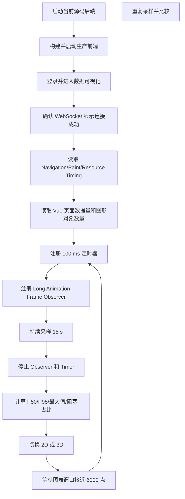

# 前端性能指标采集方法与完整监控轨迹

## 1. 文档目的

本文回答两个问题：

1. [`frontend-realtime-rendering-performance.md`](./frontend-realtime-rendering-performance.md) 中的性能指标是怎么获取的；
2. 如何在相同环境下重新执行测试，并得到可以比较的监控轨迹。

本次测试不是根据代码复杂度估算，而是在当前页面实际运行、WebSocket 持续接收测试数据、ECharts 和地图持续绘制时，通过 Chrome Performance API 采集。

## 2. 测试对象

### 2.1 页面

```text
http://localhost:9527/#/dataVisualization
```

测试前需要完成登录，并确认页面显示「连接成功」。

### 2.2 数据源

后端使用当前 [`TelemetrySimulator`](../QHZHC_Server/src/server/simulator.ts)：

```ts
pointsPerSecond: 20,
batchIntervalMs: 250,
```

默认数据压力：

```text
每秒生成 20 点
每 250 ms 提交和推送 1 批
每批约 5 点
```

### 2.3 构建方式

最终分档使用生产构建，不使用开发模式的 HMR 和源码映射结果：

```bash
VUE_APP_API_BASE_URL=http://localhost:18082 \
VUE_APP_WS_BASE_URL=ws://localhost:18082 \
npm run build -w QHZHC_Web
```

本次使用本地静态服务器托管 `dist`：

```bash
python3 -m http.server 9527 \
  --bind 127.0.0.1 \
  --directory QHZHC_Web/dist
```

后端启动命令：

```bash
PORT=18082 \
DATABASE_PATH=.data/perf-qhzhc.sqlite \
node --env-file-if-exists=.env.local \
  --import tsx \
  QHZHC_Server/src/server/index.ts
```

### 2.4 机器与浏览器

| 项目 | 环境 |
| --- | --- |
| 设备 | MacBook Pro |
| 芯片 | Apple M5 Pro |
| CPU | 18 核 |
| 内存 | 48 GB |
| 操作系统 | macOS 26.4.1 |
| 浏览器 | Google Chrome 151.0.7922.175 |
| 视口 | 1088 × 890 |
| DPR | 1.67 |
| CPU 限速 | 无 |
| 网络限速 | 无 |

## 3. 监控流程



## 4. 首屏指标如何获取

### 4.1 Navigation Timing

浏览器加载页面后，在 Chrome DevTools Console 执行：

```js
const navigation = performance.getEntriesByType("navigation")[0];

console.table({
  ttfb: navigation.responseStart - navigation.startTime,
  domInteractive: navigation.domInteractive - navigation.startTime,
  domContentLoaded:
    navigation.domContentLoadedEventEnd - navigation.startTime,
  load: navigation.loadEventEnd - navigation.startTime,
  htmlTransferSize: navigation.transferSize,
});
```

字段含义：

| 字段 | 计算方式 | 含义 |
| --- | --- | --- |
| TTFB | `responseStart - startTime` | 导航开始到收到首字节 |
| DOM Interactive | `domInteractive - startTime` | DOM 可交互时间 |
| DOMContentLoaded | `domContentLoadedEventEnd - startTime` | DOM 解析和同步脚本执行完成 |
| Load | `loadEventEnd - startTime` | 页面 Load 事件结束 |

### 4.2 FP 和 FCP

```js
const paints = performance
  .getEntriesByType("paint")
  .map((entry) => ({
    name: entry.name,
    startTime: entry.startTime,
  }));

console.table(paints);
```

返回示例：

```json
[
  {
    "name": "first-paint",
    "startTime": 1908
  },
  {
    "name": "first-contentful-paint",
    "startTime": 1908
  }
]
```

`startTime` 的单位是毫秒，起点是本次页面导航开始时间。

### 4.3 资源数量和传输体积

```js
const resources = performance.getEntriesByType("resource");

const resourceSummary = {
  count: resources.length,
  transferSize: resources.reduce(
    (total, entry) => total + (entry.transferSize || 0),
    0,
  ),
  encodedBodySize: resources.reduce(
    (total, entry) => total + (entry.encodedBodySize || 0),
    0,
  ),
  decodedBodySize: resources.reduce(
    (total, entry) => total + (entry.decodedBodySize || 0),
    0,
  ),
  maxDuration: Math.max(0, ...resources.map((entry) => entry.duration)),
};

console.table(resourceSummary);
```

注意：

- `transferSize` 是实际传输字节；
- `encodedBodySize` 是压缩或编码后的响应体；
- `decodedBodySize` 是浏览器解码后的响应体；
- 本次本地 Python 静态服务器没有启用 gzip/Brotli，所以传输量高于正常 CDN 环境。

### 4.4 DOM、Canvas 和 Heap

```js
const pageStructure = {
  domNodes: document.getElementsByTagName("*").length,
  canvasCount: document.querySelectorAll("canvas").length,
  svgCount: document.querySelectorAll("svg").length,
  heapUsed: performance.memory?.usedJSHeapSize ?? null,
  heapTotal: performance.memory?.totalJSHeapSize ?? null,
  heapLimit: performance.memory?.jsHeapSizeLimit ?? null,
};

console.table(pageStructure);
```

`performance.memory` 是 Chrome 扩展能力，不是跨浏览器标准。它适合观察当前 Chrome 会话中的分配压力，不应仅凭一次增长就判断内存泄漏。

## 5. 页面数据量如何获取

本次页面基于 Vue 2。为了确认测试时是轻载还是满 5 分钟窗口，测试脚本只读 Vue 实例状态。

下面的函数仅用于本地诊断，不应写入生产业务逻辑：

```js
function walkVue(vm, result = []) {
  if (!vm) return result;
  result.push(vm);
  for (const child of vm.$children || []) {
    walkVue(child, result);
  }
  return result;
}

function findVueComponent(name) {
  const root = document.querySelector("#app")?.__vue__;
  return walkVue(root).find((vm) => {
    return vm.$options?.name === name;
  });
}

function getVisualizationState() {
  const all = walkVue(document.querySelector("#app")?.__vue__);
  const page = all.find((vm) => {
    return Array.isArray(vm.mapList) && vm.gasdata?.data;
  });
  const planar = all.find((vm) => {
    return vm.$options?.name === "PlanimetricMap";
  });
  const stereo = all.find((vm) => {
    return vm.$options?.name === "StereoscopicMap";
  });

  return {
    connected: page?.connected,
    mapType: page?.mapType,
    mapList: page?.mapList?.length ?? 0,
    gasData: page?.gasdata?.data?.length ?? 0,
    lastSequence: sessionStorage.getItem("qhzhc_last_sequence"),
    openLayers: {
      pointFeatures:
        planar?.pointSource?.getFeatures?.().length ?? null,
      routeFeatures:
        planar?.routeSource?.getFeatures?.().length ?? null,
    },
    cesium: {
      entities: stereo?.viewer?.entities?.values?.length ?? null,
      realtimeEntities: stereo?.realtimeEntityIds?.length ?? null,
    },
  };
}

console.table(getVisualizationState());
```

实测使用这些值确认：

- 2D/3D 地图窗口始终为 300 点；
- 图表增长阶段分别为 1815 点和 3150 点；
- 满窗口接近 6000 点；
- Cesium 维持约 302 个 Entity；
- OpenLayers 维持 300 个点 Feature 和 299 个路线 Feature。

## 6. 持续渲染指标如何获取

### 6.1 为什么不用自动化 WebView 的 FPS

`requestAnimationFrame` 的回调频率通常跟随屏幕刷新率，但浏览器会降低后台标签和隐藏 WebView 的调用频率。

本次自动化 WebView 没有持续获得操作系统前台焦点。直接统计 rAF 次数会同时受到：

- 页面实际卡顿；
- 浏览器后台降频；
- WebView 调度策略。

因此，早期得到的 rAF FPS 没有作为最终结论。最终使用以下两个指标：

1. Long Animation Frame：直接观察超过 50 ms 的渲染更新；
2. 100 ms 定时器延迟：观察主线程无法按期处理任务的程度。

### 6.2 完整采样脚本

下面的代码可以直接粘贴到 Chrome DevTools Console。

```js
async function sampleRealtimeRendering({
  label = "unknown",
  durationMs = 15_000,
  tickMs = 100,
} = {}) {
  const startedAt = performance.now();
  const lags = [];
  const longAnimationFrames = [];
  const heapSamples = [];
  let expectedAt = startedAt + tickMs;

  const percentile = (values, ratio) => {
    if (!values.length) return null;
    const sorted = values.slice().sort((left, right) => left - right);
    const index = Math.floor((sorted.length - 1) * ratio);
    return sorted[index];
  };

  const timer = window.setInterval(() => {
    const now = performance.now();
    lags.push(Math.max(0, now - expectedAt));
    expectedAt = now + tickMs;

    if (performance.memory) {
      heapSamples.push({
        time: now - startedAt,
        used: performance.memory.usedJSHeapSize,
      });
    }
  }, tickMs);

  const loafSupported =
    PerformanceObserver.supportedEntryTypes.includes(
      "long-animation-frame",
    );

  const observer = loafSupported
    ? new PerformanceObserver((list) => {
        for (const entry of list.getEntries()) {
          longAnimationFrames.push({
            startTime: entry.startTime,
            duration: entry.duration,
            blockingDuration: entry.blockingDuration,
            renderDuration:
              entry.duration - (entry.renderStart - entry.startTime),
          });
        }
      })
    : null;

  observer?.observe({
    type: "long-animation-frame",
    buffered: false,
  });

  await new Promise((resolve) => {
    window.setTimeout(resolve, durationMs);
  });

  window.clearInterval(timer);
  observer?.disconnect();

  const endedAt = performance.now();
  const elapsed = endedAt - startedAt;
  const blockingTotal = longAnimationFrames.reduce(
    (total, entry) => total + entry.blockingDuration,
    0,
  );
  const loafDurations = longAnimationFrames.map(
    (entry) => entry.duration,
  );

  const result = {
    label,
    requestedDurationMs: durationMs,
    actualDurationMs: elapsed,
    state: getVisualizationState(),
    structure: {
      domNodes: document.getElementsByTagName("*").length,
      canvasCount: document.querySelectorAll("canvas").length,
      svgCount: document.querySelectorAll("svg").length,
    },
    timer: {
      expectedSamples: Math.floor(elapsed / tickMs),
      actualSamples: lags.length,
      averageLag: lags.length
        ? lags.reduce((total, value) => total + value, 0) /
          lags.length
        : null,
      p50Lag: percentile(lags, 0.5),
      p95Lag: percentile(lags, 0.95),
      maxLag: lags.length ? Math.max(...lags) : null,
      over50ms: lags.filter((value) => value > 50).length,
      over200ms: lags.filter((value) => value > 200).length,
    },
    loaf: {
      supported: loafSupported,
      count: longAnimationFrames.length,
      averageDuration: loafDurations.length
        ? loafDurations.reduce(
            (total, value) => total + value,
            0,
          ) / loafDurations.length
        : null,
      p50Duration: percentile(loafDurations, 0.5),
      p95Duration: percentile(loafDurations, 0.95),
      maxDuration: loafDurations.length
        ? Math.max(...loafDurations)
        : null,
      blockingTotal,
      blockingRatio:
        elapsed > 0 ? blockingTotal / elapsed : null,
    },
    heap: {
      first: heapSamples[0]?.used ?? null,
      last: heapSamples.at(-1)?.used ?? null,
      min: heapSamples.length
        ? Math.min(...heapSamples.map((sample) => sample.used))
        : null,
      max: heapSamples.length
        ? Math.max(...heapSamples.map((sample) => sample.used))
        : null,
      samples: heapSamples,
    },
    raw: {
      lags,
      longAnimationFrames,
    },
  };

  console.log(JSON.stringify(result, null, 2));
  return result;
}
```

调用方式：

```js
await sampleRealtimeRendering({
  label: "production-2d-growing",
  durationMs: 15_000,
});
```

切换到 3D 后：

```js
await sampleRealtimeRendering({
  label: "production-3d-growing",
  durationMs: 15_000,
});
```

窗口接近 6000 点后：

```js
await sampleRealtimeRendering({
  label: "production-3d-full-window",
  durationMs: 15_000,
});
```

### 6.3 为什么要记录实际时长

不能直接认为 `setTimeout(resolve, 15000)` 一定在 15 秒整执行。

当主线程被长任务占用时，15 秒计时器只能在主线程空闲后执行。本次测试中，实际采样窗口可能大于请求值。

所以公式必须使用：

```js
actualDurationMs = performance.now() - startedAt;
```

而不是固定使用 `15000`。

## 7. 指标计算公式

### 7.1 定时器延迟

每次计划 100 ms 后执行：

```text
lag = actualCallbackTime - expectedCallbackTime
```

本次实现每次回调后重新计算下一次期望时间：

```js
expectedAt = now + tickMs;
```

这样统计的是每一轮主线程阻塞造成的延迟，不让上一次延迟无限累积。

### 7.2 理论和实际采样次数

```text
expectedSamples = floor(actualDuration / 100 ms)
actualSamples = lags.length
```

例如：

```text
实际时长：15.61 s
理论次数：156
实际次数：10
```

说明主线程大部分时间无法执行这个 100 ms 定时任务。

### 7.3 P50 和 P95

```text
P50：50% 样本不超过该值
P95：95% 样本不超过该值
```

P95 比平均值更能体现多数用户会遇到的较差情况。

### 7.4 LoAF 阻塞占比

```text
blockingTotal =
  sum(longAnimationFrame.blockingDuration)

blockingRatio =
  blockingTotal / actualDuration
```

例如：

```text
blockingTotal = 13695.706 ms
actualDuration = 15611.3 ms
blockingRatio = 87.7%
```

这个值表示采样期间主线程有多大比例处于无法及时响应高优先级任务的状态。

### 7.5 Heap 变化

```text
heapDelta = lastHeap - firstHeap
```

Heap 会受到垃圾回收影响。某轮结束值小于开始值，通常表示采样期间发生了 GC，不代表程序释放了所有长期引用。

判断内存泄漏需要：

1. 多轮相同操作；
2. 每轮操作后回到相同页面状态；
3. 主动或自然等待 GC；
4. 比较多轮 GC 后的最低 Heap；
5. 使用 DevTools Heap Snapshot 检查保留路径。

本次短窗口只判断分配压力，不判断泄漏。

## 8. 本次完整监控轨迹

### 8.1 阶段 A：生产构建

执行：

```bash
npm run build -w QHZHC_Web
```

结果：

```text
构建成功
dist 总体积约 54 MB
Vendor Bundle 约 1.91 MB
Cesium.js 约 4.77 MB
微软雅黑字体约 14.3 MB
```

构建工具同时给出 Asset Size Limit 和 Entrypoint Size Limit 警告。

### 8.2 阶段 B：生产页面首屏

原始摘要：

```json
{
  "navigationDuration": 1423.8,
  "responseStart": 34.3,
  "domInteractive": 1374.6,
  "domContentLoaded": 1423.1,
  "load": 1423.8,
  "firstPaint": 1908,
  "firstContentfulPaint": 1908,
  "resourceCount": 53,
  "resourceTransferSize": 24324218,
  "resourceDecodedBodySize": 24318818,
  "domNodes": 904,
  "canvasCount": 8,
  "svgCount": 35,
  "heapUsed": 292793781,
  "mapList": 300,
  "gasData": 1240,
  "mapType": 1,
  "connected": true
}
```

判断：

- TTFB 很低；
- FCP 为 1.908 s，略高于 1.8 s 良好线；
- 本地无压缩传输达到 24.32 MB；
- 页面进入实时状态。

### 8.3 阶段 C：2D 增长阶段

测试状态：

```json
{
  "mapType": 1,
  "mapList": 300,
  "gasData": 1815
}
```

原始汇总：

```json
{
  "actualDurationMs": 15239.9,
  "expectedTimerSamples": 152,
  "actualTimerSamples": 24,
  "timerLagP95": 566,
  "timerLagMax": 571,
  "loafCount": 48,
  "loafAverage": 307.17,
  "loafP95": 349.9,
  "loafMax": 359.6,
  "blockingTotal": 12289.938,
  "blockingRatio": 0.806,
  "heapStart": 336140797,
  "heapEnd": 501334212
}
```

结论：增长阶段已经存在持续主线程阻塞。

### 8.4 阶段 D：3D 增长阶段

测试状态：

```json
{
  "mapType": 2,
  "mapList": 300,
  "gasData": 3150,
  "cesiumEntities": 302,
  "realtimeEntities": 300
}
```

原始汇总：

```json
{
  "actualDurationMs": 15580.3,
  "expectedTimerSamples": 155,
  "actualTimerSamples": 16,
  "timerLagP95": 909,
  "timerLagMax": 920,
  "loafCount": 32,
  "loafAverage": 464.73,
  "loafP95": 533.2,
  "loafMax": 541.1,
  "blockingTotal": 13214.063,
  "blockingRatio": 0.848,
  "heapStart": 603092963,
  "heapEnd": 306376331
}
```

结论：切换到 3D 后，地图实体数量受到控制，但图表和 3D 更新共同提高了单轮渲染成本。

### 8.5 阶段 E：等待满 5 分钟窗口

页面继续接收默认 20 点/秒的数据，直到：

```json
{
  "mapList": 300,
  "gasData": 5781,
  "mapType": 2,
  "heapUsed": 1304907896
}
```

该 Heap 值是 GC 前的瞬时高点。后续采样中 Heap 明显下降，证明期间发生过垃圾回收，因此不能把 1.30 GB 直接解释为稳定常驻内存。

### 8.6 阶段 F：3D 满窗口

测试状态：

```json
{
  "mapType": 2,
  "mapList": 300,
  "gasData": 5980
}
```

原始汇总：

```json
{
  "actualDurationMs": 15611.3,
  "expectedTimerSamples": 156,
  "actualTimerSamples": 10,
  "timerLagAverage": 1461.04,
  "timerLagP50": 1448,
  "timerLagP95": 1522.2,
  "timerLagMax": 1526.3,
  "loafCount": 19,
  "loafAverage": 773.73,
  "loafP50": 776.4,
  "loafP95": 823.6,
  "loafMax": 834.6,
  "blockingTotal": 13695.706,
  "blockingRatio": 0.877,
  "heapStart": 1370567756,
  "heapEnd": 938917691,
  "domNodes": 927,
  "canvasCount": 11
}
```

这是本次压力最大的有效样本：

```text
LoAF P95：823.6 ms
定时器延迟 P95：1522.2 ms
主线程阻塞占比：87.7%
```

### 8.7 阶段 G：2D 满窗口

测试状态：

```json
{
  "mapType": 1,
  "mapList": 300,
  "gasData": 5979
}
```

原始汇总：

```json
{
  "actualDurationMs": 15586.7,
  "expectedTimerSamples": 155,
  "actualTimerSamples": 16,
  "timerLagAverage": 869.38,
  "timerLagP50": 899.7,
  "timerLagP95": 901.6,
  "timerLagMax": 902.5,
  "heapStart": 437514688,
  "heapEnd": 439379040,
  "domNodes": 907,
  "canvasCount": 10
}
```

这一轮没有获得新的 LoAF 条目。原因是同一页面已经累计到 Chrome 的 200 条 LoAF Buffer 上限。没有用 0 代替，也没有推测 P95。

结论仍然可以由独立的定时器轨迹得出：理论 155 次只执行 16 次，延迟 P95 达到 901.6 ms，属于差档。

## 9. 分档依据

### 9.1 官方指标

| 指标 | 良好 | 需要改进 | 差 |
| --- | ---: | ---: | ---: |
| FCP | ≤ 1.8 s | 1.8–3.0 s | > 3.0 s |
| LCP | ≤ 2.5 s | 2.5–4.0 s | > 4.0 s |
| INP | ≤ 200 ms | 200–500 ms | > 500 ms |
| CLS | ≤ 0.1 | 0.1–0.25 | > 0.25 |

参考：

- [web.dev：First Contentful Paint](https://github.com/GoogleChrome/web.dev/blob/main/src/site/content/zh/metrics/fcp/index.md)
- [web.dev：Web Vitals](https://web.dev/articles/vitals)
- [MDN：Long animation frame timing](https://developer.mozilla.org/en-US/docs/Web/API/Performance_API/Long_animation_frame_timing)

### 9.2 本项目诊断指标

定时器延迟和阻塞占比不是 Web Vitals。为了判断实时可视化是否流畅，本项目使用：

| 指标 | 优秀 | 需要关注 | 差 |
| --- | ---: | ---: | ---: |
| LoAF | 15 秒内为 0 | 偶发且接近 50 ms | 持续出现或数百毫秒 |
| 100 ms 定时器延迟 P95 | ≤ 50 ms | 50–200 ms | > 200 ms |
| 主线程阻塞占比 | ≤ 5% | 5%–20% | > 20% |

当前满窗口 3D 为：

```text
LoAF P95 = 823.6 ms
定时器延迟 P95 = 1522.2 ms
阻塞占比 = 87.7%
```

三个指标都落在差档。

## 10. 测试限制

### 10.1 这不是线上真实用户 P75

本次是单机实验室测试，不是 Chrome UX Report，也不是线上 75 分位数据。

它可以判断当前实现是否存在明显主线程问题，但不能代替真实用户监控。

### 10.2 未提供可靠 FPS

自动化 WebView 没有持续保持系统前台焦点，Chrome 会降低后台
`requestAnimationFrame` 频率。

因此没有把失真的 rAF 次数写成页面 FPS。要测真实 FPS，应在前台 Chrome DevTools Performance 面板录制，或者使用可保持前台焦点的专用测试机。

### 10.3 LCP、CLS 和 INP 未填入推测值

- LCP 和 CLS 需要在页面加载前注册 Observer；
- INP 需要真实且有代表性的交互；
- 本次登录后采样没有得到可靠值；
- 文档只保留实际获取到的数据。

### 10.4 Heap 不是泄漏结论

Heap 在多轮采样中先上升、后因 GC 下降。它证明页面分配压力较高，但不能单独证明内存泄漏。

### 10.5 本地静态服务器未压缩

资源传输量反映当前构建和本地服务方式。部署 gzip/Brotli 后，线上传输量会降低。

### 10.6 测试设备性能较高

测试设备是 M5 Pro、48 GB 内存，且没有 CPU 限速。即便如此，满窗口仍出现数百毫秒长动画帧。中低端设备风险只会更高。

## 11. 推荐复测步骤

每次完成渲染优化后，按照以下顺序复测：

1. 重新构建生产版本；
2. 新开浏览器标签，重置 LoAF Buffer；
3. 登录并进入数据可视化；
4. 确认 `connected === true`；
5. 记录 Navigation、Paint 和 Resource Timing；
6. 默认 2D 下运行 15 秒采样；
7. 切换 3D，等待地图稳定；
8. 运行 15 秒采样；
9. 等待图表窗口接近 6000 点；
10. 新开标签或重载后重新构造满窗口场景；
11. 分别记录满窗口 2D 和 3D；
12. 将 JSON 原始结果纳入版本记录；
13. 对比 P95、阻塞占比和 Heap 最低点。

验收时至少连续执行 3 轮，使用中位数，避免单次 GC、网络或系统任务影响结论。

## 12. 线上监控建议

实验室脚本用于定位问题。线上应建立独立监控链路：

```text
PerformanceObserver
  -> 收集 LCP / CLS / INP / LoAF
  -> 记录路由、设备、视口、数据窗口大小
  -> 30–60 秒聚合
  -> sendBeacon 上报
  -> 服务端按版本和设备分组
  -> 计算 P50 / P75 / P95
  -> 设置性能回归告警
```

建议每条实时渲染记录同时携带：

```json
{
  "route": "/dataVisualization",
  "mapType": "2d-or-3d",
  "chartPointCount": 6000,
  "mapPointCount": 300,
  "websocketBatchRate": 4,
  "websocketPointRate": 20,
  "loafP95": 0,
  "eventLoopLagP95": 0,
  "heapUsed": 0,
  "appVersion": "git-sha"
}
```

只有把性能指标与数据窗口和地图类型一起记录，才能区分：

- 页面刚进入时的轻载性能；
- 5 分钟窗口填满后的稳态性能；
- 2D 和 3D 的差异；
- 新版本是否造成性能回退。

## 13. 最终说明

本次性能数据通过浏览器 Performance API 直接采集，测试的是当前生产构建在真实 WebSocket 数据持续推送下的运行状态。

核心证据链是：

```text
确认生产构建
  -> 确认实时连接和数据窗口
  -> 读取首屏 Timing
  -> 注册 LoAF Observer
  -> 用 100 ms Timer 观察事件循环
  -> 记录 Heap 和图形对象数量
  -> 分别测试 2D、3D、增长窗口、满窗口
  -> 按实际时长计算 P95 和阻塞占比
  -> 对照官方与项目分档
```

因此，`frontend-realtime-rendering-performance.md` 中的“当前持续实时渲染不在优秀分段”不是主观判断，而是由 LoAF、事件循环延迟和主线程阻塞占比共同支持。
