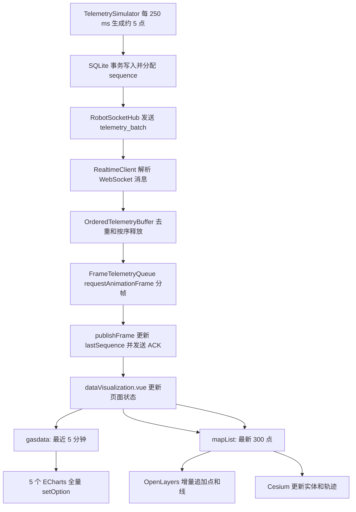

# 前端实时渲染链路与性能实测

> **历史基线说明：**本文记录的是旧版 ACK、排序缓冲及 250 ms 批次架构，部分实现已不再适用于当前代码。当前自然秒推送、自适应批量、真实 FPS 和可视历史实验请以 [实时渲染积压与 FPS 自适应优化实验日志](./realtime-rendering-adaptive-optimization.md) 为准。

## 1. 结论

当前页面已经把 WebSocket 接入、数据排序、分帧调度和具体图形绘制拆成了不同模块，属于**部分解耦**：

- `RealtimeClient` 负责连接、协议、补洞和 ACK；
- `OrderedTelemetryBuffer` 负责去重和按 `sequence` 排序；
- `FrameTelemetryQueue` 负责通过 `requestAnimationFrame` 分帧提交数据；
- `dataVisualization.vue` 负责维护页面状态；
- ECharts、OpenLayers 和 Cesium 组件负责实际绘制。

现有实现也包含数据窗口限制、地图元素上限、实体复用、按需渲染、页面隐藏时断开连接等优化。

但是，生产构建的真实采样结果显示：**当前实时渲染性能不在优秀分段，满 5 分钟数据窗口下属于明显需要优化的状态。**

最主要的原因不是 WebSocket 收包，而是每 250 ms 到达一批数据后：

1. 页面生成新的 `gasdata`；
2. 5 个图表组件的深度 watcher 同时触发；
3. 每个图表重新复制数据、生成完整 Option；
4. ECharts 使用 `notMerge: true`、`lazyUpdate: false` 全量更新；
5. 每次更新后又执行 `chart.resize()`。

当图表窗口接近 6000 点时，单次渲染工作已经远超一帧预算。

## 2. 测试环境

### 2.1 硬件与软件

| 项目 | 实测环境 |
| --- | --- |
| 设备 | MacBook Pro，Apple M5 Pro |
| CPU | 18 核 |
| 内存 | 48 GB |
| 操作系统 | macOS 26.4.1 |
| 浏览器 | Google Chrome 151.0.7922.175 |
| 视口 | 1088 × 890 |
| DPR | 1.67 |
| 前端 | Vue 2 生产构建 |
| 前端地址 | `http://localhost:9527` |
| 后端地址 | `http://localhost:18082` |
| 网络和 CPU 限速 | 未启用 |

### 2.2 数据压力

服务端默认配置位于
[`simulator.ts`](../QHZHC_Server/src/server/simulator.ts)：

```ts
pointsPerSecond: 20,
batchIntervalMs: 250,
```

因此默认压力为：

```text
每 250 ms 生成并推送 1 批
每批约 5 个点
每秒约 4 批、20 个点
```

采样覆盖以下场景：

| 场景 | 图表窗口 | 地图窗口 |
| --- | ---: | ---: |
| 生产构建 2D，增长阶段 | 1815 点 | 300 点 |
| 生产构建 3D，增长阶段 | 3150 点 | 300 点 |
| 生产构建 3D，满窗口 | 5980 点 | 300 点 |
| 生产构建 2D，满窗口 | 5979 点 | 300 点 |

### 2.3 指标口径

完整采样步骤、Console 脚本、计算公式和各阶段原始摘要见
[`前端性能指标采集方法与完整监控轨迹`](./frontend-performance-monitoring-trace.md)。

本次使用 Chrome Performance API 采集：

- Navigation Timing：TTFB、DOMContentLoaded、Load；
- Paint Timing：FP、FCP；
- Long Animation Frame（LoAF）：超过 50 ms 的长动画帧；
- 100 ms 定时器延迟：观察主线程被占用后，定时任务实际延迟；
- JavaScript Heap：观察短窗口内的分配和 GC 波动；
- DOM、Canvas、地图 Feature 和 Cesium Entity 数量。

自动化 WebView 在采样期间没有持续持有操作系统前台焦点。浏览器会对后台标签或隐藏 WebView 的
`requestAnimationFrame` 降频，因此本报告不把该环境中的 rAF 回调次数换算成 FPS，避免把后台节流误判为页面帧率。持续渲染结论使用不依赖前台刷新率的 LoAF、主线程阻塞时长和定时器延迟。

LCP、CLS 和真实 INP 需要在页面加载前或真实用户交互期间持续注册观察器。本次登录后单次实验室采样没有获得可用值，因此不填入推测数据。FCP 可以从浏览器 Paint Timing 中直接读取。

分档参考：

| 指标 | 优秀 | 需要关注 | 差 |
| --- | ---: | ---: | ---: |
| FCP | ≤ 1.8 s | 1.8–3.0 s | > 3.0 s |
| INP | ≤ 200 ms | 200–500 ms | > 500 ms |
| 单帧预算（60 Hz） | ≤ 16.7 ms | 16.7–50 ms | > 50 ms |
| LoAF | 采样期内为 0 | 偶发且接近 50 ms | 持续出现或数百毫秒 |
| 100 ms 定时器 P95 延迟 | ≤ 50 ms | 50–200 ms | > 200 ms |
| 主线程阻塞占比 | ≤ 5% | 5%–20% | > 20% |

其中 FCP、INP 和 CLS 的官方良好阈值分别是 1.8 s、200 ms 和
0.1。LoAF 表示超过 50 ms 的渲染更新；60 Hz 屏幕一帧约有 16.7 ms。

参考：

- [web.dev：First Contentful Paint](https://github.com/GoogleChrome/web.dev/blob/main/src/site/content/zh/metrics/fcp/index.md)
- [Core Web Vitals](https://web.dev/articles/vitals)
- [MDN：Long animation frame timing](https://developer.mozilla.org/en-US/docs/Web/API/Performance_API/Long_animation_frame_timing)
- [MDN：requestAnimationFrame](https://developer.mozilla.org/en-US/docs/Web/API/Window/requestAnimationFrame)

100 ms 定时器延迟和主线程阻塞占比属于本项目的实验室诊断指标，不是
Core Web Vitals。

## 3. 完整渲染链路



### 3.1 服务端生成与推送

[`TelemetrySimulator`](../QHZHC_Server/src/server/simulator.ts) 使用定时器生成数据：

```ts
this.timer = setInterval(() => this.tick(), this.config.batchIntervalMs);

count =
  (this.config.pointsPerSecond * this.config.batchIntervalMs) / 1_000;
```

默认每批约 5 点。生成后先写入 SQLite，再发布已经提交的数据：

```ts
const inserted = this.database.insertTelemetry(pending);
this.publisher(inserted, this.getStatus());
```

[`RobotSocketHub`](../QHZHC_Server/src/server/robot-socket-hub.ts) 对已鉴权客户端发送：

```ts
if (delivered.length > 0) {
  this.sendTelemetry(context, delivered, false);
}
```

当单个连接的发送缓冲超过 2 MB 时，服务端以 `1013` 关闭连接，避免慢客户端无限堆积内存。

### 3.2 WebSocket 收包

[`realtimeClient.ts`](../QHZHC_Web/src/views/DataVisualization/services/realtimeClient.ts)
收到 `telemetry_batch` 后不直接操作页面：

```ts
const ordered = this.buffer.ingest(message.points);
this.frameQueue.enqueue(ordered);

const gap = this.buffer.currentGap();
if (gap) this.requestResend(gap.fromSequence, gap.toSequence);
```

这里完成：

1. JSON 协议解析；
2. 按 `sequence` 去重；
3. 暂存乱序点；
4. 只释放连续数据；
5. 发现缺口后发送 `resend`。

### 3.3 有序缓冲

[`OrderedTelemetryBuffer.ts`](../QHZHC_Web/src/views/DataVisualization/services/OrderedTelemetryBuffer.ts)
使用 `Map<number, TelemetryPoint>` 保存待处理点：

```ts
while (this.pending.has(this.expectedSequence)) {
  ordered.push(this.pending.get(this.expectedSequence));
  this.pending.delete(this.expectedSequence);
  this.expectedSequence += 1;
}
```

它确保页面只接收连续序列，并且：

- 丢弃已经消费过的旧序号；
- 丢弃重复序号；
- 待处理数据最多保留 20000 点；
- 缺口无法恢复时可重置到服务端最新序号。

### 3.4 分帧调度

[`FrameTelemetryQueue.ts`](../QHZHC_Web/src/views/DataVisualization/services/FrameTelemetryQueue.ts)
把连续数据放入队列，并通过 `requestAnimationFrame` 消费：

```ts
while (
  this.cursor < this.queue.length &&
  batch.length < 300 &&
  performance.now() - startedAt < 5
) {
  batch.push(this.queue[this.cursor++]);
}

if (batch.length) this.onFrame(batch);
```

每帧最多取 300 点，取点预算为 5 ms。如果仍有积压，则下一帧继续。

这里有一个重要边界：**5 ms 只限制从队列取数据的时间，不包含后面的 Vue 状态更新、ECharts `setOption`、OpenLayers 和 Cesium 绘制。** 当前最重的工作发生在 `onFrame(batch)` 之后，因此这个预算无法阻止实际渲染形成长任务。

### 3.5 页面状态提交

`publishFrame()` 先更新消费游标并发送 ACK，再调用页面回调：

```ts
this.lastSequence = latest.sequence;
this.send({ type: "ack", sequence: this.lastSequence });
this.options.onPacket({ code: 200, message: "ok", data: points });
```

[`dataVisualization.vue`](../QHZHC_Web/src/views/DataVisualization/dataVisualization.vue)
中的 `handleRealtimePacket()` 负责页面状态编排：

```ts
const nextGasPoints = appendRealtimeTimeWindow(
  this.gasdata.data,
  result.data,
);
const nextMapPoints = appendRealtimeBatch(this.mapList, result.data);

this.gasdata = { ...result, data: nextGasPoints };
this.mapList = nextMapPoints;
this.detailData = point;
```

由此产生两条渲染数据流：

- `gasdata`：保留最近 5 分钟，供 5 个图表使用；
- `mapList`：最多保留最新 300 点，供 2D/3D 地图使用。

### 3.6 ECharts 渲染

页面同时挂载 5 个 [`Charts.vue`](../QHZHC_Web/src/views/DataVisualization/components/Charts.vue)
实例：

- CH4 时序变化；
- CO2 时序变化；
- 风速浓度分布；
- 实时监测；
- 甲烷碳同位素变化。

每次 `gasdata` 更新，5 个组件的深度 watcher 都会执行 `updateOptions()`：

```ts
this.chart.setOption(
  getChart({ data: this.gasdata, ... }),
  {
    notMerge: true,
    lazyUpdate: false,
  },
);
this.chart.resize();
```

`getChart()` 再根据图表类型遍历完整数据窗口并构造新的 Option。

因此，在默认每秒 4 批数据时，理论上每秒会触发约：

```text
4 次页面 gasdata 更新 × 5 个图表 = 20 次完整 setOption
```

当时间窗口接近 6000 点时，多数图表每次都重新处理数千个点。这是当前最主要的主线程压力来源。

### 3.7 OpenLayers 2D 地图

[`PlanimetricMap.vue`](../QHZHC_Web/src/views/DataVisualization/components/PlanimetricMap.vue)
通过 `mapList` watcher 获取最新点：

```ts
this.points = newVal;
this.index = newVal.length - 1;
this.drawRealtimePoint();
```

`drawRealtimePoint()` 执行：

1. 经纬度投影转换；
2. 更新或创建唯一车辆 Feature；
3. 追加最新路线段；
4. 追加最新浓度点；
5. 清理超过上限的旧 Feature。

点图层最多保留 300 个 Feature，路线图层最多保留 299 个 Feature：

```ts
prune(this.pointSource, 300);
prune(this.routeSource, 299);
```

实测满窗口时仍稳定在 300 个点 Feature 和 299 个路线 Feature。

### 3.8 Cesium 3D 地图

[`StereoscopicMap.vue`](../QHZHC_Web/src/views/DataVisualization/components/StereoscopicMap.vue)
同样监听 `mapList`，每次更新：

```ts
this.nowBar(newval[this.index]);
this.updateRealtimeRoute(newval);
```

当前优化包括：

- `scene3DOnly: true`，减少非 3D 场景开销；
- `requestRenderMode: true`，只在数据变化时请求渲染；
- 浓度柱使用 300 个固定槽位循环复用；
- 车辆模型只创建一次，后续更新位置和方向；
- 实时路线使用同一个 Entity，更新位置数组；
- 超过 300 个实时实体时删除旧实体。

实测稳定状态为：

```text
Cesium Entity 总数：302
实时浓度柱槽位：300
```

### 3.9 页面隐藏和销毁

页面隐藏时，实时客户端停止分帧队列并断开 WebSocket；页面重新可见后再从 `lastSequence` 恢复：

```ts
if (document.visibilityState === "hidden") {
  this.prepareReplayFromLastRenderedPoint();
  this.socket.close(4002, "page hidden");
}
```

组件销毁时还会移除监听器、取消计时器，并释放 ECharts、OpenLayers 和 Cesium 实例，避免离开页面后继续占用资源。

## 4. 已有性能优化

| 优化 | 实现 | 效果 |
| --- | --- | --- |
| 服务端批量推送 | 每 250 ms 推送约 5 点 | 减少 WebSocket 消息数量 |
| 写库后再推送 | SQLite 提交后发布 | 保证断线数据可恢复 |
| 发送背压保护 | 缓冲超过 2 MB 关闭连接 | 防止慢客户端拖垮服务端 |
| 有序缓冲 | `OrderedTelemetryBuffer` | 去重、排序、缺口检测 |
| 分帧消费 | `requestAnimationFrame` | 避免一次性消费超大批次 |
| 单帧取点上限 | 最多 300 点、5 ms | 限制队列出队工作 |
| 图表时间窗口 | 最近 5 分钟 | 防止数据永久增长 |
| 地图数据上限 | 最新 300 点 | 限制地图对象数量 |
| OpenLayers 车辆复用 | 更新同一个车辆 Feature | 避免车辆对象累积 |
| OpenLayers 图层裁剪 | 300 点、299 条线 | 限制 Feature 数量 |
| Cesium 按需渲染 | `requestRenderMode: true` | 空闲时减少持续渲染 |
| Cesium 实体复用 | 300 个槽位循环更新 | 避免 Entity 无限增长 |
| 3D 专用模式 | `scene3DOnly: true` | 降低 Cesium GPU 内存开销 |
| 图表关闭 Symbol | 多点时 `showSymbol: false` | 降低折线点标记开销 |
| Resize 防抖 | 100 ms debounce | 避免窗口变化时频繁 resize |
| 天气位置合并 | 经纬度保留 2 位并缓存状态 | 避免每个采样点都请求天气 |
| 后台页暂停 | 页面隐藏时断开连接 | 避免后台持续处理和绘制 |

这些优化有效控制了对象数量和异常流量，但没有解决 ECharts 全量更新造成的 CPU 峰值。

## 5. 真实测试结果

### 5.1 首屏加载

生产构建、本机无网络限速：

| 指标 | 实测值 | 判断 |
| --- | ---: | --- |
| TTFB | 34.3 ms | 优秀 |
| DOMContentLoaded | 1423 ms | 良好 |
| Load Event | 1424 ms | 良好 |
| First Paint | 1908 ms | 接近良好阈值 |
| FCP | 1908 ms | 需要改进，略高于 1.8 s |
| 已加载资源数 | 53 | 仅作记录 |
| 传输资源量 | 24.32 MB | 偏大 |
| DOM 节点 | 904 | 可接受 |
| Canvas | 8 | 较多，来自多个 ECharts 和地图 |
| JS Heap 瞬时值 | 292.8 MB | 偏高 |

本地静态服务器没有启用 gzip/Brotli，因此传输量不能直接等同于线上 CDN 结果。但构建本身仍存在明显大资源：

- `dist` 总体积约 54 MB；
- 微软雅黑字体约 14.3 MB；
- Cesium 主脚本约 4.77 MB；
- Vendor Bundle 约 1.91 MB；
- 中国地图 JSON/GeoJSON 合计约 2.76 MB。

### 5.2 实时稳态

| 场景 | 窗口点数 | 100 ms 定时器实际/理论次数 | 延迟 P95 | LoAF 平均 | LoAF P95 | 阻塞占比 | 结论 |
| --- | ---: | ---: | ---: | ---: | ---: | ---: | --- |
| 2D 增长阶段 | 1815 | 24 / 152 | 566 ms | 307 ms | 350 ms | 80.6% | 差 |
| 3D 增长阶段 | 3150 | 16 / 155 | 909 ms | 465 ms | 533 ms | 84.8% | 差 |
| 3D 满窗口 | 5980 | 10 / 156 | 1522 ms | 774 ms | 824 ms | 87.7% | 差 |
| 2D 满窗口 | 5979 | 16 / 155 | 902 ms | 缓冲已满，未取到新样本 | 同左 | 不适用 | 差 |

Chrome 对单页最多保留 200 条 LoAF 记录。最后一轮 2D 测试时该缓冲已经耗尽，因此不伪造 LoAF 数据，只使用独立的定时器延迟判断。

### 5.3 如何理解这些数字

以 3D 满窗口为例：

```text
采样时长：15.61 s
Long Animation Frame 平均：773.7 ms
Long Animation Frame P95：823.6 ms
事件循环延迟 P95：1522.2 ms
主线程累计阻塞：13.70 s
阻塞占比：87.7%
```

60 Hz 屏幕的单帧预算约为 16.7 ms，而当前长动画帧接近
774 ms，约为一帧预算的 46 倍。

这意味着：

- 数据仍在持续接收和最终绘制；
- 页面不是功能性失效；
- 但主线程长期繁忙；
- 点击、工具栏切换和地图操作会明显延迟；
- 随着图表窗口从 1800 点增长到约 6000 点，卡顿继续加重。

所以当前状态不能归类为“优秀”或“可接受”，应归类为**性能不达标**。

## 6. 为什么已有 5 ms 分帧仍然卡

`FrameTelemetryQueue` 的计时范围如下：

```text
开始计时
  -> 从 queue 取最多 300 点
  -> 到 5 ms 停止
结束计时
  -> 调用 onFrame(batch)
  -> 更新 Vue 数据
  -> 5 个 ECharts 全量 setOption
  -> 地图更新
```

真正昂贵的 ECharts、Vue watcher 和地图绘制发生在 5 ms 检查之后。

因此，当前实现只能防止“从数组里一次取太多点”，不能限制“一次页面提交和绘制花了多久”。

## 7. 当前主要瓶颈

### 7.1 图表全量重建

这是优先级最高的问题。

`Charts.vue` 每次更新都：

```ts
this.gasdata = this.newdata.data.slice();
this.chart.setOption(fullOption, {
  notMerge: true,
  lazyUpdate: false,
});
this.chart.resize();
```

问题包括：

- 5 个图表同时响应；
- watcher 使用 `deep: true`；
- 每批都复制完整数组；
- 每批都重新生成完整 Option；
- `notMerge: true` 强制丢弃旧配置；
- `lazyUpdate: false` 要求立即更新；
- 数据未增长到 6000 点时已经出现数百毫秒 LoAF；
- 隐藏左右面板使用 `v-show`，图表组件仍然挂载并继续更新。

### 7.2 图表窗口按时间限制，但点数仍高

5 分钟窗口在 20 点/秒下约有：

```text
20 × 60 × 5 = 6000 点
```

对趋势图而言，6000 个原始点通常远高于当前图表像素宽度。继续绘制全部点不会增加可见信息，却显著增加数据转换和绘制成本。

### 7.3 Vue 深度 watcher

图表、天气和地图多处使用 `deep: true`。实时数据对象层级较深，Vue 2 需要追踪大量字段变化。

当前页面通过替换数组和对象引用更新状态，多数 watcher 不需要深度监听。

### 7.4 3D 路线每批全量转换

Cesium 每次 `mapList` 更新都会把最多 300 个点重新转换为
`Cartesian3` 数组：

```ts
const positions =
  Cesium.Cartesian3.fromDegreesArrayHeights(coordinates);
```

实体数量已经被限制，但路线坐标仍是全量重建。

### 7.5 首屏资源偏大

即使默认显示 2D 地图，页面入口仍加载 Cesium 脚本和大字体。它主要影响首屏加载和内存基线。

## 8. 优化优先级

### P0：降低图表更新频率

地图可以保持每 250 ms 更新，图表没有必要以相同频率全量刷新。

建议：

```text
WebSocket：每 250 ms 接收
页面最新值/车辆：每 250 ms 更新
趋势图：每 1000 ms 合并更新一次
```

这可以把图表更新次数从每秒约 20 次完整 `setOption` 降到约 5 次。

### P0：改为增量或局部更新 ECharts

避免：

```ts
notMerge: true
lazyUpdate: false
每次 chart.resize()
```

优先选择：

- 只更新 `series.data`；
- 使用 `setOption(partialOption, { notMerge: false, lazyUpdate: true })`；
- 适合的序列使用 `appendData()`；
- 只在容器尺寸变化时调用 `resize()`。

### P0：图表数据降采样

按照图表宽度保留 300–1000 个代表点，而不是绘制约 6000 个原始点。

可使用：

- 固定时间桶聚合；
- min/max/avg 三值采样；
- LTTB；
- ECharts 支持的 sampling 策略。

地图仍保留最新 300 点，详情仍使用最新原始点，不影响业务精度。

### P1：移除不必要的深度 watcher

当前父组件每次都会创建新的 `gasdata` 和 `mapList` 引用，可以改为浅监听。

隐藏图表面板时应暂停对应图表的数据更新，而不是只用 `v-show` 隐藏 DOM。

### P1：扩大分帧预算的覆盖范围

当前 5 ms 只覆盖队列出队。建议测量完整提交：

```text
取点
  -> 数据窗口更新
  -> Vue 提交
  -> 图表和地图更新
```

如果一次提交超过预算，应减少批次点数或降低图表刷新频率。

### P1：增量维护 Cesium 路线

保留固定长度位置数组，只追加最新坐标并删除最旧坐标，避免每批重新转换 300 点。

### P2：按需加载 3D 资源

- 仅在用户切换到 3D 时加载 Cesium；
- 字体改为子集化或系统字体；
- 静态服务器开启 Brotli/gzip；
- 地图数据按区域拆包。

## 9. 验收目标

优化后建议在相同环境、相同 20 点/秒压力和约 6000 点图表窗口下重新验收：

| 指标 | 目标 |
| --- | ---: |
| FCP | ≤ 1.8 s |
| LoAF P95 | ≤ 50 ms，理想状态采样期内无 LoAF |
| 100 ms 定时器延迟 P95 | ≤ 50 ms |
| 主线程阻塞占比 | ≤ 5% |
| 地图数据量 | 始终 ≤ 300 点 |
| 2D Feature | 点 ≤ 300，路线 ≤ 299 |
| 3D 实时实体 | ≤ 302 |
| 5 分钟持续运行 | 无持续增长的堆内存趋势 |
| 页面操作 | 地图类型、气体类型和面板切换无明显延迟 |

## 10. 最终判断

当前实现的架构方向是正确的：

- 网络接收与具体绘图库已经分层；
- 有序缓冲和断点恢复保证数据正确；
- 分帧队列、对象上限和实体复用避免了无限增长；
- 2D/3D 绘制组件各自维护生命周期。

但性能保护没有覆盖最昂贵的图表更新阶段。真实生产构建测试中，满窗口 2D 的事件循环延迟 P95 约 902 ms，满窗口 3D 的 LoAF P95 约 824 ms、事件循环延迟 P95 约 1522 ms，均远高于优秀标准。

因此当前结论是：

> 渲染链路已分层，数据正确性和资源上限控制较完整；但实时图表采用高频全量重绘，导致主线程长期阻塞。当前页面的首屏性能接近良好，持续实时渲染性能不达标，必须优先优化 ECharts 更新频率、更新方式和数据采样。
