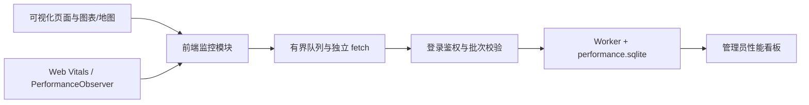

# 性能监控实现与使用

当前链路为：登录后的可视化页面采集指标，独立上报器每 10 秒发送汇总，服务端 Worker 写入独立 SQLite，管理员在性能监控页查看结果。首页、登录、注册和管理页面不进入业务采样。



## 启动与入口

使用 Node.js **24 或以上版本**，在项目根目录执行已有的 `npm install`、`npm run dev`。生产环境按现有流程构建并启动。

管理员登录后，通过“模拟后台 → 性能监控”进入 `/#/admin/performance`。打开可视化页面、在前台停留至少 20 秒后，可以看到运行指标；后台本身不采集，因此仅打开后台不会产生业务数据。

监控数据库默认与业务数据库在同一个目录，文件名为 `performance.sqlite`。可用 `PERFORMANCE_DATABASE_PATH` 指定独立位置。Worker 故障会使监控接口返回 503，业务数据库与实时推送继续工作；Worker 退出或超时后需重启服务恢复。

| 配置 | 默认值 | 用途 |
|---|---|---|
| `VUE_APP_PERFORMANCE_ENABLED` | 开启 | 构建时设为 `false`，关闭采集 |
| `VUE_APP_RELEASE` | `local` | 发布版本；生产构建建议使用提交号或发布号 |
| `PERFORMANCE_DATABASE_PATH` | 业务库目录下的 `performance.sqlite` | 独立监控数据库 |
| `sessionStorage.qhzhc_performance_enabled` | 开启 | 当前标签页设为 `false` 后刷新，用于同一构建的开关对照 |
| `sessionStorage.qhzhc_performance_hz` | `60` | 当前标签页参考档位，支持 60/90/120/144/165/240；设置后刷新 |

上述 sessionStorage 项可通过浏览器开发者工具设置。它们是测试与诊断开关，不改变模拟器配置。运行时开关仅决定采集是否启用，构建中仍保留监控模块。

## 指标口径

唯一指标字典是 [performance.ts](../QHZHC_Server/src/shared/performance.ts)，后台说明抽屉使用同一份定义。阈值版本为 `2026-09-07.1`。

| 指标 | 选择理由 | 良好或项目优秀目标 | 较差 |
|---|---|---:|---:|
| LCP | 主要内容出现速度 | ≤2500 ms | >4000 ms |
| INP | 操作响应体验 | ≤200 ms | >500 ms |
| CLS | 意外布局跳动 | ≤0.1 | >0.25 |
| FCP | 首个可见内容、白屏诊断 | ≤1800 ms | >3000 ms |
| TTFB | 文档初始请求诊断 | ≤800 ms | >1800 ms |
| FPS（rAF 估算） | 主线程帧调度 | 60 Hz 档 ≥55 | <30 |
| 事件循环延迟 P95 | 主线程调度阻塞 | ≤20 ms | >100 ms |
| LoAF 阻塞占比 | 长动画帧的阻塞影响 | ≤1% | >5% |
| 图表/地图同步更新 P95 | 定位更新调用开销 | ≤8 ms | >16.7 ms |
| 接收到状态应用 P95 | 实时处理链路 | ≤100 ms | >500 ms |
| 队列等待 P95 | 消费积压 | ≤50 ms | >200 ms |
| WebSocket 应用层 RTT P95 | 网络与两端调度诊断 | ≤100 ms | >300 ms |
| 业务 API 耗时 P95 | 接口等待 | ≤300 ms | >1000 ms |
| 业务首屏就绪 P75 | 首批业务数据、可见图表、当前地图就绪 | 2D ≤2 s；3D ≤3 s | 2D >5 s；3D >8 s |

介于两条边界之间为待优化。前五项采用公开参考值，其中 LCP/INP/CLS 是 Core Web Vitals，FCP/TTFB 是辅助加载指标；其余为项目初始工程目标，不能声称是统一行业标准。[Web Vitals](https://web.dev/articles/vitals)、[FCP](https://web.dev/articles/fcp)、[TTFB](https://web.dev/articles/ttfb)

标准指标以访问 P75 展示，使用精确样本计算，不平均各次上传值。高频运行指标使用底数 1.05 的对数直方图，合并后计算分位数，桶宽相对误差小于约 5%，接口标注 `approximate`。极接近自定义阈值的结果应结合原始慢调用摘要解释。

FPS 每 30 秒采集约 5 秒，进入页面与切换地图也会采样。FPS 与阻塞占比按有效观察时长加权；低帧率窗口占比用于辅助判断。rAF 估算无法覆盖合成线程/GPU 的全部呈现行为，不能当成屏幕真实帧率。[Chrome 对帧率测量的说明](https://web.dev/articles/smoothness)

LoAF 只累计当前可见观察窗口内的重叠部分，避免将跨窗口回调全部记入一个短窗口。Long Task 单独诊断，不与 LoAF 相加。由于浏览器事件交付和窗口截断，跨边界帧可能只计入当前窗口的可观察部分，不作为精确 GPU 利用率。[Long Animation Frames](https://w3c.github.io/long-animation-frames/)

接收速率、消费速率、队列长度、最老等待年龄、更新频率、对象数量、接口失败/取消、补发/断连、堆内存与慢资源用于定位原因，不设统一优秀阈值。内存增长不能单独证明泄漏。

### 文档首屏和 SPA 进入

首屏标准指标仅归属直接打开或刷新可视化页、且没有经过登录或其他路由的文档。经过登录重定向后再进入可视化页，不会借用登录页的 LCP。SPA 进入显示“不适用”，使用业务首屏就绪埋点解释体验。

跨路由访问的文档标记为混合路由；其标准指标不计入纯可视化达标率。页面隐藏或离开时停止主动采样，跨隐藏区间的业务计时作废。BFCache 恢复建立新的访问标识，标准指标由 web-vitals 按浏览器生命周期更新。[web-vitals 官方实现](https://github.com/GoogleChrome/web-vitals)

业务首屏以导航开始为起点，等待首批非空业务数据、五个可见图表及当前地图的业务绘制信号。隐藏图表不阻塞就绪。15 秒未完成记录超时与未完成组件；无数据、切换场景、隐藏、离开分别保留事件。绘制事件代表引擎阶段完成，不保证所有地图瓦片或持续动画结束。

## 埋点位置与生命周期

- `main.ts` 初始化标准观察器和传输依赖；路由确认进入可视化页后开启访问采集。
- `RealtimeClient` 记录接收、解析排序、补发、断线、恢复和本地单调时钟测量的 RTT。
- `FrameTelemetryQueue` 提供可选 drain 观察回调，分别报告取数、业务回调和待消费状态。原有每帧 300 点、5 ms 取数预算保持原义，不能解释成整个渲染阶段只花 5 ms。
- 图表在同步更新方法外层计时，并记录配置生成、setOption 子阶段；2D/3D 地图记录实际更新入口。
- 独立模块提供 `startView/endView/measure/record/flush`，禁用时不产生上报，业务函数的返回值和异常保持原样。
- Axios 通过共享逻辑请求标识统计刷新重试的总耗时；成功或失败只结算一次，鉴权失败先结算再跳转。

## 上报、校验与存储

上报使用独立 fetch，与业务请求拦截器分开。普通请求及退出阶段都携带 Bearer token；退出使用 keepalive，不使用无法设置 Authorization 请求头的 sendBeacon。普通请求允许一次 token 刷新；退出不刷新。

每批最多 32 KiB，队列最多 20 批，只有一个请求在途。网络错误和 5xx 最多重试两次，等待 2 秒和 5 秒；429 遵循 Retry-After。超限丢弃最旧等待批次并计数，卸载上报属于尽力发送，不保证浏览器关闭时必达。

不上传登录凭证、用户名、气体数据、经纬度、请求正文或 DOM 文本。组件和路径字段截断长度并清理参数；地图资源将路径里的坐标段和类查询参数替换为占位符。上报者身份从服务端登录鉴权获取。

| 接口 | 权限 | 返回内容 |
|---|---|---|
| POST `/api/performance/batches` | 已登录 | 持久化后 204；格式错误 400、限流 429、存储故障 503 |
| GET `/api/admin/performance/overview` | 管理员 | 分场景指标、样本数、缺失原因、近似标识 |
| GET `/api/admin/performance/trends` | 管理员 | 最多约 360 个时间桶的趋势 |
| GET `/api/admin/performance/visits` | 管理员 | 分页访问列表 |
| GET `/api/admin/performance/visits/:viewId` | 管理员 | 访问元数据、最近最多 500 个窗口及事件 |
| GET `/api/admin/performance/anomalies` | 管理员 | 分页异常记录 |
| GET `/api/admin/performance/definitions` | 管理员 | 指标字典与阈值版本 |

查询时间为 Unix 毫秒 `from/to`，默认最近一小时，最长 30 天；支持 `release/environment/mapType/mode/browser/device/dataSize/referenceHz`。分页参数为 `page/limit`，每页最多 100 条。数据量保护命中后返回 `truncated`，应缩小查询范围。

写入按用户和 batchId 去重；标准指标按 metricId 与递增版本覆盖。详细批次保留七天；分钟分布、标准样本、访问元数据和异常保留三十天。清理每小时按每表最多 5000 条分批进行，因此大量过期数据可能需要多个周期清理。监控数据不写入业务遥测表。

异常对运行指标要求连续三个完整较差窗口，连续两个非较差窗口结束；FPS 使用自身完整采样窗口，未采样区间不补零。少于 20 次访问时不作总体评级；原始值仍显示。没有混合所有指标的综合评分。

## 验证与复现

自动化测试覆盖统计分布、去重、指标版本、场景隔离、真实 Worker、鉴权、限流、上报容量、隐藏恢复、就绪版本和鉴权失败顺序。使用项目现有 typecheck、test、test:integration、build；Node 22 不能代替本项目要求的 Node 24。

`scripts/performance-browser-validation.mjs` 提供独立本地 Chrome 开关对照。它使用端口 18089、隔离数据库与生产构建，六轮各五分钟，之后录制 DevTools trace 并检查 3D 的 20/100/500 点每秒压力档。默认输出到忽略版本控制的 `.performance-work`。每次运行都会创建独立业务数据库和只在进程内保存的随机测试密码，不改动现有账号或持久化明文凭据。需安装或提供 Playwright，设置 `PLAYWRIGHT_MODULE_PATH` 为可解析的模块路径。

构建验证包前设置：

```powershell
$env:VUE_APP_API_BASE_URL = 'http://127.0.0.1:18089'
$env:VUE_APP_RELEASE = 'performance-validation'
npm run build
node scripts/performance-browser-validation.mjs
```

保持测试 Chrome 可见且有焦点。脚本保存窗口有效性、各轮起止数据量、FPS 估算、各图表 P95、上报状态和硬件信息。对照结果必须检查初始数据量与有效窗口，不能只比较两个平均数。默认五分钟时长可通过 `PERFORMANCE_RUN_MS` 调整；缩短运行只能用于冒烟，不能替代完整验收。

验证后清除两个临时构建环境变量并重新执行 `npm run build`，避免把测试端口写入交付构建。外部地图或天气服务不可用时应记录其影响，不把它等同于监控故障。

`scripts/performance-browser-smoke.mjs` 提供最终界面及故障注入冒烟，包含一次 401、600 ms 接口延迟、250 ms 主线程阻塞、离线恢复、标签页切换和后台详情检查；与长时脚本使用相同生产构建和 Playwright 环境。注入仅在测试脚本中执行。

`scripts/performance-browser-bfcache.mjs` 使用相同测试构建，允许 Chrome 启用 BFCache，记录实际 pageshow.persisted、浏览器未恢复原因和恢复前后的访问标识。普通刷新不视为 BFCache 命中。

实际检查结果与测量限制记录在 [性能监控验收记录](./performance-monitoring-validation.md)。

## 指标名称显示约定

看板、图例、指标列表、异常记录、访问详情与说明抽屉统一使用“简称（英文全称）”，例如 LCP（Largest Contentful Paint）、FPS（Frames Per Second）、WS-RTT（WebSocket Round-Trip Time）。自定义指标的简称为项目内部约定，中文含义保留在指标说明中。名称变更不改变采集字段、单位、统计口径、历史数据与阈值版本。全部 37 个名称以共享指标字典为准。
