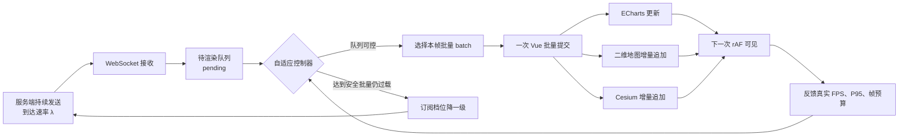
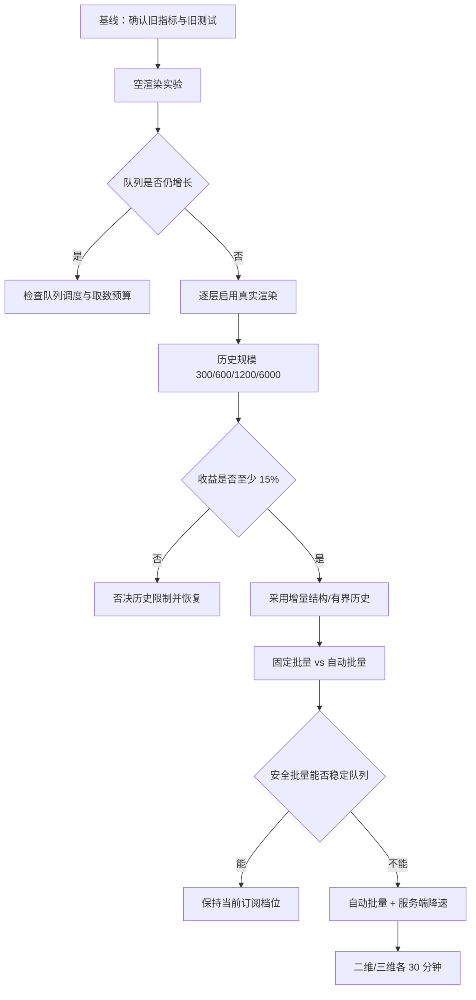
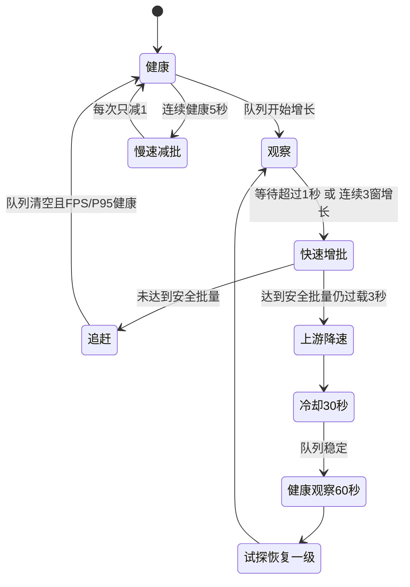

# 实时渲染积压与 FPS 自适应优化实验日志

要按实际执行顺序阅读，请直接跳到 [第 5 节的记录 01](#5-按执行顺序复盘的工作日志)。前面的章节保存问题定义、实验设计与算法说明；第 5 节逐条记录判断、操作、改动和结果。

## 0. 一页读懂：问题、证据和最终方案

### 【先看结论状态】

| 项目 | 当前状态 | 可以得出什么结论 | 不能得出什么结论 |
| --- | --- | --- | --- |
| 源码链路检查 | 已完成 | 旧 FPS 统计口径错误；取数预算没有覆盖实际渲染 | 仅凭源码不能判断真实浏览器 FPS |
| 空渲染吞吐实验 | 已完成 | 当 `λ > FPS × batch` 时，队列必然增长；批量 2 可清空相同输入 | 不能代表地图、图表和 GPU 的真实成本 |
| 历史规模微基准 | 已完成 | 全量轨迹重建随历史增长明显退化；增量追加收益远超 15% | 不能替代 Vue、Canvas、WebGL 的真机实验 |
| 单元测试 | 19 个套件、146 个用例通过 | 批量守恒、快增慢减、调速冷却、二维/三维批量完整性可回归 | 不能证明运行 30 分钟后没有浏览器内存泄漏 |
| 生产构建 | 已通过 | 改动能够进入生产构建流程 | 不代表目标机器性能达标 |
| 二维/三维各 30 分钟 | **待目标环境执行** | 执行后才能验收真实 FPS、队列和堆斜率 | 当前文档不把该项标记为通过 |

> **已经确定的主因不是单一“5 ms 超时”，而是消费能力不足与全量历史渲染共同作用。最终选择方案一作为主控制器，方案二只负责保护单帧预算。**

---

### 【整个问题用一张图表示】



这张图中有两个闭环：

1. **客户端闭环**：真实 FPS、队列长度和渲染 P95 决定下一秒使用多大的批量。
2. **上游闭环**：批量已经达到安全上限仍追不上时，降低服务端订阅速率，让 `λ ≤ μ`。

---

### 【为什么队列会越积越多】

核心关系不是“每帧有没有执行”，而是每秒到底能消费多少点：

```text
服务端：每秒到达 20 点

情况 A：10 个消费帧/秒 × 每帧 1 点 = 10 点/秒
        20 - 10 = 每秒新增 10 点积压
        5 秒后：50 点等待处理

情况 B：10 个消费帧/秒 × 每帧 2 点 = 20 点/秒
        20 - 20 = 每秒新增 0 点积压
        5 秒后：0 点等待处理
```

对应的实际空渲染实验结果：

| 模拟秒数 | 批量 1 的队列 | 批量 2 的队列 |
| ---: | ---: | ---: |
| 0 | 0 | 0 |
| 1 | 10 | 0 |
| 2 | 20 | 0 |
| 3 | 30 | 0 |
| 4 | 40 | 0 |
| 5 | **50** | **0** |

这里两组实验拥有相同的到达率、相同的帧数和相同的空渲染函数，唯一变量是每帧批量。因此可以直接判断：**固定批量过小足以造成持续积压，和 5 ms 取数超时无关。**

---

### 【为什么运行越久可能越慢】

队列问题和历史问题是两条不同的退化路径：

```text
路径 1：输入过载
λ > μ → pending 增长 → 最老数据等待时间增长 → 画面越来越滞后

路径 2：历史膨胀
历史点增多 → 全量数组复制/深度监听/轨迹重建变贵
          → 单批渲染耗时增长 → 可用消费帧减少 → μ 下降
          └───────────────────────────────────────┘
                         形成恶性循环
```

6000 点历史的 JavaScript 坐标数组微基准如下。每个数是 **2000 次调用的累计中位耗时**，不包含 Cesium 绘制：

```text
全量坐标构造   645.739 ms  ████████████████████████████████████████
仅构造新增 5 点  0.091 ms  ▏

差距：约 7065 倍
```

因此本轮没有只调整队列参数，而是同时把二维、三维地图改成批量内逐点增量追加，并把可视历史约束在 6000 点以内。

---

### 【改造前后对照】

| 链路 | 改造前 | 改造后 | 解决的问题 |
| --- | --- | --- | --- |
| FPS | 统计 `handleRealtimePacket` 次数 | 独立 rAF 采样真实画面 FPS | 避免把批量变大误判为 FPS 降低 |
| 队列批量 | 固定值 | 自动计算，保留手动回退 | 输入变化时自动追赶 |
| 时间预算 | 只测数组取数 | 结合 Vue 提交、下一帧和渲染 P95 | 预算覆盖真实渲染链路 |
| 过载处理 | 队列持续增长 | 安全批量不足后逐档降低订阅 | 从源头恢复 `λ ≤ μ` |
| 二维地图 | 深度监听完整历史 | 一个批次逐点追加，批尾移动视角 | 批次不丢点，减少重复工作 |
| 三维地图 | 每次重建完整轨迹 | 实时只转换并追加新增点 | 消除随历史增长的全量计算 |
| ECharts | 数据变化后总是 `resize()` | 容器尺寸变化时才 resize，数据更新 lazy | 去掉无关布局工作 |
| 历史数据 | 地图历史无上限 | 地图最多保留 6000 点；图表按五分钟窗口并限 6000 点 | 约束数组与地图对象规模 |
| 数据守恒 | 没有分层计数 | 接收、消费、等待、可视淘汰分别计数 | 不把批量或淘汰误判为丢点 |

---

### 【最终选择为什么不是二选一】

| 判断问题 | 方案一：自适应拥塞控制 | 方案二：有时间才渲染 |
| --- | --- | --- |
| 能提高持续消费能力 `μ` 吗 | **能**，增大每批点数 | 不能，只决定本帧是否工作 |
| 能在持续过载时清空队列吗 | **能**，必要时还能降低 `λ` | 通常不能，甚至可能减少消费机会 |
| 能避免单帧过长吗 | 需要安全批量约束 | **能**，适合做帧预算保护 |
| 主线程持续繁忙时是否可能饥饿 | 不依赖 idle 回调 | 如果依赖 idle，可能长期得不到执行 |
| 本项目定位 | **主方案** | **辅助保护** |

最终结构是：

`动态批量提高 μ → 半帧预算限制单批成本 → 仍过载时降低 λ`

不是“只选一个”，而是明确主次：**方案一负责稳定系统，方案二负责保护单帧。**

> 本文是本轮优化的增量实验记录。每个阶段先写假设与控制变量，再记录真实执行结果；未执行或未跑满的实验不会标记为通过。

## 1. 问题定义与指标澄清

### 【现象】

服务端持续向前端发送遥测点。当客户端每秒能够消费的数据点少于到达的数据点时，前端渲染队列持续增长；运行时间越长，地图历史、图表窗口和待渲染数据越大，页面可能进一步变慢。

统一使用下面的排队模型描述问题：

```text
到达速率 λ = 每秒接收点数
消费速率 μ = 每秒渲染批次数 × 每批实际消费点数

λ > μ：队列持续增长
λ ≤ μ：队列稳定或能够被逐步清空
```

### 【先区分两种“帧率”】

当前页面原有的 `fps` 由 `handleRealtimePacket` 的调用次数累计得到，本质是“每秒数据提交批次数”，不是浏览器通过 `requestAnimationFrame` 产生的真实画面帧率。每批从 1 个点增加到 5 个点后，提交批次数可能降为原来的五分之一，但页面反而可能更流畅。因此旧指标不能直接用于判断页面卡顿。

本轮将两个指标分开；浏览器会在下一次重绘前调用 `requestAnimationFrame` 回调，因此它适合测量画面调度能力，而不是数据包数量。[[1]](https://developer.mozilla.org/docs/Web/API/Window/requestAnimationFrame)

- 真实 FPS：独立的 `requestAnimationFrame` 采样结果，用于判断页面流畅度。
- 数据提交频率：每秒调用数据渲染入口的次数，用于计算消费速率。

### 【已从源码确认的事实】

1. `FrameTelemetryQueue` 的时间预算只包围数组取数循环，`onFrame` 中的 Vue、ECharts、OpenLayers 和 Cesium 工作不在预算内。
2. 当前页面每次收到批次都会创建新的响应式数组；二维和三维地图使用深度监听完整 `mapList`。
3. 三维地图会在更新时重新遍历完整轨迹并构造 Cesium 坐标数组，历史越长，单次工作量越大。
4. 图表更新会重新生成完整 option、执行 `setOption`，并在每次数据变化后调用 `resize`。
5. 当前 `mapList` 没有生命周期上限，因此即使队列短期不积压，历史对象和遍历成本仍可能随运行时间增长。
6. 当前服务端速率和每帧批量都可以调整，但改变订阅速率会重建 WebSocket 连接。

上述事实只能证明“存在风险”，不能替代 A/B 数据。历史限制、批量绘制和自动降速是否进入最终方案，仍由后续实验门槛决定。

## 2. 待证伪假设与控制变量

### 【假设总表：先规定什么现象能够证明或否定】

| 编号 | 假设 | 唯一改变的变量 | 必须保持不变 | 如果假设成立，应看到什么 | 当前判断 |
| --- | --- | --- | --- | --- | --- |
| H1 | 5 ms 取数超时是主要瓶颈 | 渲染函数：真实渲染 → 空函数 | 到达率、帧数、批量 | 空渲染仍追不上，且取数阶段耗时超预算 | **不支持**；空渲染批量 2 能稳定 |
| H2 | 单次渲染工作太重 | 依次打开父状态、图表、二维、三维 | 输入数据、历史规模、批量 | 某组件打开后 P95/长帧显著增加 | **部分支持**；三维全量轨迹成本极高，真机分层数据待补 |
| H3 | 历史增长造成时间退化 | 历史规模 300/600/1200/6000 | 批量、输入、执行轮次 | 历史越大，全量处理时间稳定上升且超过 15% | **支持**；6000 点重建是 300 点的 51.08 倍 |
| H4 | 固定批量太小造成积压 | 批量 1 → 2 | 20 点/秒、10 帧/秒、空渲染 | 队列斜率由正变为 0 | **支持**；最终积压从 50 变为 0 |
| H5 | 降低服务端速率能解除极端过载 | 订阅档位逐级下降 | 安全批量、页面模式、历史规模 | 到达率下降后 `λ ≤ μ`，队列开始回落 | **控制逻辑已验证**；真实连接断点仍需部署环境观测 |

“支持”不等于所有场景都已验收。例如 H3 的 Node 微基准足以决定是否停止全量重建，却不足以直接宣称目标电脑上的真实 FPS 已经达标。

---

### 【实验顺序与依赖关系】



本轮已经完成 S0、S1、历史微基准、控制器回归和生产构建。逐组件真机分层以及最后的 S6 需要目标浏览器、真实服务端和可观察的 WebSocket 连接，因此明确保留为部署验收。

---

### 【H1：队列或超时机制是主要瓶颈】

保持到达速率和批量不变，将真实渲染替换为空消费函数。如果空消费仍出现队列增长，优先检查调度器、计时和队列算法；如果空消费稳定，则排除“5ms 超时本身导致低 FPS”。

### 【H2：单次渲染工作过长是主要瓶颈】

按“父组件状态 → 图表 → 二维地图 → 三维地图”逐项启用，其他变量不变。记录真实 FPS、提交耗时 P95、长动画帧数量和队列斜率，用差值定位主要成本。

### 【H3：历史增长造成随时间退化】

固定到达速率、批量和页面模式，只改变历史规模 `300 / 600 / 1200 / 6000`。若历史规模扩大后渲染 P95、真实 FPS或内存出现至少 15% 的稳定差异，则接受历史限制或增量数据结构；否则不以该假设为由缩短可视历史。

### 【H4：批量消费能够消除积压】

固定渲染内容和接收速率，比较批量 `1 / 2 / 5 / 10 / 20 / 50`。如果增加批量使队列斜率从正数变为不大于 0，且真实 FPS 退化不超过 5%，则接受批量消费。

### 【H5：降低服务端速率能够恢复稳定】

在已经达到安全批量上限、队列仍持续增长的场景中，依次降低服务端档位。如果降速后满足 `λ ≤ μ`、队列等待时间回落且连接切换没有不可接受的数据断点，则允许自动降档；否则只显示过载告警，不自动改变订阅。

## 3. 统一验收门槛

每个性能候选改动使用相同数据和页面模式重复 3 次，以中位数判定：

- 主要瓶颈指标改善至少 15%。
- 真实 FPS、数据完整性等其他核心指标退化不超过 5%。
- 稳定阶段队列斜率不大于 0，最老待处理数据 P95 不超过 1 秒。
- 5 秒突发数据应在 3 秒内追平。
- 接收点数等于消费点数；批量提交不算丢点，可视历史淘汰必须单独计数。
- 真实 FPS 不低于同页面空闲基准的 90%。
- 长时间实验最终 20 分钟 JS 堆增长目标不超过 1 MB/分钟。

单组正式实验计划预热 30 秒、采集 5 分钟、重复 3 次；最终方案计划在二维和三维模式各运行 30 分钟。自动化环境无法完成的长时间浏览器实验将保留为明确的待验收项，不用短测试替代结论。

## 4. 方案推理记录

### 【为什么不单独选择“有时间才渲染”】

只在空闲或剩余时间充足时工作，只能限制某一帧的工作量，不能提高持续消费速率。若 `λ > μ`，减少可用渲染时机反而会扩大队列；`requestIdleCallback` 在主线程持续繁忙时还可能长期得不到执行。因此时间预算只能作为单帧安全边界，不能作为持续过载的主控制器。

### 【当前选择】

采用分层拥塞控制：

1. 先根据真实 FPS、到达率、队列深度和渲染成本动态选择批量。
2. 用半个显示帧周期约束单批预测成本，防止为了追队列制造长帧。
3. 达到已验证的安全批量后仍连续过载，再逐档降低服务端订阅速率。
4. 历史规模实验若证明全量历史造成显著退化，再采用有界可视历史；服务端原始数据不受影响。

---

### 【控制器每秒到底做什么】

控制器不是根据单次抖动立即改参数，而是每秒读取一组稳定口径的数据：

| 输入 | 含义 | 对控制结果的影响 |
| --- | --- | --- |
| `arrivalRate` | 最近窗口每秒收到多少点 | 输入越高，所需批量越大 |
| `consumeRate` | 最近窗口每秒实际消费多少点 | 用于判断当前是否已经追上 |
| `pending` | 当前队列有多少点 | 进入两秒追赶项，不只维持平衡，还要偿还积压 |
| `oldestPendingMs` | 最老点等待了多久 | 超过 1 秒触发快速增批 |
| `actualFps` | 独立 rAF 得到的真实 FPS | 决定每秒有多少可用消费机会 |
| `renderP95Ms` | 最近渲染样本的 95 分位 | 判断批量是否已经逼近帧预算 |
| `frameIntervalMs` | 实际显示帧周期 | 预算取其一半，不硬编码为 60 Hz |
| `queueSlope` | 队列每秒增长或下降多少点 | 连续 3 个正窗口判定持续过载 |

所需批量计算：

```text
所需批量 = ceil(
  (到达率 + 当前积压 / 2 秒追赶窗口)
  / max(真实 FPS, 1)
)
```

#### <u>1. 没有积压时</u>

```text
到达率 = 20 点/秒
pending = 0
真实 FPS = 10

所需批量 = ceil((20 + 0 / 2) / 10)
         = 2
```

批量 2 只够维持队列不增长。

#### <u>2. 已经积压 30 点时</u>

```text
到达率 = 20 点/秒
pending = 30
真实 FPS = 10

所需批量 = ceil((20 + 30 / 2) / 10)
         = ceil(35 / 10)
         = 4
```

此时每秒理论消费 `10 × 4 = 40` 点：20 点处理新输入，剩余能力用于在约两秒内追赶 30 点积压。

**<u>限制：</u>** 计算结果不是无条件采用。最终批量还必须位于 1～50，并且不能超过已经用渲染样本验证过的安全批量。

---

### 【快增、慢减与安全批量】



“快增慢减”的目的不是让批量频繁追随噪声，而是处理两个风险：

- 增得太慢：积压会转化为越来越大的数据延迟。
- 减得太快：刚追平就缩小批量，下一秒又过载，形成来回震荡。

安全批量通过已观察到的渲染成本学习。假设显示器的实际帧周期约为 16.67 ms，则默认只允许渲染工作占一半：

```text
单帧预算 = 16.67 × 50% ≈ 8.33 ms
```

当某批量对应的渲染 P95 已超过 8.33 ms，控制器不会为了追队列继续把同一帧塞得更满。此时如果队列仍连续增长，问题转交给订阅降速，而不是牺牲页面响应。

---

### 【服务端档位怎样降、怎样恢复】

档位顺序固定，不做任意数值跳变：

`全部 → 20 → 10 → 5 → 2 → 1`

```text
过载第 1 秒：记录，不调速
过载第 2 秒：继续确认，不调速
过载第 3 秒：仍在安全批量上限 → 降一个档位
之后 30 秒：冷却期，禁止再次连续改档

队列稳定后：
健康持续不足 60 秒 → 保持当前档位
健康持续达到 60 秒 → 只试探恢复一个档位
恢复后再次观察 → 若重新过载，按相同规则退回
```

这里分别记录“用户请求档位”和“实际生效档位”。例如用户选择 20 点/秒，过载后实际连接降为 10 点/秒；界面仍显示请求值 20，方便健康期试探恢复，也避免用户误以为自己的配置被永久修改。

---

### 【数据守恒怎样判断有没有丢点】

批量变大、可视历史淘汰和真正的数据丢失不能混在一个数字里：

```text
接收总数 = 已消费总数 + 当前等待数

可视历史保留数
  = 已消费总数
  - 已明确记录的可视淘汰数
  - 非地图/图表展示范围内的数据
```

一个批次包含 5 个点，只会触发一次父组件提交，但消费统计必须增加 5，而不是增加 1。超过 6000 点后删除最旧的可视对象，也只增加“可视淘汰数”，不能减少接收数或消费数。

## 5. 按执行顺序复盘的工作日志

本节依据本轮留下的阶段记录、源码差异、单元测试与三份 JSON 报告，按执行先后复盘。原始记录没有保存每条操作的准确时刻，因此“记录 01”这类编号表示顺序，不冒充分钟级时间戳。下面的“判断”是当时依据代码或实验作出的推理；实测数据与尚未验证的推断分别写明。

### 【记录 01｜先冻结旧行为】

接到的问题是“每帧只渲染一条时 FPS 低，队列越运行越长”。此时还不能动批量或地图代码：若旧连接恢复、队列热更新原本就失败，后续回归将无法判断是优化造成的还是旧问题。于是先执行 `realtimeClient.spec.js` 与 `frameTelemetryQueue.spec.js`。两个套件、13 个用例通过，耗时 42.061 秒。

这一步只建立功能基线。测试没有真实浏览器绘制、GPU、堆采样；所以我没有把“旧测试通过”解释为页面性能正常。接下来必须先查面板里的 FPS 究竟统计了什么。

### 【记录 02｜沿着旧 FPS 和 5 ms 预算追代码】

在 `dataVisualization.vue` 中追踪旧 `fps` 的累加位置，发现它随 `handleRealtimePacket` 调用增加。一个批次含 1 点或 5 点，都只算一次；因此面板数字表示每秒提交多少批数据。批量变大时这个数可能下降，即使单位时间消费点数上升。此时不能用它回答“浏览器画面为什么卡”。

再进入 `FrameTelemetryQueue.flush()` 看 5 ms 条件。计时发生在从数组取点的循环内，`onFrame(batch)` 在循环之后；Vue 更新、ECharts、二维地图与 Cesium 均不在预算内。由此只能否定“5 ms 已保护整条渲染链路”这一理解，**还不能断言**真实渲染耗时就是主因，也不能断言 5 ms 从未限制取数。

我据此把要观测的量拆开：独立 rAF FPS；每秒提交批数；到达/消费点数；队列长度与队首等待；父组件入口、Vue 提交与下一次 rAF 的时间。下一步先补观测，之后才用相同输入做对照。

### 【记录 03｜补齐队列和画面测量口径】

先改 `FrameTelemetryQueue.ts`：入队时给每个点记录时间戳，提供 `oldestPendingMs()` 和累计入队/消费计数，队列压缩时同步压缩时间戳。检查极小预算边界时发现，若取第一点前就耗尽预算，队列可能没有进展；于是让非空队列每帧至少取一条。这一步的目标是让“积压多少、等了多久、有没有少消费”可核对，而不是直接提升浏览器 FPS。

随后新增 `RenderPerformanceMonitor.ts`，独立用 rAF 采样，不再用数据入口次数冒充帧率。在 `dataVisualization.vue` 中把旧值标为“数据提交频率”，从 `handleRealtimePacket` 开始计时，分别记录同步合并、`$nextTick` 后的提交成本和下一次 rAF 的延迟；`realtimeClient.ts` 汇总到达率、消费率、积压与守恒计数供面板读取。下一次 rAF 只是**最早可见机会的近似**，不是 GPU 已完成呈现的精确时间，这个边界保留给真机性能录制。

确定性测试暴露了一个测量器自身的边界错误：模拟器首个 rAF 时间戳为 0 时，旧的“0 表示未初始化”判断让窗口多算一帧。将起点改成可空值后复测通过。队列年龄、守恒、预算边界测试也通过。只有先让仪表可信，下一步的“低 FPS”诊断才不会继续建立在旧误标指标上。

### 【记录 04｜用空渲染把队列吞吐与地图成本拆开】

我先没有把整张页面加入测试，而是令渲染回调为空函数，固定每秒到达 20 点、每秒可执行 10 个消费帧、持续 5 个模拟秒。只改变 `maxPointsPerFrame`，分别设为 1 和 2。报告保存在 `reports/realtime-rendering/queue-throughput-experiment.json`。

| 固定条件 | 批量 1 | 批量 2 |
| --- | ---: | ---: |
| 到达点数 | 100 | 100 |
| 最多可消费点数 | 50 | 100 |
| 结束时待处理 | **50** | **0** |
| 理论队列斜率 | +10 点/秒 | 0 点/秒 |

观察与公式吻合：`μ = 消费帧数 × 每帧点数`。这说明在**空渲染条件下**，固定批量 1 自身就足以造成积压；将批量改成 2 不需要更多消费帧也能追平输入。它没有测出真实地图每批的成本，因此下一步不能直接把批量设到 50；需要一边扩大消费能力，一边控制单批渲染时间。

---

### 【记录 05｜从吞吐实验推导批量控制器】

空渲染证明批量 1 与 2 的消费能力不同，但真实页面每多画一个点都会增加成本。最初可选的两种做法是：固定设一个较大的批量，或在每个观测窗口根据输入和积压重算。固定值不能同时适应 1 点/秒与 20 点/秒，也无法在设备变慢时知道何时停下；因此新增无网络、无定时器的 `AdaptiveRenderController.ts`，由客户端每秒交给它一次观测样本。

先计算维持输入并在两秒内追赶积压所需的批量。例如到达 20 点/秒、真实 FPS 为 10、已有 30 点待处理，计算为 `ceil((20 + 30/2)/10)=4`。然后加入约束：批量限在 1～50；P95 渲染耗时超过实际帧周期的一半时，不继续向上试探；队列等待超过 1 秒或连续增长时快速增批；队列清空、FPS 与耗时健康持续 5 个窗口才减 1。控制器保留手动批量入口，供 A/B 比较和故障回退。

我用确定性的样本时间、FPS、pending 和 P95 测边界，而不是等待真实 60 秒完成每个测试。控制器和 rAF 采样相关 8 个用例通过。这里验证的是**控制规则会作出什么决定**，并没有证明某台设备在批量 4 时一定能保持 90% 基准 FPS；安全批量仍要靠运行样本学习。

### 【记录 06｜接入实时客户端时发现空桶会冻结旧积压】

将控制器接到 `realtimeClient.ts` 时，顺着消息状态检查暂停和恢复路径。发现收到 `no-data` 空桶时，旧逻辑无条件调用 `frameQueue.pause()`；如果上一秒仍有点排队，新的这一秒“没有新点”却把旧队列也停掉。这会表现为队列不动、画面滞后，和渲染函数耗时无关。

为避免凭阅读直接改动，我构造“队列里还有两个点 → 收到 no-data → 继续推进帧”的用例。修复为：空桶仅更新连接状态；若队列仍有 pending，则保持/恢复消费。复现用例中两个旧点最终均被消费。这个发现使诊断多了一条独立原因：即使 `λ ≤ μ`，状态机暂停也可能让队列停滞，所以最终验收必须同时看队列斜率与连接状态。

### 【记录 07｜把控制决策连接到界面与订阅档位】

客户端新增 `runtimeStats()`，把到达、消费、等待、当前批量、安全批量、队列斜率与原因返回面板；`reportRenderPerformance()` 接收 rAF 与 P95 样本，执行新的批量决定。批量变化只调用队列的 `setMaxPerFrame()`，不重连；手动选择批量时关闭自动模式。面板默认展示自动模式，同时显示“请求订阅档位”和“实际生效档位”，否则自动降速后用户无法判断当前输入变少是服务端原因还是客户端消费变快。

再考虑安全批量到顶后的场景：如果继续加点会超过半帧预算，单靠客户端不能让 `μ` 超过 `λ`。控制器于是连续确认 3 个过载窗口后请求降低一个已有订阅档位，至少冷却 30 秒；健康持续 60 秒才试探恢复一级。客户端沿用原有 `setMaxPointsPerSecond` 的重连机制执行档位变化。集成测试证明目标档位 20 保持不变时，实际档位可以因持续过载降到 10；恢复和冷却规则也有确定性测试。

这个结果只证明客户端会按规则切换连接参数。真实 WebSocket 重连时长、服务端是否恰好补齐断点、降速后的真实 FPS 和队列斜率，仍需部署环境观测，因此此处没有写成“自动降速已通过端到端性能验收”。

---

### 【记录 08｜批量增大后先检查“每个点都画了没有”】

控制器可以让一帧交给页面多个点，但检查 `PlanimetricMap.vue` 和 `StereoscopicMap.vue` 时发现，旧 watcher 收到更新后的完整 `mapList`，随后把索引移到最后一项，只为这一项创建可视对象。若现在直接把批量从 1 调到 5，接收与队列的计数可能都显示“消费 5 点”，地图却只出现最后 1 点；这会用吞吐改进掩盖可视数据缺失。

因此先改父组件的提交形状：`dataVisualization.vue` 一次合并这一批完整数据，另传 `realtimeBatch` 和递增的 `realtimeBatchId` 给地图。二维组件监听批次版本，逐点追加浓度点与路线段，最后一点才居中；三维组件逐点创建/更新柱体并追加轨迹，最后一点才跟随视角。地图不再以深度监听完整 `mapList` 作为实时绘制触发器，历史模式所需路径继续保留。

批量测试传入多点并逐一检查绘制对象；地图生命周期与批量完整性相关 33 个用例通过。判断由此改变：批量大小现在可以影响一次提交包含多少点，而不会因为地图只读取末点而静默少画。

### 【记录 09｜用不同历史长度检查“越运行越慢”】

完成批量正确性后，仍有另一条潜在退化路径：三维轨迹的旧代码在每次更新时从完整历史构造坐标数组；父组件的数组合并也随历史变长。若只调大批量，单次工作可能随时间越来越重，最终可用消费帧下降。因此固定新增批次为 5 点，只改变已有历史为 300、600、1200、6000 点，分别测数组追加、完整坐标数组重建与仅构造新增 5 点的坐标数组。

`QHZHC_Web/tests/performance/realtimeHistory.bench.js` 在 Node v22.12.0 下每轮调用操作 2000 次，共做 5 轮取中位数；以下 **ms 是一轮 2000 次操作的累计耗时，不是一次浏览器渲染耗时**。原始五轮样本保存在 `reports/realtime-rendering/history-microbenchmark.json`。

| 历史点数 | 数组追加累计中位数 | 完整坐标构造累计中位数 | 仅新增 5 点累计中位数 |
| ---: | ---: | ---: | ---: |
| 300 | 4.252 ms | 12.643 ms | 0.158 ms |
| 600 | 4.851 ms | 30.174 ms | 0.239 ms |
| 1200 | 7.052 ms | 65.540 ms | 0.109 ms |
| 6000 | 28.881 ms | 645.739 ms | 0.091 ms |

比较同一操作随历史增长的变化：完整坐标构造在 6000 点时是 300 点时的 51.08 倍；数组追加为 6.79 倍。比较同一 6000 点背景下的两种坐标构造，2000 次累计耗时相差约 7065 倍。这里测的是 **JavaScript 数组算法**；脚本没有调用 Cesium、Vue、Canvas 或 GPU，故不能把 645.739 ms 称为“单次 Cesium 渲染耗时”。这个结果足以支持消除每批全量坐标构造，但真实 FPS 收益还要在浏览器中确认。

### 【记录 10｜据规模证据改轨迹、历史与图表】

根据上一条数据，我把三维实时路径改成只将本批新点转为 `Cartesian3` 并追加到现有轨迹状态；初始化或显式重画仍可走全量路径。二维点、线段和三维柱体也要有界，否则只优化坐标构造仍会让可视对象永久增长。

取 6000 点为可视硬上限的计算是：20 点/秒 × 300 秒 = 6000 点；若连续运行 30 分钟而不淘汰，则是 36000 点。于是 `visualizationData.ts` 对地图批次保留最近 6000 点；二维图层移除最旧点及线段；三维轨迹移除最旧坐标，柱体使用最多 6000 个可复用槽位。这里的地图约束是**点数上限**，只在输入恰为 20 点/秒时等价于约五分钟，不保证所有订阅档位都是严格五分钟；图表另有真实的五分钟时间窗口，并再设 6000 点硬上限。淘汰只发生在前端可视历史，`totalReceived` 与 `totalConsumed` 不减。

随后检查 `Charts.vue` 的更新路径：数据变化原先触发深监听，`setOption` 后又无条件 `resize()`。尺寸没有变化时，数据更新无需重复走 resize，因此改为浅监听、`lazyUpdate: true`，并交给已有容器尺寸监听处理 resize。相关用例验证这些调用行为；**没有单独的图表真机三轮 A/B 数字**，所以不能从本条推出“图表 FPS 已提升 15%”。

---

### 【记录 11｜修改完后按故障风险回归】

先检查控制器与队列：极小取数预算仍能推进至少一个点；手动模式不被自动决策覆盖；连续过载才降一个档位；冷却期间不重复降档；健康期达到阈值才试探恢复。再检查组件：同一批的每个点都进入二维、三维可视对象；超出 6000 时最旧对象被淘汰且最新点保留；批量计数满足“已接收 = 已消费 + 待处理”。这些测试针对的是先前真正发现的风险，而不是只断言函数被调用。

高相关图表、地图、模式切换和工具栏共 52 个用例通过；随后执行全量单元测试，19 个套件、146 个用例全部通过。生产构建通过。对本次改动的 Vue/JS 文件单独执行 ESLint 也通过。验证摘要写入 `reports/realtime-rendering/implementation-validation.json`。

全项目 lint 另有既存页面/配置错误，项目 ESLint 也不能解析 TypeScript；因此我没有把“定向 lint 通过”写成“全项目 lint 通过”。构建的 16 条警告为原有样式导出和资源体积类警告。此时能确认功能回归和生产打包可用，仍不能确认目标浏览器长时间运行达标。

### 【记录 12｜到这里能作出的方案判断，以及停在哪里】

回到最初的两种方案：空渲染对照显示，增加批量能把相同 10 个消费帧/秒的能力从 10 提到 20 点/秒；只等“有时间才渲染”不会增加这个能力。于是批量控制承担追赶队列的任务。历史规模实验又说明不能无条件增批：若每次都做随历史增长的全量工作，批量越大越可能拖长一帧。因此用实测 P95 和半帧预算限制继续增批，达到安全上限仍过载时才向服务端降一个订阅档位。

截至本条，证据链能支持的是：队列容量模型成立；旧 FPS 标注错误；空桶冻结是一个独立状态错误；完整坐标数组构造随历史增长明显变贵；控制器、批量完整性与限长行为通过确定性回归。**它还不能支持**“20 点/秒的真实二维/三维页面已达到 90% 空闲 FPS”“5 秒突发必在 3 秒内追平”或“最后 20 分钟堆增长不超过 1 MB/分钟”。这三项都需要目标环境数据。

下一步操作已明确，但尚未执行：在同一浏览器和同一数据集下，先测二维空闲基准，再按固定批量、自适应批量、自动降速逐组运行，每组预热 30 秒、采集 5 分钟、重复 3 次；三维重复相同流程。最后两种地图各跑 30 分钟，记录 FPS、队列斜率、队首等待 P95、重连断点、JS 堆和可视对象数。只有这些数据达到第 3 节门槛，才能把“规则实现完成”推进为“真机性能验收通过”。

---

以下是便于查文件和复测的索引，不再作为执行顺序的替代。

### 【代码修改怎样一一对应问题】

| 文件 | 原问题 | 关键修改 | 对应证据或测试 |
| --- | --- | --- | --- |
| `services/AdaptiveRenderController.ts` | 固定批量无法适应输入和设备能力 | 追赶公式、快增慢减、安全批量、档位冷却与恢复 | 控制器边界、过载、恢复、防震荡测试 |
| `services/RenderPerformanceMonitor.ts` | 旧 FPS 是数据入口次数 | 独立 rAF 计数、基准 FPS、帧周期、P95 | rAF 与数据回调解耦测试 |
| `services/FrameTelemetryQueue.ts` | 不知道队列年龄；极小预算可能一条也不取 | 入队时间戳、最老等待、守恒计数、至少消费一条 | 队列年龄、压缩、预算边界测试 |
| `services/realtimeClient.ts` | 缺少运行态反馈；no-data 会冻结积压 | 汇总到达/消费/斜率；接入控制器；空桶不暂停旧数据 | 数据守恒、自动降档、no-data 回归 |
| `dataVisualization.vue` | 指标混淆；一次批次可能引发多次无效更新 | 自动/手动模式；一次批量提交；nextTick+rAF 测量；新增监控字段 | 组件回归与生产构建 |
| `Charts.vue` | 深监听、每次更新无条件 resize | 浅监听、lazy update、resize 交给容器变化 | 图表相关用例 |
| `PlanimetricMap.vue` | 深监听完整历史；批量只使用末点 | 显式批次版本；批内逐点追加；批尾更新视角；对象限长 | 二维批量完整性和限长测试 |
| `StereoscopicMap.vue` | 全量 Cesium 坐标重建；批量只使用末点 | 增量 Cartesian3；批内逐点追加；环形柱体槽位 | 三维批量完整性、轨迹与槽位测试 |
| `utils/visualizationData.ts` | 历史无界增长 | 五分钟窗口与 6000 点硬上限 | 历史淘汰保留最新点测试 |

#### <u>1. 改造前的数据更新路径</u>

```text
收到一批数据
  ├─→ 父组件复制完整数组
  ├─→ 图表深度监听 → setOption → resize
  ├─→ 二维地图深度监听完整 mapList → 只处理最后一点
  └─→ 三维地图深度监听完整 mapList
       ├─→ 只处理最后一点
       └─→ 重新转换全部历史坐标并重建轨迹
```

问题有两类：批量中的中间点没有完整进入地图；即使只新增一个点，部分组件仍按完整历史规模工作。

#### <u>2. 改造后的数据更新路径</u>

```text
收到一批 N 个点
  └─→ 父组件合并一次状态、提交一次批次版本
       ├─→ 图表：更新有界五分钟数据，不因数据变化 resize
       ├─→ 二维地图：循环追加 N 个点和线段，最后一点更新视角
       └─→ 三维地图：循环追加 N 个柱体和轨迹坐标
            ├─→ 实时路径不重建完整历史
            └─→ 初始化/显式重画才走全量路径
```

“一次提交”不表示只处理一个点，而是把 N 个点组织成一次组件更新，再由地图内部以增量方式处理完整批次。

---

### 【测试覆盖到哪里】

| 风险 | 自动化验证方式 | 结果 |
| --- | --- | --- |
| 自动批量越界 | 输入极端到达率和 FPS，检查 1～50 | 通过 |
| 手动模式被自动控制覆盖 | 切为手动后运行控制窗口 | 通过 |
| 队列增长却没有快速增批 | 构造连续正斜率和等待超 1 秒 | 通过 |
| 健康一秒就立即减批 | 构造不足/达到 5 个健康窗口 | 通过 |
| 服务端档位频繁震荡 | 验证 3 秒过载、30 秒冷却、60 秒恢复 | 通过 |
| 极小时间预算导致零进展 | 让预算在首点前耗尽 | 仍至少消费一条，通过 |
| no-data 冻结已有积压 | 空桶到达前保留两个待处理点 | 两点继续消费，通过 |
| 批量中间点被地图丢弃 | 一个批次提供多个坐标 | 二维、三维全部追加，通过 |
| 轨迹限长破坏最新点 | 超过 6000 点后检查首尾 | 淘汰最旧、最新点保留，通过 |
| 批量被误记成一个消费点 | 对比接收、消费和 pending | 守恒关系通过 |

全量结果是 19 个套件、146 个用例通过。结构化验证摘要位于 `reports/realtime-rendering/implementation-validation.json`；吞吐对照位于 `reports/realtime-rendering/queue-throughput-experiment.json`；历史微基准位于 `reports/realtime-rendering/history-microbenchmark.json`。

---

### 【目标环境 30 分钟测试怎样执行】

这部分是待执行的验收步骤，不是已完成结果。二维和三维必须分开测试，因为 OpenLayers/Canvas 与 Cesium/WebGL 的成本结构不同。

#### <u>1. 每种地图模式的固定流程</u>

| 阶段 | 时长 | 操作 | 记录目的 |
| --- | ---: | --- | --- |
| 空闲基准 | 2 分钟 | 连接建立但不输入实时点 | 得到该设备、该页面的基准 FPS |
| 预热 | 30 秒 | 20 点/秒、自动批量 | 排除初始化、Shader 编译和首次 GC |
| 稳定输入 | 5 分钟 × 3 | 每轮相同数据与视角 | 以三轮中位数判断是否达到 15% 门槛 |
| 突发输入 | 5 秒突发 + 3 秒观察 | 在稳定流上注入突发点 | 验证追赶窗口与队列恢复 |
| 长稳 | 30 分钟 | 保持 20 点/秒，不切页面 | 验证最后 20 分钟堆斜率和对象上限 |
| 恢复 | 2 分钟 | 停止输入，继续观察 | 验证队列归零、内存是否回落或稳定 |

每一轮至少记录：

| 类别 | 字段 |
| --- | --- |
| 帧 | 空闲基准 FPS、真实 FPS、帧周期、Long Animation Frame/Long Task |
| 队列 | 到达率、消费率、pending、队列斜率、最老等待时间 |
| 渲染 | 当前批量、安全批量、同步耗时、Vue 提交 P50/P95、下一帧延迟 |
| 历史 | 图表点、二维实体、三维柱体、轨迹点、可视淘汰数 |
| 调速 | 请求档位、生效档位、调速原因、最近调速时间、重连耗时 |
| 守恒 | 接收总数、消费总数、当前等待数 |
| 内存 | JS heap，尤其是最后 20 分钟的线性斜率 |

#### <u>2. A/B 组合</u>

| 组别 | 批量策略 | 服务端自动降速 | 用途 |
| --- | --- | --- | --- |
| A | 固定批量 1/2/5/10/20/50 | 关闭 | 建立不同批量的吞吐与帧成本曲线 |
| B | 自动批量 | 关闭 | 判断仅客户端控制能否稳定队列 |
| C | 自动批量 | 开启 | 验证客户端到顶后的完整拥塞控制 |

同一组测试不得同时改变地图模式、历史规模、服务端速率和批量策略，否则无法知道收益来自哪一项。

---

### 【看到异常时怎样定位】

```text
队列是否持续增长？
├─ 否
│  ├─ 真实 FPS ≥ 空闲基准 90% → 当前配置通过
│  └─ 真实 FPS < 空闲基准 90%
│     └─→ 对比父状态/图表/二维/三维的分层 P95，定位纯渲染瓶颈
└─ 是
   ├─ 当前批量 < 安全批量
   │  └─→ 检查控制器为何没有增批、是否处于手动模式
   └─ 当前批量 = 安全批量
      ├─ 渲染 P95 > 半帧预算
      │  └─→ 不再增批；应降低订阅速率或继续优化组件
      └─ 渲染 P95 ≤ 半帧预算
         └─→ 检查安全批量学习是否过于保守

队列稳定但 JS heap 持续增长？
├─ 地图/图表对象数超过 6000 → 检查淘汰逻辑
├─ 对象数稳定但 heap 增长 → 做堆快照，查监听器/闭包/WebGL资源
└─ 只在切换模式后增长 → 检查组件销毁与 Cesium/OpenLayers 释放
```

这棵判断树把三类问题分开：吞吐不足、单批渲染过重、资源没有释放。三者都可能表现为“越运行越卡”，但修复方式不同。

## 6. 参考文献

[1] MDN WEB DOCS. [Window: requestAnimationFrame() method](https://developer.mozilla.org/docs/Web/API/Window/requestAnimationFrame)[EB/OL]. [2026-09-23].

[2] MDN WEB DOCS. [PerformanceObserver](https://developer.mozilla.org/docs/Web/API/PerformanceObserver)[EB/OL]. [2026-09-23].

[3] MDN WEB DOCS. [Long Animation Frames API](https://developer.mozilla.org/docs/Web/API/Performance_API/Long_animation_frame_timing)[EB/OL]. [2026-09-23].

[4] VUE.JS. [Async Update Queue](https://v2.vuejs.org/v2/guide/reactivity.html#Async-Update-Queue)[EB/OL]. [2026-09-23].

[5] APACHE ECHARTS. [echartsInstance.setOption](https://echarts.apache.org/en/api.html#echartsInstance.setOption)[EB/OL]. [2026-09-23].
