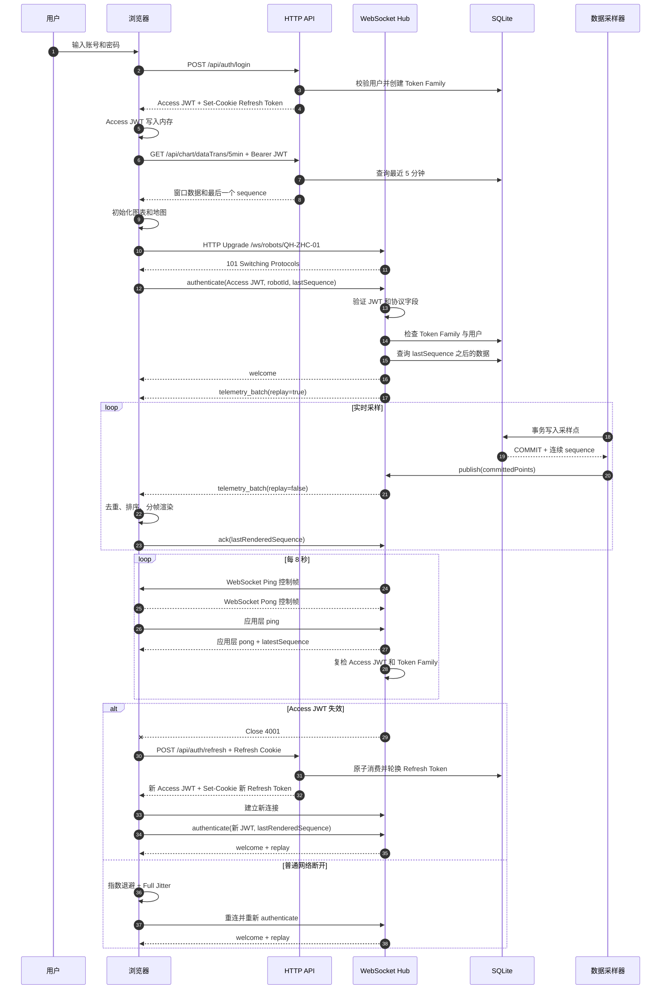

# 走航车实时数据完整链路：JWT、WebSocket、心跳与断线恢复

## 1. 实现概览

当前系统使用以下认证和实时通信模型：

- Access Token 是短期 JWT，仅保存在前端 JavaScript 内存；
- Refresh Token 是高熵随机字符串，仅保存在 `HttpOnly` Cookie；
- Refresh Token 每次只能使用一次，刷新时必须轮换；
- 已消费的 Refresh Token 再次出现时，服务端撤销整个 Token Family；
- HTTP API 使用 `Authorization: Bearer <access-token>`；
- WebSocket 先建立连接，再通过第一条 `authenticate` 消息鉴权；
- Access JWT 失效后，前端通过 HTTP 刷新 Token，再重新建立 WebSocket；
- 断线后根据 `lastSequence` 补发数据，保证不漏点；
- 服务端和客户端同时执行心跳检测；
- 普通网络故障使用带完全抖动的指数退避重连。

核心代码：

| 职责 | 文件 |
| --- | --- |
| JWT 签发、验证和 Refresh 生命周期 | [`QHZHC_Server/src/server/auth.ts`](../QHZHC_Server/src/server/auth.ts) |
| Refresh Token Family 持久化与原子轮换 | [`QHZHC_Server/src/server/database.ts`](../QHZHC_Server/src/server/database.ts) |
| 登录、刷新、登出和 Bearer 鉴权 | [`QHZHC_Server/src/server/app.ts`](../QHZHC_Server/src/server/app.ts) |
| Token 生命周期配置 | [`QHZHC_Server/src/server/config.ts`](../QHZHC_Server/src/server/config.ts) |
| WebSocket 首帧鉴权、心跳和数据补发 | [`QHZHC_Server/src/server/robot-socket-hub.ts`](../QHZHC_Server/src/server/robot-socket-hub.ts) |
| WebSocket 消息协议 | [`QHZHC_Server/src/shared/protocol.ts`](../QHZHC_Server/src/shared/protocol.ts) |
| 前端内存 Token 和单飞刷新 | [`QHZHC_Web/src/services/accessToken.ts`](../QHZHC_Web/src/services/accessToken.ts) |
| Axios Bearer 注入和自动重试 | [`QHZHC_Web/src/services/httpAuth.ts`](../QHZHC_Web/src/services/httpAuth.ts)、[`request.ts`](../QHZHC_Web/src/utils/request.ts) |
| WebSocket 客户端状态机 | [`QHZHC_Web/src/views/DataVisualization/services/realtimeClient.ts`](../QHZHC_Web/src/views/DataVisualization/services/realtimeClient.ts) |
| 乱序缓冲和分帧消费 | [`OrderedTelemetryBuffer.ts`](../QHZHC_Web/src/views/DataVisualization/services/OrderedTelemetryBuffer.ts)、[`FrameTelemetryQueue.ts`](../QHZHC_Web/src/views/DataVisualization/services/FrameTelemetryQueue.ts) |

## 2. 完整时序



## 3. 登录与 Token 签发

### 3.1 登录入口

前端调用：

```http
POST /api/auth/login
Content-Type: application/json

{
  "username": "admin",
  "password": "Admin@123456"
}
```

服务端执行：

```text
校验账号密码
  -> 创建 familyId
  -> 生成 32 字节随机 Refresh Token
  -> 数据库保存 Refresh Token 的 SHA-256
  -> 签发 Access JWT
  -> Set-Cookie 下发 Refresh Token
  -> 响应体返回 Access JWT 和用户资料
```

响应体：

```json
{
  "accessToken": "<jwt>",
  "accessTokenExpiresAt": 1787800000000,
  "user": {
    "id": 1,
    "username": "admin",
    "displayName": "系统管理员",
    "role": "admin"
  }
}
```

Refresh Token Cookie：

```http
Set-Cookie: qhzhc_refresh=<random-token>;
HttpOnly;
SameSite=Lax;
Path=/api/auth
```

`HttpOnly` 表示前端 JavaScript 不能读取 Refresh Token。前端不调用 `document.cookie`，浏览器根据 `Set-Cookie` 自动保存和替换它。

### 3.2 Access JWT

Access JWT 默认有效期为 15 分钟，使用 `jose` 签发。主要 Claims：

```json
{
  "sub": "1",
  "sid": "token-family-id",
  "role": "admin",
  "iss": "qhzhc-auth",
  "aud": "qhzhc-api",
  "iat": 1787800000,
  "exp": 1787800900,
  "jti": "access-token-id"
}
```

各字段职责：

| Claim | 作用 |
| --- | --- |
| `sub` | 标识用户 ID |
| `sid` | 关联当前登录设备的 Token Family |
| `role` | 描述签发时的用户角色 |
| `iss` | 限定签发方 |
| `aud` | 限定使用该 Token 的服务 |
| `iat` | 记录签发时间 |
| `exp` | 限制有效期 |
| `jti` | 唯一标识本次签发的 Access JWT |

服务端验证时固定允许 `HS256`，并检查签名、`iss`、`aud` 和 `exp`。验证通过后，再根据 `sub` 查询当前用户，根据 `sid` 检查 Token Family 是否仍然有效。

### 3.3 Access JWT 为什么只放内存

前端的 [`accessToken.ts`](../QHZHC_Web/src/services/accessToken.ts) 使用模块变量保存 Access JWT：

```ts
let accessToken: string | null = null;

function getAccessToken(): string | null {
  return accessToken;
}

function setAccessToken(token: string): void {
  accessToken = token;
}

function clearAccessToken(): void {
  accessToken = null;
}
```

它不会写入 `localStorage`、`sessionStorage` 或 Cookie。刷新页面后内存 Token 消失，前端通过 Refresh Cookie 获取新的 Access JWT。

## 4. HTTP API 鉴权

### 4.1 请求拦截

所有受保护请求都使用共享 Axios 实例。请求拦截器读取内存 Token：

```ts
service.interceptors.request.use((config) =>
  applyAccessToken(config, accessTokenManager.getAccessToken()),
);
```

最终请求包含：

```http
Authorization: Bearer <access-jwt>
```

服务端 `requireAuth` 中间件执行：

```text
解析 Authorization
  -> 必须符合 Bearer <token>
  -> 验证 JWT
  -> 检查 Token Family
  -> 查询当前用户
  -> 把 AuthPrincipal 写入 request.user
  -> 进入业务接口
```

### 4.2 页面刷新后的认证恢复

页面刷新会丢失内存 Access JWT，但 Refresh Cookie 仍由浏览器保存。首次受保护请求的流程是：

```text
请求未携带 Access JWT
  -> API 返回 401
  -> Axios 拦截器调用 /api/auth/refresh
  -> 浏览器自动携带 Refresh Cookie
  -> 获得新 Access JWT
  -> 写入内存
  -> 原请求携带 Bearer Token 重试一次
```

前端不需要提前读取 Refresh Token，也不需要手动设置 Cookie。

## 5. Refresh Token 单次轮换

### 5.1 数据结构

`refresh_tokens` 表保存：

```text
token_hash
family_id
user_id
parent_token_hash
replaced_by_hash
created_at
expires_at
consumed_at
revoked_at
```

数据库不保存 Refresh Token 明文。已消费 Token 保留到 Family 过期，以便检测重放。

### 5.2 原子轮换

刷新接口：

```http
POST /api/auth/refresh
Cookie: qhzhc_refresh=<current-token>
```

数据库使用 `BEGIN IMMEDIATE` 执行轮换：

```text
计算旧 Token 哈希
  -> 查询 refresh_tokens
  -> 检查过期、消费和撤销状态
  -> 标记旧 Token consumed_at
  -> 写入 replaced_by_hash
  -> 插入同 Family 的新 Token 哈希
  -> COMMIT
```

成功响应：

```text
响应体
  -> 新 Access JWT

Set-Cookie
  -> 新随机 Refresh Token
```

同一个 Family 的 Token 使用同一个绝对过期时间。连续刷新不会无限延长登录期限。

### 5.3 重放检测

如果 `consumed_at` 已存在，说明该 Refresh Token 已经使用过：

```text
旧 Refresh Token 再次出现
  -> UPDATE 同 family_id 的全部 Token
  -> revoked_at = 当前时间
  -> 返回 401 REFRESH_TOKEN_REUSED
  -> 清除浏览器 Refresh Cookie
```

Family 撤销后：

- 当前新 Refresh Token 不能继续刷新；
- 同一 Family 已签发的 Access JWT 无法通过 `sid` 状态检查；
- 对应 WebSocket 会在下一轮心跳复检时以 `4001` 关闭。

这是严格单次消费策略。多个浏览器标签页如果同时提交同一个 Refresh Cookie，第二次提交会被视为重放并撤销整个 Family。

## 6. 前端自动刷新

前端自动刷新不是写在每个业务接口里，而是拆成 3 个公共模块：

- [`accessToken.ts`](../QHZHC_Web/src/services/accessToken.ts)：管理内存里的 Access JWT，并负责刷新。
- [`httpAuth.ts`](../QHZHC_Web/src/services/httpAuth.ts)：封装 `401 -> refresh -> retry` 的通用逻辑。
- [`request.ts`](../QHZHC_Web/src/utils/request.ts)：创建全局 Axios 实例，把请求拦截和响应拦截挂到所有接口上。

业务接口只调用共享的 `request`：

```ts
request.get("/api/telemetry/recent");
request.post("/api/robots", payload);
```

接口本身不需要关心 Access JWT 是否过期，也不需要自己写刷新和重试逻辑。

### 6.1 `accessTokenManager` 的作用

`accessTokenManager` 是前端认证状态的单例管理器。它只做 4 件事：

| 方法 | 作用 |
| --- | --- |
| `getAccessToken()` | 从内存读取当前 Access JWT，供请求拦截器使用。 |
| `setAccessToken(token)` | 登录或注册成功后，把服务端返回的 Access JWT 写入内存。 |
| `clearAccessToken()` | 登出、刷新失败或认证失效时，清空内存 Token。 |
| `refreshAccessToken()` | 调用 `/api/auth/refresh`，让浏览器自动带上 Refresh Cookie，换回新的 Access JWT。 |

这里有两个关键点：

1. Access JWT 只放在模块变量里，不写入 `localStorage`。
2. Refresh Token 不由 JavaScript 读取，浏览器会自动通过 `HttpOnly` Cookie 发送给 `/api/auth/refresh`。

简化后的核心逻辑如下：

```ts
function refreshAccessToken(): Promise<string> {
  if (!refreshPromise) {
    refreshPromise = refreshRequest()
      .then(({ accessToken }) => {
        memoryToken = accessToken;
        return accessToken;
      })
      .finally(() => {
        refreshPromise = null;
      });
  }
  return refreshPromise;
}
```

`refreshPromise` 的作用是合并并发刷新。因为 Refresh Token 是一次性的，多个接口不能同时拿同一个 Refresh Cookie 去刷新。否则第一次刷新成功后，后面的刷新请求会变成旧 Refresh Token 重放，服务端会撤销整个 Token Family。

合并后的效果是：

```text
请求 A 返回 401 -> 创建 refreshPromise -> 请求 /api/auth/refresh
请求 B 返回 401 -> 复用同一个 refreshPromise
请求 C 返回 401 -> 复用同一个 refreshPromise

/api/auth/refresh 成功
  -> accessTokenManager 写入新的 Access JWT
  -> A 使用新 Token 重试原请求
  -> B 使用新 Token 重试原请求
  -> C 使用新 Token 重试原请求
```

### 6.2 请求发出前：统一注入 Bearer Token

[`request.ts`](../QHZHC_Web/src/utils/request.ts) 中创建了全局 Axios 实例。所有业务 API 都应该走这个实例：

```ts
service.interceptors.request.use((config) =>
  applyAccessToken(config, accessTokenManager.getAccessToken()),
);
```

请求发出前，拦截器会读取当前内存中的 Access JWT。如果存在，就把它加到请求头里：

```http
Authorization: Bearer <access-token>
```

所以接口代码不需要手动拼 `Authorization`。这就是“统一 API 鉴权”的前端落点。

### 6.3 请求失败后：统一刷新并重试

当服务端返回 `401` 时，响应拦截器会把错误交给 [`httpAuth.ts`](../QHZHC_Web/src/services/httpAuth.ts)：

```ts
if (rawError.response?.status === 401) {
  return handleAuthError(rawError);
}
```

`handleAuthError` 的核心步骤是：

1. 判断这次失败是不是 `401`。
2. 判断当前请求是否允许自动刷新。
3. 调用 `accessTokenManager.refreshAccessToken()` 获取新的 Access JWT。
4. 把新 Token 重新写入原请求的 `Authorization`。
5. 调用 `client.request(retryConfig)` 重试刚才失败的原请求。

简化后的关键代码是：

```ts
const accessToken = await manager.refreshAccessToken();
const retryConfig = applyAccessToken(
  { ...config, _authRetry: true },
  accessToken,
);

return client.request(retryConfig);
```

这一层把“刷新 Token 后再次请求”的业务逻辑统一封装起来。页面组件、业务接口、数据服务都不用重复写 `catch 401`。

### 6.4 防止无限刷新

每个原请求通过 `_authRetry` 标记限制为最多重试一次：

```ts
if (error.response?.status === 401 && config?._authRetry) {
  manager.clearAccessToken();
  await onUnauthenticated();
  return Promise.reject(error);
}
```

也就是说：

- 第一次 `401`：允许刷新 Access JWT，然后重试原请求。
- 重试后仍然 `401`：认为登录态不可恢复，清空本地认证状态并跳转登录页。

以下认证接口不会触发自动刷新：

- `/api/auth/login`
- `/api/auth/register`
- `/api/auth/refresh`

这样可以避免刷新接口自己失败后再次刷新自己，造成递归调用。

### 6.5 失败后的统一收口

如果 Refresh 失败，或者重试后的业务请求仍返回 `401`，前端会统一走 `handleUnauthenticated()`：

1. 清空内存 Access JWT；
2. 清理本地用户展示状态；
3. 跳转登录页；
4. 不再重复刷新。

完整调用关系可以概括为：

```text
业务 API
  -> 共享 request 实例
  -> 请求拦截器读取 accessTokenManager.getAccessToken()
  -> 自动加 Authorization: Bearer <access-token>
  -> 服务端返回 401
  -> 响应拦截器调用 handleAuthError()
  -> handleAuthError 调用 accessTokenManager.refreshAccessToken()
  -> 浏览器自动携带 HttpOnly Refresh Cookie 请求 /api/auth/refresh
  -> 服务端轮换 Refresh Token，并返回新的 Access JWT
  -> accessTokenManager 更新内存 Access JWT
  -> httpAuth 用新 Token 重试原请求
  -> 原请求成功后，结果继续返回给业务代码
```

## 7. WebSocket 建连与首帧鉴权

### 7.1 HTTP Upgrade

浏览器首先建立 WebSocket 传输连接：

```http
GET /ws/robots/QH-ZHC-01 HTTP/1.1
Host: api.example.com
Upgrade: websocket
Connection: Upgrade
Sec-WebSocket-Version: 13
Sec-WebSocket-Key: <random-base64>
```

服务端检查 URL 是否符合 `/ws/robots/:robotId`，然后返回：

```http
HTTP/1.1 101 Switching Protocols
Upgrade: websocket
Connection: Upgrade
Sec-WebSocket-Accept: <calculated-value>
```

此时只建立了传输通道，连接处于未鉴权状态。服务端不会推送采样数据，也不会处理心跳、ACK 或补发请求。

### 7.2 客户端发送第一条鉴权消息

`onopen` 触发后，客户端从内存读取 Access JWT：

```json
{
  "type": "authenticate",
  "accessToken": "<access-jwt>",
  "protocolVersion": 1,
  "robotId": "QH-ZHC-01",
  "lastSequence": 12840
}
```

`lastSequence` 是最后已经提交给页面消费的采样点序号，不是最后收到但仍处于缓冲区中的序号。

### 7.3 服务端鉴权

服务端按顺序执行：

```text
解析 JSON
  -> 校验 authenticate 消息结构
  -> 校验 protocolVersion
  -> 校验消息 robotId 与 URL robotId
  -> 验证 Access JWT
  -> 检查 Token Family
  -> 查询当前用户
  -> 根据 lastSequence 创建 replay 计划
```

连接建立后有 5 秒鉴权期限：

| 场景 | 处理 |
| --- | --- |
| 5 秒内未发送鉴权消息 | `4100 authentication timeout` |
| 第一条消息不是 `authenticate` | `4100 authentication required` |
| 消息格式或协议版本错误 | `4100 invalid message` |
| Access JWT 无效、过期或 Family 撤销 | `4001` |
| 重复发送 `authenticate` | `4100 already authenticated` |

### 7.4 `welcome` 与断点恢复

鉴权通过后，服务端返回：

```json
{
  "type": "welcome",
  "protocolVersion": 1,
  "connectionId": "5d91...",
  "robotId": "QH-ZHC-01",
  "heartbeatIntervalMs": 8000,
  "latestSequence": 12847,
  "resumedFrom": 12840
}
```

服务端比较 `lastSequence` 与数据库序号：

- 没有缺失数据：只发送 `welcome`；
- 缺失量不超过 5000 点：按每批最多 250 点发送 `telemetry_batch`，并标记 `replay: true`；
- 缺失量超过恢复预算或数据已被清理：发送 `gap`，客户端不再处理这段历史数据，直接对齐服务端最新值继续实时绘制。

客户端只有收到 `welcome` 后才进入 `connected` 状态、清零重连次数并启动应用层心跳。

## 8. 断点恢复

断点恢复解决的是：页面已经展示到某个采样点后，连接断开或重新鉴权，如何从最后一个已消费的 `sequence` 继续接收，避免重复推送或漏点。

这里要区分两个概念：

- **最近 5 分钟首屏：** 页面首次进入实时模式时，用 HTTP 查一个时间窗口，用来快速铺满地图和图表。
- **WebSocket replay：** WebSocket 鉴权后，服务端根据客户端上报的 `lastSequence` 补发缺失的连续采样点。

最近 5 分钟查询只发生在页面进入实时模式的初始化阶段，不是每次 WebSocket 鉴权都会执行。

### 8.1 首次进入：先用 HTTP 初始化首屏

页面进入实时模式时，先请求最近 5 分钟数据：

```text
GET /api/chart/dataTrans/5min
  -> request 全局实例自动附加 Bearer Access JWT
  -> 服务端计算 from = now - 5 min，to = now
  -> 查询该时间窗口内的走航点
  -> 最多返回 300 个展示点
```

服务端接口在 [`app.ts`](../QHZHC_Server/src/server/app.ts) 中：

```ts
const to = validDate(request.query.time) ?? new Date().toISOString();
const from = new Date(Date.parse(to) - 5 * 60_000).toISOString();
const result = services.database.queryHistory("QH-ZHC-01", from, to, 300);
```

返回结构是兼容旧页面的数据包：

```json
{
  "code": 200,
  "message": "查询成功",
  "data": [
    { "sequence": 12840, "timestamp": "..." }
  ],
  "total": 300,
  "sampled": false
}
```

前端拿到这批数据后执行：

```text
applyRealtimeInitialWindow(result)
  -> 写入 mapList、gasdata、detailData
  -> 渲染地图、图表和详情
  -> 取 mapList 最后一个点的 sequence
  -> startRealtime({ initialSequence: latestPoint.sequence })
```

如果最近 5 分钟没有数据，`initialSequence` 就是 `0`。如果最后一个首屏点是 `12840`，后续 WebSocket 首帧鉴权会发送：

```json
{
  "type": "authenticate",
  "lastSequence": 12840
}
```

这样设计的原因是：首屏 HTTP 查询负责“先看到最近窗口”，WebSocket 负责“从窗口最后一个点之后继续接上”。

### 8.2 鉴权后：服务端按 `lastSequence` 生成 replay 计划

WebSocket 连接成功后，客户端第一条消息是 `authenticate`。服务端验证 Access JWT 后，不会重新查最近 5 分钟，而是调用 `createReplayPlan(...)`：

```text
latestSequence = 数据库当前最大 sequence
requestedFrom = lastSequence + 1
earliestAvailable = 数据库当前最小 sequence

如果 latestSequence <= lastSequence
  -> 没有缺失，只发送 welcome

如果 requestedFrom >= earliestAvailable 且缺失量 <= 5000
  -> 查询 [requestedFrom, latestSequence]
  -> 发送 replay=true 的 telemetry_batch

如果 requestedFrom < earliestAvailable 或缺失量 > 5000
  -> 返回 gap
```

`welcome` 总是先返回，用来告诉客户端这次连接恢复到了哪个断点：

```json
{
  "type": "welcome",
  "latestSequence": 12847,
  "resumedFrom": 12840
}
```

如果 HTTP 首屏查询完成到 WebSocket 鉴权完成之间又产生了新点，例如服务端最新已经到 `12847`，客户端传来的 `lastSequence` 是 `12840`，服务端会补发：

```json
{
  "type": "telemetry_batch",
  "firstSequence": 12841,
  "lastSequence": 12847,
  "replay": true,
  "points": []
}
```

这批数据不是“最近 5 分钟历史”，而是 `lastSequence` 之后的连续补发。

### 8.3 断线后：前端如何恢复状态

前端只把已经按顺序提交给页面的数据记为断点。核心状态是 `lastSequence`：

```ts
this.lastSequence = latest.sequence;
sessionStorage.setItem("qhzhc_last_sequence", String(this.lastSequence));
this.send({ type: "ack", sequence: this.lastSequence });
```

也就是说，`lastSequence` 表示“页面已经消费完成的最后一个点”，不是“WebSocket 刚收到的最后一个点”。

断线时分两类：

| 场景 | 恢复方式 |
| --- | --- |
| 普通网络断开、页面从隐藏恢复 | 保留当前 `lastSequence`，重连后重新发送 `authenticate`。 |
| Access JWT 过期，服务端关闭 `4001` | 先调用全局 `refreshAccessToken()`，刷新成功后重连，再发送当前 `lastSequence`。 |

重连前，前端会清理尚未提交给页面的缓冲数据：

```ts
this.frameQueue.stop();
this.buffer.reset(this.lastSequence + 1);
this.lastResendKey = "";
```

这样做是为了避免把断线前还没完整排序、还没渲染的数据当成已消费数据。重连后，客户端继续上报旧的 `lastSequence`，服务端会从 `lastSequence + 1` 开始补发。

### 8.4 什么是 `gap`

`gap` 表示服务端无法按 `lastSequence + 1` 开始连续补齐数据。

当前代码里有两种情况会返回 `gap`：

1. **断点太旧：** 客户端请求的 `requestedFrom` 小于数据库当前最早保留的 `earliestAvailable`。说明这段数据已经被清理。
2. **缺失太多：** `latestSequence - lastSequence > 5000`。说明一次 WebSocket replay 超过恢复预算。

服务端返回：

```json
{
  "type": "gap",
  "requestedFrom": 12001,
  "earliestAvailable": 13000,
  "latestSequence": 18050,
  "action": "skip-to-latest"
}
```

含义是：

- 客户端想从 `12001` 继续；
- 但服务端最早只保留到 `13000`；
- 当前最新已经到 `18050`；
- 中间缺失段不能再靠 WebSocket 连续补齐，客户端直接跳过这段历史并进入实时推送。

### 8.5 缺口如何解决

客户端收到 `gap` 后，不再继续等待这段旧数据，直接把本地游标推进到服务端 `latestSequence`：

```text
收到 gap
  -> 停止当前分帧队列
  -> 清空乱序缓冲
  -> lastSequence = gap.latestSequence
  -> OrderedTelemetryBuffer 从 latestSequence + 1 开始等待
  -> 后续收到下一批 WebSocket 实时推送时直接绘制
```

前端关键逻辑是：

```ts
this.frameQueue.stop();
this.lastSequence = Math.max(this.lastSequence, message.latestSequence);
this.buffer.reset(this.lastSequence + 1);
this.send({ type: "ack", sequence: this.lastSequence });
```

这个恢复动作的取舍很明确：

- 已经无法连续补齐的旧缺口，不再强行等待；
- 客户端不再处理缺失区间里的历史数据；
- 页面保持当前已绘制状态，后续收到新实时点后继续向前绘制。

因此，`gap` 不是鉴权失败，也不是连接失败，而是断点续传超出服务端可恢复范围后的“跳过历史、进入实时推送”信号。

## 9. 实时数据主动推送

服务端采样链路：

```text
TelemetrySimulator.tick()
  -> generate(count)
  -> AppDatabase.insertTelemetry(points)
  -> BEGIN IMMEDIATE
  -> 批量 INSERT
  -> COMMIT
  -> RobotSocketHub.publish(committedPoints, status)
```

必须先提交数据库，再通过 WebSocket 推送。这样客户端收到的每个点都能在断线后重新查询。

推送消息：

```json
{
  "type": "telemetry_batch",
  "batchId": "e87a...",
  "firstSequence": 12848,
  "lastSequence": 12852,
  "points": [],
  "sentAt": 1787800000000,
  "replay": false
}
```

服务端只向已鉴权且车辆 ID 匹配的连接发送数据。单连接待发送数据超过 2 MiB 时，服务端以 `1013` 关闭慢客户端，客户端随后从最后已渲染序号恢复。

## 10. 有序消费、补洞与 ACK

### 10.1 有序缓冲

每个采样点包含单调递增的 `sequence`。`OrderedTelemetryBuffer` 按以下规则处理：

```text
sequence < expectedSequence
  -> 重复点，丢弃

sequence = expectedSequence
  -> 释放当前点
  -> 连续释放后续已缓存点

sequence > expectedSequence
  -> 暂存
  -> 记录中间缺口
```

待处理缓冲区最多保存 20000 个点，防止异常乱序无限占用内存。

### 10.2 缺口补发

客户端期望 101，却先收到 103 时发送：

```json
{
  "type": "resend",
  "fromSequence": 101,
  "toSequence": 102
}
```

服务端最多补发 5000 点，并拆成每批最多 250 点。如果数据已经超出保留范围，返回：

```json
{
  "type": "gap",
  "requestedFrom": 101,
  "earliestAvailable": 500,
  "latestSequence": 9000,
  "action": "skip-to-latest"
}
```

客户端收到后不再请求历史数据，而是把本地 `lastSequence` 推进到 `latestSequence`，等待下一批 WebSocket 实时推送。

### 10.3 分帧渲染与 ACK

连续数据进入 `FrameTelemetryQueue`：

- 每帧最多处理 300 点；
- 单帧处理预算为 5 ms；
- 通过 `requestAnimationFrame` 避免一次性占满主线程；
- 页面完成本批消费后更新 `lastSequence`；
- 随后发送 `ack(sequence)`。

ACK 表示“已经交给页面消费”，不是“网络层已经收到”。断线恢复时可能重复获取少量数据，但不会跳过仍未处理的数据。

## 11. 双层心跳

### 11.1 WebSocket 控制帧

服务端每 8 秒：

1. 检查上一轮是否收到 Pong；
2. 未收到则 `terminate()`；
3. 已收到则将 `protocolAlive` 设为 `false`；
4. 发送 Ping 控制帧；
5. 浏览器协议栈自动回复 Pong。

这一层用于发现 TCP 半开连接。

### 11.2 应用层心跳

客户端每 8 秒发送：

```json
{
  "type": "ping",
  "nonce": "1787800000000",
  "sentAt": 1787800000000
}
```

服务端返回：

```json
{
  "type": "pong",
  "nonce": "1787800000000",
  "serverTime": 1787800000012,
  "latestSequence": 12852
}
```

客户端超过 `3 × heartbeatIntervalMs`，即默认 24 秒没有收到任何服务端消息，会主动以 `4000` 关闭并进入重连。

### 11.3 认证复检

每轮服务端心跳还会重新验证连接保存的 Access JWT：

```text
检查 exp
  -> 检查 sid 对应 Token Family
  -> 查询当前用户
  -> 失败时 Close 4001
```

因此用户登出、Refresh Token 重放或 Family 被撤销后，已建立的 WebSocket 最迟在下一轮心跳被关闭。

## 12. 断线与重连

### 12.1 普通断线

当前客户端使用带完全抖动（Full Jitter）的指数退避：

```ts
const ceiling = Math.min(15_000, 500 * 2 ** Math.min(attempt, 6));
const delay = Math.max(250, Math.round(ceiling * Math.random()));
```

| 失败次数 | 延迟上限 |
| ---: | ---: |
| 1 | 500 ms |
| 2 | 1000 ms |
| 3 | 2000 ms |
| 4 | 4000 ms |
| 5 | 8000 ms |
| 6 及以后 | 15000 ms |

实际延迟在 250 ms 到当前上限之间随机分布，避免大量客户端同时重连。只有收到 `welcome` 才会清零失败次数。

### 12.2 认证失效

收到 `4001` 时不直接执行普通退避：

```text
Close 4001
  -> 状态变为 auth-recovering
  -> 调用全局 refreshAccessToken()
  -> 成功：立即建立新 WebSocket
  -> 第一条消息携带新 Access JWT
  -> lastSequence 保持不变
  -> 服务端 replay 断线数据
```

刷新失败时停止重连、清理登录态并跳转登录页。

### 12.3 其他关闭码

| 关闭码 | 含义 | 客户端行为 |
| ---: | --- | --- |
| `1000` | 页面离开或正常关闭 | 不重连 |
| `1006` | 异常断开 | 指数退避重连 |
| `1012` | 服务重启或模拟断网 | 指数退避重连 |
| `1013` | 客户端背压过高 | 退避后重连并 replay |
| `4000` | 客户端心跳超时 | 指数退避重连 |
| `4001` | Access JWT 失效或 Family 撤销 | 先 Refresh，再重连 |
| `4002` | 页面进入后台 | 回到前台后重连 |
| `4003` | 权限不足 | 停止重连 |
| `4100` | 首帧、协议或报文错误 | 停止重连 |
| `4500` | 服务端处理错误 | 关闭当前连接 |

### 12.4 网络和页面状态

- `navigator.onLine === false` 时暂停重连；
- 触发 `online` 后立即连接；
- 页面进入后台时以 `4002` 主动关闭；
- 页面重新可见后立即连接；
- 页面销毁时清理 WebSocket、Timer 和事件监听。

## 13. 关键服务端伪代码

```ts
class RobotSocketHub {
  accept(socket, robotId) {
    const context = {
      socket,
      robotId,
      principal: null,
      accessToken: null,
      initialized: false,
      authTimer: setTimeout(
        () => socket.close(4100, "authentication timeout"),
        5_000,
      ),
    };

    socket.on("message", (raw) => this.onMessage(context, raw));
  }

  async onMessage(context, raw) {
    const message = parseAndValidate(raw);

    if (!context.initialized && message.type !== "authenticate") {
      context.socket.close(4100, "authentication required");
      return;
    }

    if (message.type === "authenticate") {
      const principal = await auth.verifyAccessToken(message.accessToken);
      assert(message.robotId === context.robotId);

      context.principal = principal;
      context.accessToken = message.accessToken;
      context.initialized = true;
      clearTimeout(context.authTimer);

      sendWelcomeAndReplay(context, message.lastSequence);
      return;
    }

    routeAuthenticatedMessage(context, message);
  }

  async checkHeartbeats() {
    for (const context of clients) {
      if (context.initialized) {
        await auth.verifyAccessToken(context.accessToken);
      }
      verifyTransportHeartbeat(context);
      context.socket.ping();
    }
  }
}
```

## 14. 关键客户端伪代码

```ts
class RealtimeClient {
  connect() {
    const socket = new WebSocket(url);

    socket.onopen = () => {
      const accessToken = accessTokenManager.getAccessToken();
      if (!accessToken) {
        socket.close(4001, "access token missing");
        return;
      }

      socket.send(JSON.stringify({
        type: "authenticate",
        accessToken,
        protocolVersion: 1,
        robotId,
        lastSequence: this.lastSequence,
      }));
    };

    socket.onclose = (event) => {
      void this.handleClose(socket, event);
    };
  }

  async handleClose(socket, event) {
    if (event.code === 4001) {
      this.onStatus("auth-recovering");
      try {
        await accessTokenManager.refreshAccessToken();
        this.connect();
      } catch {
        this.stop();
        await handleUnauthenticated();
      }
      return;
    }

    if (event.code === 4003 || event.code === 4100) {
      this.stop();
      return;
    }

    this.scheduleReconnect();
  }
}
```

## 15. 配置

```dotenv
ACCESS_TOKEN_TTL_MINUTES=15
REFRESH_TOKEN_TTL_DAYS=7
JWT_SECRET=replace-with-at-least-32-random-bytes
```

生产环境必须提供至少 32 字节的随机 `JWT_SECRET`，并使用 HTTPS/WSS。

## 16. 当前安全边界

已经实现：

- Access JWT 不持久化到浏览器存储；
- Refresh Token 使用 `HttpOnly` Cookie；
- Refresh Token 数据库只保存哈希；
- Refresh Token 单次消费和原子轮换；
- Refresh Token 重放撤销整个 Family；
- Access JWT 固定算法、签发方和受众；
- HTTP 请求最多自动重试一次；
- WebSocket 鉴权前不推送业务数据；
- Access JWT 与 Token Family 在心跳阶段复检。

当前限制：

- 严格单次 Refresh 不协调多个浏览器标签页，同时刷新会触发 Family 撤销；
- WebSocket Upgrade 当前只校验路径，尚未增加 `Origin` 白名单；
- `users` 表当前没有独立的启用状态和细粒度实时权限字段；
- Token Family 状态每次 HTTP 鉴权都查询 SQLite，以即时撤销能力换取了部分无状态优势；
- Access JWT 在连接中的失效检测粒度受 8 秒心跳周期限制。

## 17. 测试覆盖

服务端测试覆盖：

- Access JWT 签发和验证；
- Refresh Token 单次轮换；
- 旧 Refresh Token 重放；
- Token Family 撤销；
- Bearer API 鉴权；
- Refresh Cookie 自动替换和失败清理；
- WebSocket 首帧鉴权；
- `welcome`、实时广播和序号 replay。

前端测试覆盖：

- Access JWT 仅保存在内存；
- 并发 Refresh 单飞；
- Bearer Header 注入；
- `401` 刷新和单次重试；
- 刷新失败后清理认证状态；
- WebSocket 第一条 `authenticate` 消息；
- `4001` 刷新后使用同一游标重连；
- 刷新失败后停止重连；
- 乱序缓冲、去重和分帧渲染。

## 18. 面试表达

> 系统登录后返回短期 Access JWT，前端只将它保存在内存；长期 Refresh Token 使用 `HttpOnly` Cookie，服务端只保存哈希。普通 API 请求通过 Bearer Access JWT 鉴权，多个请求同时遇到 `401` 时共享同一个 Refresh Promise，刷新成功后分别重试一次。Refresh Token 每次使用后立即失效并轮换，如果旧 Token 再次出现，服务端认为可能发生凭证重放，撤销整个 Token Family。
>
> WebSocket Upgrade 只负责建立传输通道。连接成功后，客户端第一条 `authenticate` 消息携带 Access JWT、车辆 ID 和最后已渲染序号；服务端完成 JWT、Family 和协议校验后才返回 `welcome` 并补发断线数据。实时采样点在数据库事务提交后推送，客户端按 sequence 去重、排序、补洞并分帧渲染。服务端和客户端通过双层心跳发现半开连接，服务端还会在心跳阶段复检 JWT 与 Token Family。普通网络故障使用指数退避重连，认证失效则先刷新 Token，再从最后序号恢复实时流。
