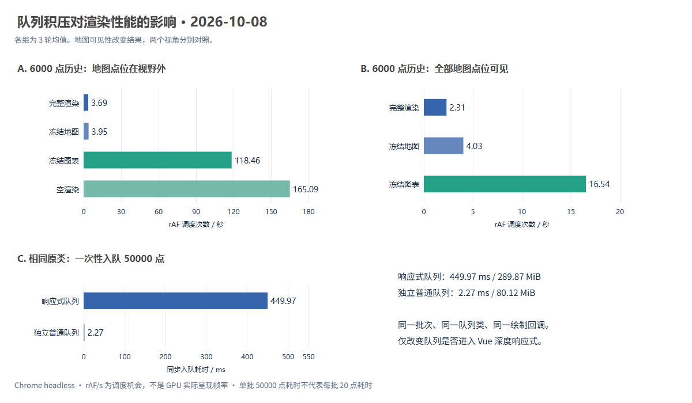

# 队列积压对页面渲染性能的影响实验

实验日期：2026-10-08（Asia/Shanghai）。本记录针对当前生产构建，不沿用历史报告的 FPS 或机器数据。

## 结论与证据边界

队列积压与卡顿存在两条不同的关系：

1. **大批量入队本身会阻塞。**当前 `RealtimeClient` 放在 Vue 2 的 `data()` 中，其内部帧队列、数组和遥测点均被深度观察。`push` 不只是存入引用，还会为新对象建立响应式属性；单批入队越大，观察成本越高；保留的积压越多，堆也越大。
2. **持续卡顿来自消费之后的图表与可见地图更新。**同样保存大队列，暂停消费能保持接近空闲的 rAF 调度频率；恢复消费后，状态合并、图表更新和绘制持续抢占主线程。图表是大窗口场景的主要瓶颈，可见地图也会产生独立长帧。

所以不能把“pending 数值变大”直接解释为“每帧遍历整个待处理队列”。当前队列按游标取点，没有逐点 `shift()`；积压也可能是绘制变慢、消费能力下降的结果。需要同时看队列长度、队首等待、入队时间、实际消费量、帧间隔和长帧。

本次不修改产品渲染逻辑。冻结图表/地图、空渲染、非响应式队列均只在独立实验页面内使用，用于定位原因。

## 环境、原始数据与指标

实验机器：Intel Core i7-14650HX，Windows 11 10.0.26200，约 32 GB 内存；Node 24.19.0。Chrome 实际版本、视口、DPR、逻辑核数、源文件 SHA-256 见 [metadata.json](./metadata.json) 与各轮 `initial.viewport`。基线提交为 `29f9ec81b8e00952791d47639eff0e79df752b9e`。

使用重新构建的 Vue 2.7.16 / ECharts 5.6.0 生产包、二维 OpenLayers 页面。Chrome 以 headless 模式运行，无 CPU 或网络限速；禁用 BFCache，每轮关闭旧标签并创建新标签，防止上轮页面的对象和堆混入本轮。第三方底图请求被阻断；矢量对象更新、轨迹和图表实际运行。车跟随关闭，轨迹固定在同一经纬度小范围内。

**地图视角边界：**51 轮主实验保留默认地图中心 `[104.81769, 28.16944]`、zoom=21，夹具在 `[116.32,40.00]` 附近，因此点位不在视野内。主实验适合隔离队列、状态与图表成本，不能代表大量地图要素同时可见的场景。截图核对后追加居中、zoom=16 的三组三轮实验，实际视野内的物理点数也记录在 `initial.mapView.visiblePoints`。两类场景分别统计。

每组重复 3 次，每轮测量 12 秒；历史对象实际铺图后预热 5 秒。前两轮采用正序/反序，第三轮轮换起点，减轻固定顺序偏差。测量前强制 GC 一次以统一内存起点，测量期间不主动 GC。

- [三轮汇总与完整指标表](./tables.md)
- [可重算的分析数据](./analysis.json)
- [实时进度记录](./progress.jsonl)
- 每轮 `*-r1.json` / `*-r2.json` / `*-r3.json` 保存帧时间戳、LoAF scripts、Long Task、队列采样、方法耗时与堆指标。



图由项目已有 ECharts SVG 渲染器导出；同时保留 [SVG 矢量版](./comparison.svg)。

指标口径：

| 指标 | 计算方式与用途 |
| --- | --- |
| rAF/s | 独立 rAF 回调数 ÷ 实测秒数，表示主线程获得动画调度的机会；不是 GPU 实际呈现帧率 |
| 帧间隔 P95 | 相邻 rAF 时间戳差的 nearest-rank P95，观察尾部停顿 |
| LoAF | PerformanceObserver 的 `long-animation-frame`，保留 duration、blockingDuration 和脚本归因 |
| Long Task | `longtask` 条目；超过 50 ms 的任务可能延迟输入与其他任务 |
| Timer P95 | 请求 100 ms 后执行回调的额外延迟；不是 INP，未冒充真实用户输入结果 |
| 消费速率 | 队列实际 consumed ÷ 实测秒数 |
| 起始堆 | GC 后 CDP `JSHeapUsedSize`，包括当前页面和数据对象；不是队列的精确独占内存 |
| 入队时间 | 夹具点构造完成后，单次 `enqueue()` 的同步耗时；在持续采样窗口之外单独计量 |

汇总使用各轮指标的算术均值并提供 rAF/s 的轮次范围；P95 是各轮 P95 的均值，不能解释成合并所有样本的 P95。没有长帧时以“—”表示。观察器只纳入 `started ≤ startTime < ended` 的条目；跨窗口条目不作为完整测量样本。

## 可重复实验过程

1. 构建当前前端。启动独立 Node 服务，数据库保存在本次创建的 `.data/queue-experiment-*`；暂停此独立服务的模拟器。
2. 用临时 Chrome 配置登录演示账号，打开生产页面，等待 `RealtimeClient` 创建完成，然后停止网络连接和自动控制。保留原来的 `FrameTelemetryQueue` 与 `publishFrame()` 路径。
3. 用确定性夹具初始化地图与图表。点间隔 50 ms、字段完整、坐标来自同一条局部闭环轨迹。核对图表数组长度和物理地图 Feature 数量均等于指定历史数。
4. 预热后暂停队列，一次性注入指定数量的待处理点。所有队列规模使用同一个点生成器的前 N 项，因此同一消费前缀的时间、坐标和气体值相同。数据创建和一次性入队不混入持续渲染指标。
5. 应用本组消融条件，记录对象是否拥有 Vue 2 的 `__ob__`；执行 GC，读取起始堆。
6. 注册独立 rAF、100 ms 延迟探针、500 ms 队列状态采样、LoAF / Long Task 观察器；恢复消费，测量约 12 秒。暂停组保持不消费。
7. 停止采样与消费，保存原始记录，检查 `enqueued - consumed = pending`、页面可见性和未捕获运行时异常。关闭整张旧标签再测下一组。

### 对照矩阵

| 实验 | 固定条件 | 唯一主要变量 | 回答的问题 |
| --- | --- | --- | --- |
| 暂停消费 | 历史 1000 点、batch=1 | pending=1000/10000/50000 | 仅保存更多队列数据会不会持续降低调度频率？ |
| 恢复消费 | 历史 200 点、batch=1 | pending=1000/10000/50000 | 每帧渲染同一前缀时，队列总长度是否决定帧率？ |
| 历史规模 | pending=10000、batch=1、完整渲染 | 历史 200/1000/6000 点 | 已消费的可视数据规模是否扩大每次更新成本？ |
| 绘制消融 | 历史 6000 点、pending=10000、batch=1 | 完整 / 冻结地图 / 冻结图表 / 空渲染 | 主要长帧来自哪条下游链路？ |
| 批量 | 历史 1000 点、pending=10000 | batch=1/5/20 | 提高消费量能否同时改善流畅度？ |
| 连续到达 | 历史 6000 点、初始 pending=0 | batch=1/20 | 名义 20 点/秒输入能否被持续处理？ |
| 响应式消融 | 相同原类、回调和夹具 | 队列在 Vue 内 / 队列独立保存 | 深度观察贡献了多少入队和内存成本？ |

“空渲染”使用项目已有 `emptyRender` 分支，不写入新的图表和地图状态，但保留原历史、页面与监控。冻结图表只替换 `scheduleUpdateOptions()`，冻结地图只替换 `drawRealtimeBatch()`；其他路径仍实际执行。

非响应式队列由原 `frameQueue.constructor` 创建，同样调用原客户端 `publishFrame()`；保存于实验的普通对象中，不放回 Vue 的响应式字段。它不改数组算法、每帧预算或业务渲染。连续输入由页面 Timer 模拟，主线程阻塞会延迟该 Timer，所以必须使用实际 enqueued 计算到达速率，不能认为名义 20 点/秒一直准时到达。该组不是真实网络负载测试。

一次性注入 N 点属于补发突发压力实验，不能把其数百毫秒耗时套用到正常每批 20 点的入队事件。这里“一次新入队的批量”与“已经保存的 pending 数”需要单独对照。

## 三轮正式结果

17 组 × 3 轮共 **51 轮**；每轮约 12 秒，持续采样合计约 10 分钟。所有轮次通过队列守恒和可见性检查，未捕获运行时异常。以下是三轮均值；各轮原值与完整范围见汇总表。

### 仅增加等待队列，与增加可视历史的差别

| pending 起点 | 暂停消费 rAF/s（历史 1000） | 完整消费 rAF/s（历史 200） | 暂停组单次入队 ms | 暂停组 GC 后堆 MiB |
| ---: | ---: | ---: | ---: | ---: |
| 1000 | 164.97 | 19.71 | 4.77 | 71.75 |
| 10000 | 165.08 | 19.95 | 66.87 | 112.04 |
| 50000 | 165.08 | 20.64 | 449.97 | 289.87 |

等待队列放大 50 倍，暂停时调度频率未下降，消费时也没有随 pending 变大的单调退化。这个范围内，持续绘制成本比等待队列长度更能解释低帧率；但大量新增项的观察成本和保留堆明显上升。

固定 pending=10000、batch=1，历史从 200 → 1000 → 6000 点，rAF/s 从 **19.95 → 8.02 → 3.69**，LoAF P95 从 **124.33 → 291.33 → 697.40 ms**。历史 6000 组同步 flush P95 仅 7.20 ms，却出现约 697 ms 长帧，直接说明耗时主要在 flush 后续阶段。

### 相同 6000 点历史，冻结哪个下游环节有效？

| 条件 | rAF/s | 帧间隔 P95 ms | LoAF/轮 | LoAF P95 ms | Timer P95 ms |
| --- | ---: | ---: | ---: | ---: | ---: |
| 完整渲染 | 3.69 | 668.40 | 30.67 | 697.40 | 703.17 |
| 冻结地图更新 | 3.95 | 696.63 | 29.00 | 706.30 | 771.23 |
| 冻结图表更新 | 118.46 | 12.23 | 0 | — | 12.93 |
| 空渲染 | 165.09 | 6.20 | 0 | — | 5.30 |

冻结图表后 rAF/s 提高约 **32 倍**，三轮均无 LoAF；冻结地图没有消除长帧。支持“点位在视野外的控制场景中，持续长帧主要来自图表更新”的假设。由于冻结组改变了消费速度，结束时可视数据规模也会不同，结果只用于这段控制窗口的因果定位，不能解释成无限期稳定帧率。

### 相同 50000 点，响应式队列和独立队列

| 历史 1000 点、暂停消费 | 单批入队 ms | GC 后堆 MiB | rAF/s |
| --- | ---: | ---: | ---: |
| 原响应式队列 | 449.97 | 289.87 | 165.08 |
| 相同类的独立队列 | 2.27 | 80.12 | 164.69 |

独立队列单批入队耗时减少约 **99.5%**，页面起始堆减少约 **72.4%**。两组的 `queueArray` / `firstPoint` 观察标志分别为 true / false。完整消费组的 rAF/s 则只有 **20.64 → 20.83**，不支持“移出响应式即可解决持续渲染卡顿”的结论。

### 放大 batch 的代价

| 历史 1000、pending=10000 | 消费点/s | rAF/s | LoAF P95 ms | 结束 pending |
| --- | ---: | ---: | ---: | ---: |
| batch=1 | 8.02 | 8.02 | 291.33 | 9903.00 |
| batch=5 | 36.47 | 7.29 | 326.63 | 9553.33 |
| batch=20 | 105.62 | 5.28 | 451.47 | 8706.67 |

batch=20 的消费量约为 batch=1 的 **13.2 倍**，但调度频率降低约 **34.1%**，LoAF P95 增加约 **55.0%**。这组明确证明吞吐与流畅度可以背离。

名义 20 点/秒连续到达、历史 6000 组中，batch=1 实际消费 3.72 点/秒，结束 pending 平均 174.33；batch=20 消费 17.38 点/秒，结束 pending=20，但 LoAF P95 仍为 624.13 ms、Timer P95 为 625.80 ms。末尾 pending=20 还受最后一秒到达与采样结束的相位影响，不能解释成持续增长。大批量改善积压，并没有消除约 0.6 秒的停顿。

## 补充对照：地图点位全部可见

将地图居中到夹具范围并固定 zoom=16，三轮初始视野内点数均为 **6000**。共 9 轮，原始数据和范围见 [地图可见对照表](../queue-backlog-2026-10-08-map-visible/tables.md)。

| 条件 | rAF/s | 帧间隔 P95 ms | LoAF P95 ms | Timer P95 ms |
| --- | ---: | ---: | ---: | ---: |
| 完整渲染 | 2.31 | 785.57 | 791.40 | 985.00 |
| 冻结地图更新 | 4.03 | 630.07 | 661.90 | 656.33 |
| 冻结图表更新 | 16.54 | 131.23 | 134.23 | 79.03 |

冻结地图与冻结图表都有效，冻结图表的提升更大；但冻结图表后仍出现约 134 ms 长帧。因此正常显示大量地图要素时，**图表全量更新与可见地图绘制共同造成卡顿**。视野外场景的“冻结图表后无长帧”不能推广到此场景。

完整渲染从点位在视野外的 3.69 下降到全部可见时的 2.31 rAF/s，约下降 37.5%；这两个实验的视角不同，该百分比描述整套视角变化，不是每个地图要素的独占成本。

## 补充对照：已有大队列，每次只新增 20 点

固定历史 1000 点、队列暂停，每种已有 pending 独立测 3 轮，每轮 20 次新批次。每次生成全新的 20 个对象后，只计量 `enqueue()`，再在实验代码中恢复原 pending。共 180 个同步入队样本；各轮原数组和汇总见 [small-batch-analysis.json](../queue-backlog-2026-10-08-enqueue20/small-batch-analysis.json)。

| 已有 pending | 样本 | 均值 ms | P50 ms | P95 ms | 最大 ms |
| ---: | ---: | ---: | ---: | ---: | ---: |
| 1000 | 60 | 0.142 | 0.100 | 0.300 | 0.300 |
| 10000 | 60 | 0.247 | 0.100 | 0.400 | 5.600 |
| 50000 | 60 | 0.158 | 0.100 | 0.300 | 0.300 |

已有积压增长时，固定 20 点入队的 P95 仍为约 0.3～0.4 ms，没有单调增长。5 万点一次性入队的约 450 ms 尖峰主要来自**单批新增对象数量及响应式观察**，不能归因成“已有队列越长，每次追加 20 点也必然越来越慢”。均值受 10000 组的单个 5.6 ms 尾部样本影响；短操作还受约 0.1 ms 计时粒度限制。

## 附加 CPU / GC 诊断

另外采集 2 轮 12 秒的 Chrome trace 与 CPU profile，使用 `queue-bench-start/end` 标记截取主线程窗口。该组为点位在视野外的场景，带采样开销，不混入上述 60 轮渲染对照。

- [诊断摘要与函数采样](../queue-backlog-2026-10-08-trace/diagnostics.json)
- [完整渲染 trace](../queue-backlog-2026-10-08-trace/history6000-r1-trace.json)、[CPU profile](../queue-backlog-2026-10-08-trace/history6000-r1.cpuprofile)
- [冻结图表 trace](../queue-backlog-2026-10-08-trace/charts-frozen6000-r1-trace.json)、[CPU profile](../queue-backlog-2026-10-08-trace/charts-frozen6000-r1.cpuprofile)

完整渲染的实测窗口 13.39 秒，识别到主线程 MinorGC 72 次、累计 391.66 ms、最大 10.47 ms；MajorGC 1 次、8.98 ms。rAF 回调事件累计 11.81 秒，其中单个 FunctionCall 最大约 458 ms；LoAF P95 为 957.5 ms。CPU 采样包含 ZRender 显示对象更新与 Canvas `fill` 等工作。

冻结图表组的 MinorGC 累计 168.09 ms、MajorGC 9.68 ms，rAF/s 为 114.18、无 LoAF。可识别的 GC 尖峰与数百毫秒绘制长帧量级不同，支持绘制链路为首要瓶颈；不能把所有暂停都算成 GC。时间线事件含嵌套调用，累计时长不能跨分类相加；CPU self time 也是采样估计。

## 原因：源码和实测怎样对应

### 1. 深度响应式扩大入队成本和活对象数量

父组件的 `data()` 声明 `realtimeClient: null`，随后赋值客户端实例。浏览器中的 `initial.observed` 证明客户端、队列、内部数组、待处理点均有 `__ob__`。

Vue 2.7 的观察器对可扩展对象/数组建立 Observer；数组的 `push` 拦截器进一步观察新增项，对象的每个属性建立 getter/setter。这解释了为什么大数组入队不能只按普通数组追加的成本理解。机制以 [Vue 2.7 Observer 源码](https://github.com/vuejs/vue/blob/v2.7.16/src/core/observer/index.ts) 和 [数组拦截器](https://github.com/vuejs/vue/blob/v2.7.16/src/core/observer/array.ts) 为依据。

还有一个独立发现：虽然父组件使用 `Object.freeze({ points: [] })` 包装地图存储，实验中底层 points 数组仍出现 `__ob__`。冻结外壳不能阻止同一数组经图表 `gasdata` 或地图子组件 `data().points` 重新进入响应式系统。这里只确认观察行为；本次未对所有进入路径逐一消融，不能把全部成本归到某一个赋值。

### 2. 等待队列与可视历史是不同规模

`FrameTelemetryQueue.flush()` 从 `queue[cursor++]` 提取小批次；其操作量主要由 batch 控制，并非每次扫描全部 pending。游标超过 2000 且已超过数组一半时才 `slice()` 压缩；尚未压缩的已消费引用仍会暂时保留。

但 `handleRealtimePacket()` 会调用 `appendRealtimeTimeWindow()`，复制、解析时间并筛选整个图表窗口；5 个图表各自复制数据和生成 Option。地图也保留已消费点及绘图对象。积压恢复后，**待处理队列、图表窗口、地图历史**可能同时很大，三者不能混用同一个“队列数据量”概念。

### 3. 5 ms 预算不覆盖实际绘制

取点 `while` 中检查的是提取耗时；`onFrame(batch)` 在循环之后，Vue 微任务、图表 120 ms 合并 Timer、ECharts 延迟更新更在其后。因此即使同步 flush 的 P95 很小，后面的 rAF 仍可能出现数百毫秒间隔。

[机制验证脚本](../../scripts/verify-queue-mechanism.mjs) 使用真实队列和可控虚拟时钟：设置取点预算 5 ms、回调人为占用 80 ms，整次 flush 仍耗费虚拟 80 ms。记录见 [mechanism.json](./mechanism.json)。这些 80 ms 是机制断言中的配置值，不是机器实测。

主线程任务按完成顺序执行；rAF 提供绘制前的回调时机，不能把耗时 JavaScript 自动拆短或移出主线程。超过 50 ms 的任务会影响响应能力。参考 [web.dev 长任务说明](https://web.dev/articles/optimize-long-tasks) 与 [MDN requestAnimationFrame](https://developer.mozilla.org/en-US/docs/Web/API/Window/requestAnimationFrame)。

### 4. ECharts lazyUpdate 改变执行时机，没有消除全量更新

当前图表已经使用浅 watcher 和 120 ms 合并更新；不能套用旧报告“深 watcher、每次 resize”的结论。当前实际参数是 `notMerge: true, lazyUpdate: true`。

`notMerge` 会重建图表模型；`lazyUpdate` 把更新挂到 pending，由后续图形动画回调处理。它减少当前 `setOption()` 的同步工作，不保证下一帧便宜。依据为与当前版本一致的 [ECharts 5.6 源码](https://github.com/apache/echarts/blob/5.6.0/src/core/echarts.ts)。长帧中的 vendor 脚本位置可对应到 [ZRender 动画循环](https://github.com/ecomfe/zrender/blob/5.6.1/src/animation/Animation.ts)。

冻结图表后保留地图和状态更新却显著恢复调度能力，是比“看到某个库名”更强的因果证据。同步 `updateOptions()` 计时不包括 ZRender 的后续布局/绘制，因此不可把它的 P95 与 LoAF P95 当成同一阶段。

### 5. 积压形成反馈，扩大 batch 可能造成吞吐与流畅度背离

在队列始终有数据且每帧确实消费 batch 个点时，服务能力可近似为 `μ = 可用 rAF/s × batch`。若输入 `λ > μ`，队列增速约为 `λ - μ`。但 batch 增大会改变每帧成本和可用 rAF，所以 μ 并非常数。

机制验证固定 10 个可用帧/秒、输入 20 点/秒，运行 10 秒：batch=1 时 pending=100；batch=2/5 时 pending=0。这里的 10 帧/秒是虚拟调度条件，非浏览器实测。真实批量组另见三轮数据表。

实际反馈链条是：可视数据变多 → 更新更昂贵 → 主线程长帧 → rAF 消费次数减少 → pending 与等待增长 → 恢复消费时更多数据进入状态和绘图库。只看“队列清空”不能证明渲染恢复流畅。

### 6. 内存和 GC：已证明与尚未证明的部分

对照证明大队列增加起始堆，非响应式队列能检验响应式包装的额外保留成本。Vue 2 深度观察和窗口数组复制会产生更多活对象/临时对象。

大堆和持续分配可能放大 GC 压力，这是 [V8 的并发标记说明](https://v8.dev/blog/concurrent-marking) 支持的机制推断。**不能仅凭 heap 上下波动，就断言每次长帧都是 GC。**持续渲染的定位依据是图表、地图消融和长帧脚本；额外 trace 的结果如上独立记录。

## 重跑与验收

从仓库根目录运行，要求 Node ≥24、项目依赖已安装、18080 端口空闲。脚本会在端口占用时拒绝启动，输出目录必须为空。Windows 默认使用本机 Chrome，也可设置 `QHZHC_BENCH_CHROME`。

```powershell
npm run build -w QHZHC_Web
$env:QHZHC_QUEUE_OUTPUT = 'reports/queue-backlog-rerun'
$env:QHZHC_QUEUE_DIAGNOSTIC = '1'
$env:QHZHC_QUEUE_SECONDS = '12'
$env:QHZHC_QUEUE_REPEATS = '3'
node scripts/measure-queue-backlog.mjs
node scripts/verify-queue-mechanism.mjs
node scripts/summarize-queue-backlog.mjs reports/queue-backlog-rerun
```

地图可见补充实验再设置 `QHZHC_QUEUE_CENTER_MAP=1`、`QHZHC_QUEUE_CASES=history6000,map-frozen6000,charts-frozen6000`，另选空输出目录，重复 3 轮。小批次入队实验设置 `QHZHC_QUEUE_PROBE=1`、`QHZHC_QUEUE_CASES=paused-q1000,paused-q10000,paused-q50000`、测量 3 秒，另选空输出目录，重复 3 轮。

汇总两套渲染数据后，使用 `node scripts/plot-queue-backlog.mjs <主实验目录> <地图可见目录>` 生成导出图；该脚本使用项目现有 ECharts，无需额外绘图库。CPU/GC 摘要使用 `node scripts/analyze-queue-traces.mjs <trace目录>` 重算。

`QHZHC_QUEUE_CASES` 可指定逗号分隔的子集。`QHZHC_QUEUE_TRACE=1` 用于独立诊断轮次，会增加采样开销，应写到不同输出目录。实验结束关闭自身创建的 Chrome 与服务，保留隔离数据库作为本地复现材料，不写入原业务数据库。

预试验目录 `queue-backlog-2026-10-08-smoke` 和 `queue-backlog-2026-10-08-pilot` 不属于正式统计：前者只验证脚本；后者暴露观察器时间边界及页面上下文保留问题后被中止。正式轮次修正时间边界、关闭旧标签并禁用 BFCache 后重新执行。

## 下一步优化顺序

1. 将连接实例、队列、绘图库实例移出 Vue 2 深度响应式存储；只把面板所需的少量标量统计保留为响应式状态。地图/图表子组件也要检查同一数组被再次观察的入口。
2. 针对 5 分钟图表做按像素采样、更新频率限制和可复用的 series 更新；分别实测模型合并、关闭实时动画等候选策略。全量业务数据与显示样本分开保存。
3. 依据完整长帧及队列等待控制批量，不只依据取点时间或 `$nextTick` 耗时。限制补发批次，避免一次性大量入队；必要时从服务端限流或对展示数据采样。
4. 保留数据正确性与历史查询能力；队列丢弃/采样策略须由业务决定。若迁移计算到 Worker，也须考虑通信和拷贝成本，不能把 DOM/Canvas 库的主线程工作全部假设为可迁移。

优化验收应复用本组夹具和三轮对照，同时要求：入队长任务减少、LoAF 与帧间隔 P95 改善、队列增长停止、队首等待回落、内存受控。此次结果不构成对三维 Cesium、真实输入 INP 或长时间在线稳定性的验收。

## 实际验证记录

前端生产构建成功，存在项目已有的样式导出与包大小告警。真实浏览器渲染对照共 60 轮，另做 9 轮小批次入队探针和 2 轮 CPU/GC 诊断；所有浏览器轮次完成队列守恒/可见性检查，没有未捕获运行时异常。真实队列的虚拟时钟机制验证通过。

原 Jest 入口因父 pnpm 工作区解析到 Vue 3.5.43、而 Vue 模板编译器为 2.7.16，无法启动。使用临时 `.data/queue-jest-config.cjs`，只对两个纯队列测试文件使用现有 TypeScript CommonJS 转译器后，**2 个套件、7 个测试通过**。这是有范围限制的队列验证，未宣称全项目标准测试入口通过，未修改工作区依赖。
